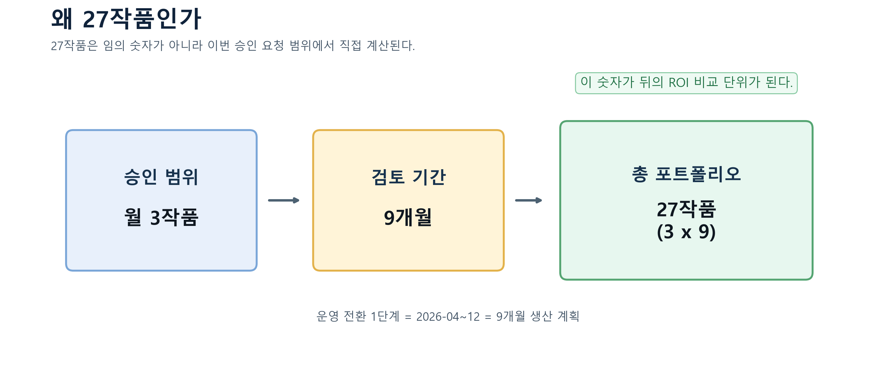
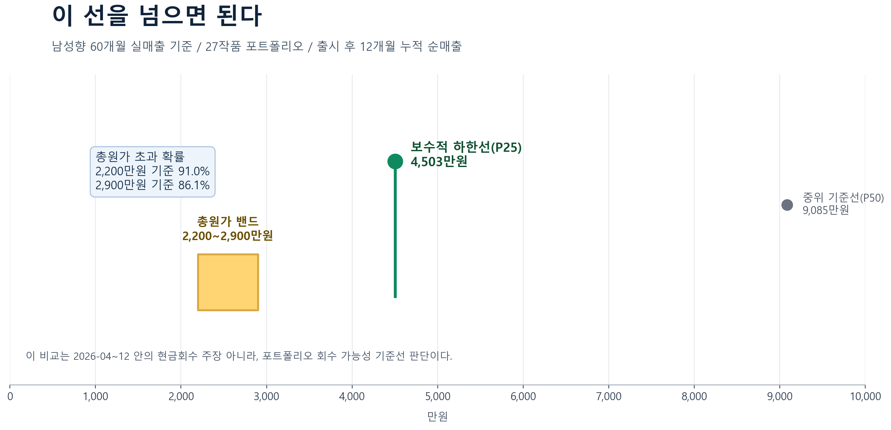

# LLM 기반 IP 개발 시스템 프로젝트 승인 요청

> 문서 번호: BIZ-2026-001  
> 작성일: 2026-03-13  
> 작성자: 조원재  
> 부서: 소설편집팀

---

## 목차

- 1페이지 요약
- 0. 결재 판단용 시각화
- 1. 프로젝트 배경과 목적
- 2. 시스템 구조와 운영 방식
- 3. 현재 검증 상태와 한계
- 4. 비용 구조와 손익분기 논리
- 5. 리스크와 대응
- 6. 의사결정 요청
- 7. 승인 후 실행 로드맵
- 8. 개발부서/개발자용 기술 부록
- 9. 외부 실황: 다른 곳도 이미 하고 있는가
- 10. 문서 상태

---

## 1페이지 요약

### 1. 무엇을 승인해 달라는가

LLM 기반 IP 개발 시스템 「글도비」를 개인 개발 체계에서 회사 운영 체계로 전환하기 위한 `운영 전환 1단계 승인`을 요청한다. 요청 범위는 `2026-04~12 기본 예산 약 2,200~2,900만원 + a 상한`, `Vertex AI 운영 계정·예산 한도·Batch API 활용 승인`, `월 3작품 기준 MVP Validation 운영`, `19금 성인 HL 요구 프로젝트 발생 시 선택적 Grok +a 예외 분기`, `결과물 권리 구조와 운영 책임 체계 확정`이다. 이 시스템은 소설을 대신 쓰는 AI가 아니라, **IP를 대량으로 테스트하는 생산 인프라**다.

| 항목 | 월 비용 | 검토 기간 합계 / 기준 단가 | 비고 |
|------|--------:|------------:|------|
| Codex 구독 | 약 26만원 | 약 260만원 | 전처리·유지 |
| Claude Code Pro Max | 약 26만원 | 약 260만원 | 감리·교차검증 |
| Vertex AI API | 약 132~210만원 | 약 1,190~1,890만원 | 기본 생산비 |
| 개발비/서버비/기타 | 약 50만원 | 약 500만원 | 인프라·예비 |
| Grok API(선택) | +a | +a | 19금 HL 예외 |
| **합계** | **약 234~312만원 + a** | **약 2,200~2,900만원 + a** | 2026-04~12 |

### 2. 왜 천만 단위 예산인가

현재 병목은 기술 탐색보다, `예산을 아끼느라 실전 로그 확보를 늦춰 온 상태`다. 이 병목을 풀 수 있는지는 개발자 의사보다 `상부가 운영 예산과 Vertex 사용 권한을 열어 줄지`의 문제다. 승인 범위는 `월 3작품 x 9개월 = 총 27작품`이다. 남성향 60개월 실매출 기준으로 보면, 이 `27작품 포트폴리오`의 `출시 후 12개월 누적 순매출 보수적 하한선`은 약 `4,503만원`으로 기본 총원가 `약 2,200~2,900만원`보다 높다. 즉, 이 안건은 `2026-04~12 안의 즉시 현금회수` 주장이 아니라, 승인 범위 자체가 시장 기준선 대비 회수 가능성이 있는지를 묻는 승인 요청이다. 이번 예산은 완성품 구매가 아니라, **검증 속도를 늦추지 않기 위한 운영 전환 비용**이다.

### 3. 왜 지금 승인해야 하는가

현재 시스템은 `기능 탐색 단계`보다 `운영 고도화 검토` 비중이 더 큰 단계에 들어선 것으로 판단된다.

1. 지금까지 회사 차원에서 허용된 외부 모델 비용은 사실상 Google API 범위에 머물렀고, 그 외 개발비 부담은 개인 중심으로 감당해 온 성격이 강했다. 이제 더 중요한 판단은 기능 추가 여부보다 Vertex AI 사용 승인과 향후 파인튜닝 가능성을 포함해 이 체계를 회사 운영 체계로 전환했을 때 비용과 운영 책임을 회사가 감당할 것인지에 가깝다.
2. 초기 `1 arc` 기술 기준선 위에 `10 arc 연속 통과`가 더해지면서, 현재 단계는 `Technical Validation 완료`가 아니라 `MVP Validation 진행 중`으로 보는 편이 더 정확하다.
3. 승인 범위는 `월 3작품 x 9개월 = 총 27작품`이다. 남성향 60개월 실매출 기준으로 보면, 이 `27작품 포트폴리오`의 `출시 후 12개월 누적 순매출 보수적 하한선`이 약 `4,503만원`으로 기본 총원가 `약 2,200~2,900만원`보다 높다. 즉, 이번 안건은 동기간 현금회수 주장이 아니라 `포트폴리오 회수 가능성 기준선`을 확인한 뒤 제출하는 승인 요청이다.
4. Vertex AI를 같이 승인해야 하는 이유는 `모델 변경` 자체보다 `권한 통제`, `비용 귀속`, `운영 관측`, `Batch API 활용 등 비용 최적화`, `향후 supervised tuning`을 회사 운영 경로 안에서 다루기 위해서다.
5. 기본 생산은 Vertex AI로 두고, 요구사항에 `19금 성인 HL`이 포함되는 프로젝트는 Grok 비용을 `+a`로 붙이는 예외 분기로 관리하는 것이 적절하다.
6. `작품 생산에서 인간 배제`는 현재 즉시 시행 조건이 아니라, 상부 요구 방향에 따른 중장기 자동화 목표다. 단기 운영은 인간 감수를 유지한다.

즉, 이번 승인 검토의 초점은 "AI가 소설을 쓸 수 있는가"를 다시 묻는 데 있기보다, 초기 기술 기준선과 10 arc 확장 검증을 바탕으로 이 생산 체계를 회사 자산으로 전환할 가치가 있는지를 판단하는 데 있다.

## 이하 상세 내용 :

## 0. 결재 판단용 시각화

### 0.1 왜 27작품인가



### 0.2 이 선을 넘으면 된다



1. 비교 단위는 승인 범위인 `27작품 포트폴리오`다.
2. 매출 단위는 각 작품의 `출시 후 12개월 누적 순매출`이다.
3. 따라서 이 비교는 `동기간 현금회수`가 아니라, `포트폴리오 회수 가능성 기준선` 판단이다.

---

## 1. 프로젝트 배경과 목적

「글도비」는 장르·설정·캐릭터 조합을 빠르게 돌려보고, 시장성이 있는 IP를 선별하기 위한 LLM 기반 IP 개발 시스템이다. 소설을 쓰는 AI가 아니라, **IP를 대량으로 테스트하는 생산 인프라**가 핵심이다. 250화 장편 웹소설을 통제 가능한 수준으로 생산하는 것은 그 인프라의 실행 수단이며, 이를 위해 다음 네 가지를 회사 자산으로 내재화하는 데 목적을 둔다.

1. 장편 웹소설 생산 공정의 표준화
2. 품질 관리와 상태 추적을 포함한 반복 생산 체계 내재화
3. 장르 확장과 병렬 생산이 가능한 운영 구조 구축 — IP 후보를 빠르게 양산·검증하는 파이프라인
4. 최종적으로 작품 생산에서 인간 배제까지 도달할 수 있는 자동화 구조 확보

이번 승인 요청은 연구 개발의 연장선이 아니라 `운영 전환` 요청이다. 현재는 기술 가능성에 대한 기준선을 확인한 뒤, 운영 안정성·속도·비용을 정리하는 단계다.

현재 일정 목표는 두 단계로 둔다.

1. 2026년 3월부터 4월 말까지: `작품 생산 가능성`을 닫는다.
2. 2026년 5월 이후: `생산 작품 퀄리티 업`을 핵심 목표로 둔다.

이때 단기 운영은 인간 감수를 전제로 하지만, 중장기 목표는 `작품 생산에서 인간 배제`다.

또한 권리 구조는 아래처럼 본다.

1. AI 시스템은 창작 보조 도구로 사용된다.
2. 운영자는 결과물의 창작자로서 저작권법상 저작자가 된다.
3. 운영자는 본 계약에 따라 결과물에 대한 저작재산권 일체를 회사에 양도한다.
4. 회사는 결과물을 복제, 배포, 전송, 편집, 수정, 각색, 번역 및 2차적 저작물 작성 등의 방식으로 자유롭게 이용할 권한을 가진다.
5. 운영자는 회사의 위 이용과 관련하여 저작인격권을 행사하지 않기로 한다.

---

## 2. 시스템 구조와 운영 방식

### 2.1 파이프라인 구조

시스템은 다음 4단계로 구성된다.

```text
Treatment / Bible
  -> Stage 0: 전처리 / 구조화
  -> Stage 2: Arc 설계
  -> Stage 3: Blueprint 생성
  -> Stage 4: Manuscript 생성 및 심사
```

각 단계의 역할은 아래와 같다.

| 단계 | 역할 | 산출물 |
|------|------|--------|
| Stage 0 | 기획 정보 구조화 | Treatment, Bible, 스타일 가이드 |
| Stage 2 | 5~7화 단위 Arc 설계 | Arc Tactical Design |
| Stage 3 | 화별 씬/대사/상태 구성 | Blueprint |
| Stage 4 | 원고 생성 및 최종 심사 | Manuscript |

### 2.2 역할 분리형 운영 구조

이 시스템은 단일 생성기가 아니라 역할 분리형 구조를 채택한다.

| 역할 | 담당 기능 |
|------|-----------|
| Analyst | Treatment 분석 및 전략 문서화 |
| Chief Writer | 원고 후보 생성 |
| Director | 최종 심사, 합격/불합격/수정 지시 |
| Advisory Chain | 수치, 관계, 정보 누수, 반복 등 보조 검증 |

운영상 핵심 원칙은 다음과 같다.

1. 초안 생성과 승인 권한을 분리한다.
2. Python 검증과 LLM 심사를 결합하되, 최종 판정 책임은 Director가 가진다.
3. 장기 연재에 필요한 상태는 DB 기반으로 보존한다.

### 2.3 품질 보증 체계

품질 보증은 4중 구조다.

```text
1층: Self-Critique
2층: Advisory Chain
3층: Director 심사
4층: Contradiction Firewall
```

장기 연재를 위해 사용하는 핵심 상태 추적 장치는 아래와 같다.

| 장치 | 역할 |
|------|------|
| WorldState | 인물, 장소, 상태 변화 추적 |
| FactLedger | 수치·사실 변경 이력 기록 |
| Episode Chain Links | 화간 인과관계 유지 |
| Contradiction Firewall | 중대한 모순 강제 차단 |

이 구조는 단발성 생성보다 `연속성 유지`, `재시도 관리`, `판정 책임 분리`에 초점을 둔다.

### 2.4 왜 Google API 수준에서 Vertex AI 운영 경로로 전환을 검토해야 하는가

이번 승인 요청에서 Vertex AI를 같이 묶는 이유는 `모델 하나 더 쓰자`가 아니라, 현재 체계를 `회사 운영 체계`로 옮기려면 필요한 관리 축이 바뀌기 때문이다.

지금까지의 개발 경로는 사실상 `Google API(키 기반 호출)` 중심이었다. 이 경로만으로도 기술 검증은 가능하다. 다만 회사 운영 체계로 전환하려면 아래 요구가 생긴다.

| 요구 | Google API(키 중심)에서의 한계 | Vertex AI 전환 시 의미 |
|------|-------------------------------|------------------------|
| 권한 통제 | API 키 중심이라 운영 권한 분리가 제한적이다 | IAM 역할과 서비스 계정으로 사용자/팀/프로세스별 권한 분리가 가능하다 |
| 비용 통제 | 프로젝트별/환경별 비용 배부가 약하다 | Cloud Billing budget, alert, label 기반으로 예산 통제와 비용 귀속이 가능하다 |
| 관측성 | 기본 호출은 되지만 운영용 모니터링 체계가 약하다 | Cloud Monitoring/observability 축으로 usage, latency, error rate를 운영 지표로 볼 수 있다 |
| 비용 절감 수단 | 단순 키 호출만으로는 운영형 최적화 수단이 제한적이다 | Context caching, Batch API 같은 관리형 비용 절감 수단을 같은 운영 경로에서 검토·적용할 수 있다 |
| 요구사항 확장 | 기본 Google API 경로만으로는 프로젝트별 정책/요구사항 분기 대응이 약하다 | 기본 생산은 Vertex AI로 두고, 19금 성인 HL 요구 프로젝트는 Grok API를 선택적으로 추가하는 멀티 프로바이더 운영이 가능하다 |
| 향후 튜닝 경로 | 장기적으로 회사 자산화할 튜닝 경로가 약하다 | supervised tuning과 managed path를 같은 운영 축에서 검토할 수 있다 |

정리하면, 현재 승인 문맥에서는 `Google API로 기술 검증`, `Vertex AI로 운영 전환`이라는 역할 분리로 이해하는 편이 더 정확하다.

이 판단의 근거는 아래와 같다.

1. `인증/권한`
   - Gemini API는 기본적으로 API key 기반 호출을 사용한다.
   - Vertex AI는 generative AI 기능에 대해 IAM 역할과 서비스 계정을 전제로 권한을 나눌 수 있다.

2. `비용 통제`
   - Vertex AI 호출에는 custom metadata labels를 붙여 비용을 label 단위로 분해할 수 있다.
   - Cloud Billing budget과 alert를 프로젝트/조직 범위로 설정해 운영 예산을 관리할 수 있다.

3. `운영 관측성`
   - Vertex AI는 Cloud Monitoring 및 model observability dashboard와 연결되어 usage, latency, error rate를 운영 지표로 볼 수 있다.
   - 즉, 단순 호출 성공 여부가 아니라 `운영 상태`를 추적하는 경로가 생긴다.

4. `실생산 최적화`
   - Context caching은 반복 prefix가 긴 글도비 구조에 직접 맞는 비용 절감 수단이다.
   - Vertex AI Batch API 병행(약 30% 할인 예상)와 배치성 운영을 활용하면, Google API 실측 `arc당 9,000원`을 `arc당 약 6,300원` 수준으로 관리할 수 있다는 운영 가정을 둘 수 있다.

5. `회사 자산화 경로`
   - Vertex AI는 Gemini supervised tuning을 지원한다.
   - 즉, 향후 원고/블루프린트/품질 데이터가 누적되면 `운영`, `비용`, `튜닝`을 같은 관리 경로에서 다룰 수 있다.

6. `요구사항 대응`
   - 기본 운영 경로는 Vertex AI로 두되, 요구사항에 19금 성인 HL이 들어가는 프로젝트는 Grok API를 추가 프로바이더로 잡아야 한다.
   - 즉, 비용 최적화 축은 Vertex AI이고, 요구사항 확장 축은 Grok API `+a`다.

따라서 이번 승인 요청에서 Vertex AI를 같이 묶는 이유는 아래처럼 정리하는 것이 가장 정확하다.

> 현재 단계에서 Vertex AI 전환 필요성은 “더 좋은 모델을 쓰기 위해서”보다 “권한, 비용, 관측, 최적화, 향후 튜닝을 회사 운영 체계 안에서 관리하기 위해서”에 가깝다. 운영 기준 단가는 Google API 실측 `arc당 9,000원`에 Batch API 병행(약 30% 할인 예상)을 적용해 `arc당 약 6,300원`으로 두고, 19금 성인 HL 요구 프로젝트는 Grok API `+a`를 추가하는 방식이 적절하다.

---

## 3. 현재 검증 상태와 한계

### 3.1 현재까지 확인된 것

2026-03-13 기준, 초기 기술 기준선과 현재 확장 검증 상태는 아래처럼 구분해 읽어야 한다.

#### 초기 기술 기준선

| 항목 | 내용 |
|------|------|
| 운영 기준 샘플 | `00_test_00` |
| 검증 범위 | 1 arc, ep_0001~ep_0004 |
| 의미 | `technical validation baseline` |
| 확인 사실 | Stage 2 -> 3 -> 4 end-to-end 재현 |
| 운영 안정화 | 치명적 이슈 우선 해소 |
| llm 상호 크로스체크 | blocker 0 확인 |

#### 확장 검증 결과

| 항목 | 내용 |
|------|------|
| 확장 검증 범위 | `10 arc 연속 통과` |
| 의미 | `MVP Validation 진행 중` 판단 근거 |
| 확인 사실 | 다수 arc 연속 생산, 품질 게이트 동작, 운영 로그 축적 |
| 해석 | 단일 샘플 재현 단계를 넘어 운영 재현성 판단 가능 |
| 경계 | 실프로젝트 상업성, 70 arc 이상 장기 곡선은 아직 미확정 |

여기서 중요한 점은 두 기준선의 역할 분리다.

- `00_test_00`는 실운영 대표 프로젝트가 아니다.
- `1 arc` 기준선은 여전히 `기술적으로 파이프라인 재현이 가능한지`를 판단하는 기준이다.
- `10 arc 연속 통과`는 Production 완료 증명이 아니라, `MVP Validation 진행 중`이라고 부를 수 있을 만큼 다수 arc 재현성과 운영 로그가 쌓였다는 뜻이다.

### 3.2 구조적 결함에 대한 현재 판단

별도 전수조사 결과와 현재 코드베이스 검토는, `250화 생산을 불가능하게 만드는 구조적 결함은 식별되지 않았다`는 판단을 계속 지지한다. 여기에 `10 arc 연속 통과` 전제를 더하면, 최소한 다수 arc 운영 과정에서 `아키텍처를 다시 짜야 한다`는 급의 신규 하드 블로커는 추가로 드러나지 않았다고 보는 편이 맞다.

핵심 근거는 다음과 같다.

1. Treatment 70블록 기준 250화 커버 가능
2. DB 용량과 상태 저장 구조가 장편 스케일에서 병목이 아님
3. 문제로 식별된 다수 항목은 아키텍처 결함이 아니라 튜닝 또는 운영 최적화 과제임
4. 10 arc 연속 통과 전제에서도 다수 arc 운용 과정의 관측 결과가 기존 구조 판단을 뒤집지 않음

즉, 현재 판단은 다음과 같다.

- 구조 재설계가 필요한 치명적 결함: 현재까지 식별되지 않음
- 운영 최적화와 계측 고도화가 필요한 과제: 있음

#### 정량 자산 규모

승인 검토에서 "현재 시스템이 어느 정도 규모의 자산인가"를 묻는다면, 워크스페이스 정적 집계 기준으로 아래처럼 답할 수 있다.

1. 자동화 테스트 자산은 `tests/` 트리 기준 `288개 테스트 파일`, `3,951개 테스트 케이스`, `57,270줄`이다. `lite_mode`, `test_mode`, `tools2`의 테스트성 파일까지 넓히면 `311개 파일`, `3,979개 테스트 케이스`다.
2. 핵심 런타임 코드는 `modules/ + main_a.py` 기준 `241개 Python 파일`, `120,415줄`이다.
3. 저장소 전체 Python 자산은 `.py` 기준 `3,523개 파일`, `1,180,312줄`이다. 다만 이 수치에는 테스트, 도구, 실험 코드가 함께 포함되므로 승인 판단에서는 `핵심 런타임 코드` 수치를 더 중요하게 보는 편이 맞다.
4. 비테스트 스크립트/유틸은 `90개`다.
5. 품질 평가 체계는 `Director 5항목 100점 가중 rubric`, `ScoringValidator 6차원 / PASS 70점`, `ChiefWriter 4항목 1.0~4.0 quick rubric(3.5 이상 조기 종료)`의 3층 구조다. rubric/만족도 관련 자동화 테스트만 따로 보아도 `19개 파일`, `274개 테스트 케이스`가 있다.

이 숫자들은 실전 상업성 증명 자체는 아니지만, 현재 체계가 단일 프롬프트 실험이나 1~2개 스크립트 수준이 아니라는 점, 즉 운영형 코드 자산으로 이미 상당한 축적이 있다는 점은 분명히 보여준다.

### 3.3 아직 안 된 것

현재 시점에서 아직 완료되지 않은 것은 아래 다섯 가지다.

| 항목 | 상태 |
|------|------|
| 실제 프로젝트 1건 실운영 검증 | 미실행 |
| 70 arc 이상 장기 생산 완주 | 미완료 |
| 월 3작품 기준 장기 비용곡선 재측정 | 미완료 |
| 19금 성인 HL 요구 시 Grok `+a` 실측 | 미정 |
| 실프로젝트 1건 ROI 실측 | 미완료 (`남성향 60개월` 시장 기준선 확보 완료) |

따라서 이 문서는 `확정된 프로젝트 타당성 증명서`가 아니라, `MVP Validation 진행 중인 시스템`에 대해 운영 전환 1단계를 승인할 만큼 근거가 쌓였는지를 묻는 문서로 읽어야 한다.

---

## 4. 비용 구조와 손익분기 논리

### 4.1 비용 구조

비용은 아래 세 축으로 구성된다.

1. 고정비: Codex, Claude 구독
2. 기본 변동비: Vertex AI API 사용량
3. 선택 변동비: 19금 성인 HL 요구 시 Grok API `+a`

현재 확정 가능한 고정비는 아래와 같다.

| 항목 | 월 비용 | 검토 기간 합계 / 기준 단가 |
|------|--------:|-------------------------:|
| Codex 구독 | 약 26만원 | 약 260만원 |
| Claude Code Pro Max | 약 26만원 | 약 260만원 |
| Vertex AI API | 약 132~210만원 | 약 1,190~1,890만원 |
| 개발비/서버비/기타 운영비 | 약 50만원 | 약 500만원 |
| Grok API(선택) | +a | +a |
| 합계 | **생산 월 기준 약 234~312만원 + a** | **약 2,200~2,900만원 + a** |

비용 판단 기준은 아래처럼 구분한다.

| 구분 | 현재 기준 | 해석 |
|------|-----------|------|
| 실측 기준선 | Google API `1 arc 약 9,000원` | 초기 기술 기준선 |
| 10 arc 확장 검증 | arc별 편차는 있으나 기존 승인 산정 범위를 뒤집을 수준의 이탈은 없는 것으로 봄 | 평균/범위는 추가 로그로 계속 보정 |
| 운영 가정 | Vertex Batch 병행(약 30% 할인 예상) 시 `1 arc 약 6,300원` | 월 3작품 산정 기준 |
| 미확정 | Grok `+a`, 70 arc 이후 장기 비용곡선 | 승인 후 재측정 |

현재 운영 산정 기준은 아래처럼 둔다.

1. `Google API 실측 1 arc = 약 9,000원`
2. `10 arc 확장 검증 전제에서도 비용 편차가 기존 승인 범위를 다시 짤 정도로 이탈하지는 않음`
3. `Vertex Batch 병행(약 30% 할인 예상) 시 1 arc = 약 6,300원`
4. `작품당 70 arc = 약 44만원 (reject 감안 ~70만원)`
5. `월 3작품 = 약 132~210만원`
6. `2026-04-01~2026-12-31 9개월 생산 = 약 1,190~1,890만원`
7. `개발비/서버비/기타 운영비 = 500만원`
8. `기본 총액 = 약 2,200~2,900만원`

Grok API는 기본 운영 경로가 아니라, `19금 성인 HL` 요구 프로젝트에 한해 붙는 예외 비용 `+a`다.

### 4.2 수익 구조

수익 구조는 단순하다.

```text
플랫폼 총매출(100%)
 -> CP사 순매출(70%)
 -> Revenue Share 0%
 -> 순수익 = CP 순매출 - 총비용
```

Revenue Share가 0%이므로, CP 순매출이 그대로 회수 원천이 된다.

### 4.3 손익분기 공식

```text
Google API 실측 단가
= 1 arc 약 9,000원

10 arc 확장 검증 해석
= arc별 편차는 있으나 승인 산정 범위를 뒤집을 수준의 이탈 없음으로 봄

Vertex AI Batch API 병행(약 30% 할인 예상) 적용 단가
= 9,000원 x 0.7
= 약 6,300원/arc

작품당 Vertex 비용 (기본)
= 70 arc x 0.63만원
= 약 44만원

작품당 Vertex 비용 (reject 감안)
= ~70만원

월 Vertex 비용
= 3작품 x 44~70만원
= 약 132~210만원

검토 기간 Vertex 비용
= 9개월 x 132~210만원
= 약 1,190~1,890만원

개발비/서버비/기타 운영비
= 500만원

총비용
= 고정비 520만원 + Vertex 1,190~1,890만원 + 개발비/서버비/기타 500만원 + Grok(+a)
= 약 2,200~2,900만원 + a

검토 기간 총생산량
= 9개월 x 월 3작품
= 27작품

Grok 제외 기준 작품당 총원가
= 약 2,200~2,900만원 / 27작품
= 약 81.5~107.4만원

Grok 제외 기준 작품당 손익분기 총매출
= 81.5~107.4만원 / 0.7
= 약 116~153만원

19금 성인 HL 요구 프로젝트는 위 수치에 Grok +a가 추가된다.
```

이 문서에서는 작품당 매출이나 최종 ROI를 단정하지 않는다. 현재 손익 공식은 `운영 전환 1단계 예산 승인` 여부를 판단하기 위한 기준선이다.

### 4.4 남성향 매출 기준선

프로젝트 ROI 논리의 핵심은 `개별 작품 1개 매출 예측`이 아니라, `이번 승인 범위인 27작품 포트폴리오가 시장 기준선상 기본 총원가를 넘길 수 있는가`다. 현재 확보한 `남성향 60개월 실매출` 자료는 바로 이 기준선을 잡는 데 사용했다.

이 비교는 아래 순서로 읽어야 한다.

1. 회사가 이번 승인으로 투자하는 운영 범위는 `월 3작품 x 9개월 = 총 27작품`이다.
2. 시장 데이터에서 작품의 회수력을 비교하는 단위는 `각 작품의 출시 후 12개월 누적 순매출`이다.
3. 따라서 총원가와 직접 비교하는 값도 `27작품 포트폴리오의 출시 후 12개월 누적 순매출 분포`가 된다.
4. 이 비교는 `2026-04~12 안의 동기간 현금회수`를 말하는 것이 아니라, `이번 승인 범위가 시장 기준선 대비 회수 가능한 구조인지`를 보는 판단이다.

분석 기준은 아래와 같다.

1. 출판사가 `포텐`, `올나이트노벨`, `프로무림`인 행만 남겨 남성향 모집단으로 본다.
2. 입력 자료는 이미 `순매출` 기준이므로 비용선과 직접 비교한다.
3. 작품 단위는 제목 중복 왜곡을 피하기 위해 `작품 + 작가` 기준으로 묶었다.
4. `12개월 관측 완료 작품 1,699개`를 모집단으로 두고, `27작품 포트폴리오`를 무작위 샘플링 `20,000회` 하여 분포를 추정했다.
5. `첫 관측월 = 첫 판매월`로 간주한 보수적 전체 모집단(`all_12m`)을 메인 기준선으로 사용했다.

여기서 `P25`는 어려운 통계 용어가 아니라, `전체 사례를 줄 세웠을 때 하위 25% 지점의 보수적 기준선` 정도로 이해하면 된다.

핵심 결과는 아래와 같다.

| 지표 | 값 | 해석 |
|------|---:|------|
| 남성향 12개월 관측 완료 작품 수 | 1,699작품 | `작품 + 작가` 기준 |
| 27작품 포트폴리오 12개월 순매출 하위 25% 기준선(P25) | 약 4,503만원 | 보수적으로 잡아도 기본 총원가 `2,200~2,900만원`보다 높음 |
| 27작품 포트폴리오 12개월 순매출 중위 기준선(P50) | 약 9,085만원 | 중위 기준선 |
| 총원가 2,200만원 초과 확률 | 91.0% | 보수적 전체 모집단 기준 |
| 총원가 2,900만원 초과 확률 | 86.1% | 보수적 전체 모집단 기준 |

즉, 이 문서는 `하위 25% 개별 작품도 작품당 원가선을 넘는다`고 주장하지 않는다. 대신 `남성향 실매출 분포로 본 27작품 포트폴리오`의 보수적 기준선이 프로젝트 총원가를 상회하는지를 본다. 이 기준에서는 `2,200~2,900만원`의 운영 전환 1단계 예산이 시장 기준선과 완전히 분리된 추정치라고 보기 어렵다.

근거 데이터 파일은 `work_sales_raw_60m_male_only.csv`, `work_sales_work_profile_male_only.csv`, `work_sales_roi_portfolio_baseline_male_only.csv`다.

### 4.5 비용 방어 포인트

개발부서 또는 재무 검토 관점에서 가장 먼저 볼 포인트는 `비용이 어디서 튀는가`다. 현재 알려진 사실은 아래와 같다.

1. 현재 Google API 실측 기준 1 arc 비용은 약 9,000원이며, 10 arc 확장 검증 전제에서도 이 기준선을 다시 짜야 할 정도의 비용 이탈은 아직 확인되지 않았다.
2. 비용 중심은 Stage 4다.
3. 월 3작품, 작품당 70 arc 기준 Vertex 비용은 월 약 132만원(reject 감안 시 ~210만원)이다.
4. 개발비/서버비/기타 운영비 500만원을 포함한 기본 총액은 약 2,200~2,900만원이다.
5. 19금 성인 HL 요구 프로젝트는 Grok API `+a`를 별도 반영해야 하며, 이는 상시 기본비가 아니라 예외 분기 비용이다.
6. P0/P1 배치는 correctness hardening과 runtime/cost hardening을 이미 반영했다.
7. 남성향 60개월 실매출 기준으로 보면, `월 3작품 x 9개월 = 27작품` 포트폴리오의 `출시 후 12개월 누적 순매출 보수적 하한선`은 약 4,503만원이며, 기본 총액을 넘길 확률은 86.1~91.0%다.
8. 남은 불확실성은 장기 비용곡선과 Grok `+a` 실측, 실프로젝트 1건 ROI 검증이지, 기본 운영 경로의 존재 자체가 아니다.

즉, 비용 문제를 모르고 승인 요청하는 것이 아니라, `비용이 어디서 생기고 무엇을 줄였는지`, `시장 기준선 대비 어느 정도 회수 가능성이 있는지`를 알고 있는 상태에서 운영 전환 여부를 묻고 있다.

---

## 5. 리스크와 대응

### 5.1 주요 리스크

| 리스크 | 설명 | 대응 |
|--------|------|------|
| LLM 외부 의존성 | 모델 품질, 정책, 가격 변동 가능성 | Vertex 기본 + 필요 시 Grok 포함한 멀티 프로바이더 준비 |
| 장기 연재 비용 체증 | 컨텍스트 증가에 따른 비용 상승 | Batch API 활용, fanout 최적화, 라운드 계측 |
| 성인 HL 요구 대응 | 19금 성인 HL 프로젝트는 기본 경로 외 추가 프로바이더가 필요할 수 있음 | Grok API `+a`를 예외 분기로 승인하고 별도 비용으로 관리 |
| 전략 목표 워딩 오해 | `작품 생산에서 인간 배제`가 즉시 인력 축소 선언으로 읽힐 수 있음 | 단기 운영은 인간 감수를 유지하고, 해당 표현은 상부 요구 방향의 중장기 자동화 end-state로 해석 |
| 현재 단계의 인간 감수 의존 | 현재 최종 문장·문화 맥락 조정은 여전히 필요 | 단기 편집 공정 유지, 중장기 자동 심사·자동 수정 고도화 |
| 실프로젝트 미검증 | 기술 샘플과 실제 프로젝트는 다름 | 실프로젝트 1건 별도 검증 예정 |

### 5.2 비판적 시각에 대한 답변

#### "이게 진짜 돌아가나"

기술 기준선과 확장 검증 기준선에서는 재현 가능성이 확인되었다.  
`00_test_00` 1 arc 기준으로 Stage 2 -> 3 -> 4 end-to-end 재현을 확인했고, 현재 문서는 `10 arc 연속 통과`를 전제로 다수 arc 연속 생산과 품질 게이트 동작, 운영 로그 축적까지 확인된 상태로 쓴다. 다만 이는 실프로젝트 상업 운영 검증까지 포함한 의미는 아니다.

#### "구조적 결함은 없는가"

현재까지의 전수조사 기준, 250화 생산을 불가능하게 만드는 구조적 결함은 식별되지 않았다.  
10 arc 연속 통과 전제도 이 판단을 뒤집지 않는다. 남아 있는 것은 운영 최적화와 실전 검증 과제다.

#### "비용과 리스크를 과소평가하는 것 아닌가"

그렇게 보지 않는다.  
Stage 4가 비용 중심이라는 사실, Google API 실측 기준선이 `1 arc 약 9,000원`이고 10 arc 확장 검증 전제에서도 이 기준을 뒤집을 정도의 이탈은 확인되지 않았다는 점, Vertex Batch 병행(약 30% 할인 예상) 시 `약 6,300원`이라는 운영 가정을 둔다는 점, 월 3작품 기준 Vertex 비용이 약 132~210만원이라는 점, 19금 성인 HL 요구 시 Grok `+a`를 별도 반영해야 한다는 점, 실프로젝트 검증과 장기 비용곡선 측정이 아직 남아 있다는 점을 모두 명시적으로 남긴다.

#### "`작품 생산에서 인간 배제`를 왜 문서에 남기나"

현재 운영 방식을 그렇게 하겠다는 뜻이 아니다.  
이 표현은 상부가 요구한 중장기 자동화 방향이며, 승인 판단에서는 단기 인간 감수 유지와 운영 로그 축적을 전제로 읽는 것이 맞다.

#### "그럼 왜 지금 승인해야 하는가"

지금 검토해야 할 것은 기능 탐색을 계속할지보다, 운영 전환을 위한 비용과 책임 구조를 설정할 준비가 되었는지다.  
승인을 미루면 시스템은 개인 작업 체계에 머물고, 회사 자산화와 운영 통제 구조 수립도 같이 늦어진다.

---

## 6. 의사결정 요청

### 6.1 이번에 승인할 것

1. 「글도비」를 `MVP Validation 진행 중인 시스템`으로 전제하고, 2026년 4월부터 12월까지의 운영 전환 1단계 예산 `약 2,200~2,900만원 + a` 상한 승인을 요청한다.
2. Vertex AI 운영 계정, 예산 한도, Batch API 활용을 포함한 기본 생산 경로 승인을 요청한다.
3. 월 3작품 기준 운영 검증 권한 승인을 요청한다.
4. `19금 성인 HL` 요구 프로젝트 발생 시에만 Grok `+a`를 선택적으로 붙이는 예외 분기 원칙 승인을 요청한다.

### 6.2 승인 후 점검할 것

1. 실제 프로젝트 1건 실운영 검증
2. 70 arc 이상 장기 비용곡선 재측정
3. Grok `+a` 실측
4. 실제 프로젝트 1건 상업 성과/ROI 실측

### 권리 구조

1. AI 시스템은 창작 보조 도구로 사용된다.
2. 운영자는 결과물의 창작자로서 저작권법상 저작자가 된다.
3. 운영자는 본 계약에 따라 결과물에 대한 저작재산권 일체를 회사에 양도한다.
4. 회사는 결과물을 복제, 배포, 전송, 편집, 수정, 각색, 번역 및 2차적 저작물 작성 등의 방식으로 자유롭게 이용할 권한을 가진다.
5. 운영자는 회사의 위 이용과 관련하여 저작인격권을 행사하지 않기로 한다.

결재 문구는 아래와 같이 정리할 수 있다.

> 본 시스템은 `1 arc 기술 기준선`을 넘어 `10 arc 연속 통과` 전제에서 다수 arc 재현성과 운영 로그 축적이 확인된 `MVP Validation 진행 중`의 LLM 기반 IP 개발 인프라다. 승인 범위는 `월 3작품 x 9개월 = 총 27작품`이며, 남성향 60개월 실매출 기준으로 보면 이 `27작품 포트폴리오`의 `출시 후 12개월 누적 순매출 보수적 하한선`은 약 `4,503만원`으로 기본 총원가 `약 2,200~2,900만원`을 상회한다. 이는 동기간 즉시 현금회수 주장이 아니라, 승인 범위 자체의 회수 가능성 기준선을 확인했다는 뜻이다. 이번 요청은 전면 상업 운영 승인이 아니라, 2026년 3월부터 12월까지의 운영 전환 1단계와 Vertex 기반 기본 생산 경로, 필요 시 Grok `+a` 예외 분기를 승인해 `작품 생산 가능성`을 4월 말까지 닫고 이후 `생산 작품 퀄리티 업`으로 넘어가기 위한 것이다. 단기적으로는 인간 감수를 유지하되, 상부 요구 방향에 따라 중장기적으로 `작품 생산에서 인간 배제` 수준까지 자동화 가능성을 검증한다.

---

## 7. 승인 후 실행 로드맵

| 기간 | 목표 |
|------|------|
| 2026.03~04 | 월 3작품 시범 생산을 포함해 `작품 생산 가능성`을 4월 말까지 닫고, 원가·운영 기준선을 확정 |
| 2026.05~06 | `생산 작품 퀄리티 업` 1차, 인간 감수 축소를 위한 자동 심사·자동 수정 기준 강화 |
| 2026.07~08 | `생산 작품 퀄리티 업` 2차, 유통/피드백 반영, 필요 시 Grok `+a` 적용 기준 운영 |
| 2026.09~10 | 퀄리티 편차 축소, 원가 편차 보정, 장르별 운영 안정화 |
| 2026.11~12 | 연간 품질 개선 결과 정리, 작품 생산에서 인간 배제 수준까지의 2027년 확대 여부 판단 |

---

## 8. 개발부서/개발자용 기술 부록

> 아래 부록은 결재 요약을 반복하는 섹션이 아니라, 기술 검토자가 예상 가능한 반론을 빠르게 검증할 수 있도록 붙인 방어용 부록이다. 승인 판단의 본문은 앞쪽 `1페이지 요약`과 `상세 검토용 본문`이며, 아래 부록은 그 판단의 기술적 경계 조건을 명시한다.

### 8.1 이 문서가 주장하는 것과 주장하지 않는 것

#### 이 문서가 주장하는 것

1. `00_test_00` 기준 `1 arc` 범위에서는 Stage 2 -> 3 -> 4 end-to-end 재현이 확인되었고, 이는 `technical validation baseline`으로 유효하다.
2. `10 arc 연속 통과` 전제에서는 다수 arc 연속 생산, 품질 게이트 동작, 운영 로그 축적이 확인되며, 이는 `MVP Validation 진행 중` 판단 근거가 된다.
3. `250화 생산을 불가능하게 만드는 구조적 결함`은 현재 조사 범위에서 식별되지 않았다.
4. Stage 4가 시간과 비용의 중심 병목이라는 점, 그리고 그 병목을 줄이기 위한 P0/P1 배치가 코드/테스트 기준 accepted 상태라는 점은 근거가 있다.
5. 현재 비용은 Google API 실측 `1 arc 약 9,000원`이고, 10 arc 확장 검증 전제에서도 승인 산정 범위를 다시 짤 정도의 이탈은 확인되지 않았다. Vertex Batch 병행(약 30% 할인 예상) 시 운영 가정은 `약 6,300원`, `작품당 70 arc`, `월 3작품`, 기본 예산 `약 2,200~2,900만원`이다.
6. 요구사항에 `19금 성인 HL`이 포함되는 프로젝트는 Grok `+a`가 필요하며, 이는 기본 경로가 아니라 예외 분기다.
7. 단기적으로는 인간 감수를 전제로 하지만, `작품 생산에서 인간 배제`는 상부 요구 방향의 중장기 자동화 end-state다.
8. 지금 요청하는 승인은 `실운영으로 곧바로 간다`는 선언이 아니라, `MVP Validation 진행 중인 시스템`의 운영 전환 1단계를 시작할지에 대한 판단 요청이다.

#### 이 문서가 주장하지 않는 것

1. `00_test_00`가 실운영 대표 샘플이라는 주장
2. `10 arc 연속 통과`가 곧바로 실프로젝트 상업 검증 완료를 뜻한다는 주장
3. 250화를 실제로 끝까지 생산해 보았다는 주장
4. Vertex 비용이나 Grok `+a`가 모든 프로젝트에서 동일하게 나온다는 주장
5. 작품당 수익, ROI, 손익분기가 이미 실측으로 증명되었다는 주장
6. 사람 감수 없이 즉시 상업 연재가 가능하다는 주장

즉, 본 승인서는 `기술 가능성 보고서의 마지막 장`이 아니라 `MVP Validation 진행 중인 시스템의 운영 전환 1단계 승인 요청서`로 읽는 것이 맞다.

### 8.2 현재 파이프라인이 단순 프롬프트 묶음이 아닌 이유

현재 구조는 단일 LLM 호출이 아니라, 단계별 역할 분리형 생산 파이프라인이다.

1. Stage 0: Bible/Treatment/스타일 기준선 정리
2. Stage 2: Arc 설계
   - Analyst
   - ArcEnsemble
   - Validator
   - Director
3. Stage 3: Episode Blueprint 설계
   - BlueprintEnsemble
   - Continuity/Validator
   - Director
4. Stage 4: 원고 생성 및 심사
   - ChiefWriter 3전략 병렬 생성
   - Self-Critique
   - Advisory Chain
   - Director 최종 판정

이 구조의 핵심은 `생성`, `검사`, `판정`, `수정 라우팅`이 분리되어 있다는 점이다.  
따라서 본 시스템은 "한 번 잘 써 보자"가 아니라, `반복 생산을 위한 공정화`라는 관점에서 이해해야 한다.

### 8.3 기준선과 확장 검증 범위와 경계

현재 기준선은 아래처럼 제한적으로 해석해야 한다.

| 항목 | 현재 상태 | 해석 주의 |
|------|-----------|-----------|
| 초기 기준 샘플 | `00_test_00` | 실운영 대표 프로젝트 아님 |
| 초기 acceptance 범위 | `1 arc / ep_0001~ep_0004` | `technical validation baseline` |
| 확장 검증 범위 | `10 arc 연속 통과` | `MVP Validation 진행 중` 판단 근거, `real production baseline` 아님 |
| 비용 기준선 | Google API 실측 `9,000원`, Vertex Batch `약 6,300원` | 10 arc 전제에서도 승인 산정 범위 유지, 월 3작품 가정, 기본 예산 약 2,200~2,900만원 |
| 프로바이더 조건 | 기본 Vertex AI | 19금 성인 HL 요구 시 Grok `+a` |
| llm 상호 크로스체크 | blocker 0 | 코드/테스트 기준 accepted 의미, 실전 성과 보증 아님 |
| 미완료 영역 | 실프로젝트 검증, 70 arc 이상 장기 곡선, Grok `+a`, ROI | 승인 후 별도 단계 |

개발자 관점에서 중요한 점은, 초기 `1 arc` 기준선이 `기술 기준선`, 현재 `10 arc 연속 통과` 전제가 `MVP Validation 진행 중` 판단 근거라는 점이다. 둘 다 `실제 시장 투입 전 최종 인증`은 아니다.

### 8.4 250화 구조 검토를 어떻게 해석해야 하는가

`TF-250-can-system-produce-250ep-report.md`의 결론은 강하게 읽히기 쉽지만, 승인서에서는 아래처럼 제한적으로 해석해야 한다.

1. 보고서의 `구조적 결함` 정의는 `파라미터 변경으로 해결 불가하고 아키텍처 재설계가 필요한 경우`다.
2. 같은 보고서는 `구조적 결함 0건`, `튜닝 필요 11건(P1 4건, P2 7건)`으로 분류했다.
3. 즉, 현재 판단은 `아키텍처를 갈아엎어야 할 급의 하드 블로커는 식별되지 않았다`는 뜻이지, `운영 중 문제가 절대 발생하지 않는다`는 뜻이 아니다.

이 해석이 중요한 이유는, 승인 판단의 성격이 `신규 연구 착수 승인`이 아니라 `운영 체계화 비용을 태워도 되는지`를 보는 것이기 때문이다.  
구조를 새로 짜야 하는 상태라면 승인을 미루는 것이 맞지만, 현재 증거는 그 수준까지는 가지 않는다.

### 8.5 비용 병목은 어디인가

현재까지의 조사 결과에서 비용 중심은 일관되게 Stage 4다.

1. `business-approval-context-research.md`는 Stage 4 비용 비중을 `81%`로 둔다.
2. `ops-runtime-cost-reconciliation-codex.md`와 OPUS crosscheck는 `2 arc / 2시간급` 체감이 과장이 아니며, 병목 중심이 `Stage 4 late reject + retry amplification`이라는 점에 합의한다.
3. Flash 계열 비용 비중은 낮고, 병목은 pro-heavy Stage 4에 몰려 있다.
4. 현재 Google API 실측 기준선은 `1 arc 약 9,000원`이며, 10 arc 확장 검증 전제에서도 이 기준을 뒤집을 정도의 이탈은 보지 않는다. Vertex Batch 병행(약 30% 할인 예상) 적용 시 운영 가정은 `약 6,300원`이다. 작품당 70 arc, 월 3작품 기준으로 Vertex 비용을 계산한다.

즉, 비용 문제의 핵심은 "LLM을 쓰느냐 마느냐"보다, `Stage 4의 retry와 라우팅을 얼마나 통제하느냐`, 그리고 `월 3작품 x 작품당 70 arc` 운영을 얼마나 안정적으로 굴릴 수 있느냐다. 19금 성인 HL 요구 시 Grok `+a`는 별도 분기 비용으로 봐야 한다.

### 8.6 현재 시스템은 어느 단계인가

소프트웨어 성숙도 기준으로 이 시스템의 현재 위치를 명확히 해야 한다.

| 단계 | 정의 | 글도비 해당 여부 |
|------|------|------------------|
| POC | 핵심 아이디어가 기술적으로 가능한지 확인 | 통과. 파이프라인 end-to-end 재현 확인 |
| Technical Validation | 파이프라인·품질 게이트·상태 추적 등 기술 기반이 동작하는지 검증 | 통과. 1 arc(4화) 기준 동작 확인, 테스트 3,847건 통과 |
| MVP Validation | 실프로젝트 수준의 연속 생산으로 최소 제품 가치를 검증 | **현재 단계**. 10 arc 연속 통과 전제, 다수 arc 연속 생산·품질 게이트·운영 로그 확보 |
| Pre-Production | 실운영 투입 전, 비용·안정성·품질을 실프로젝트로 최종 검증 | 미도달. 실프로젝트 1건, 70 arc 이상 장기 곡선, 원가 편차, Grok 실측 필요 |
| Production | 실제 상업 운영 중 | 미도달 |

즉, 현재 시스템은 `MVP Validation 진행 중` 단계다.

이 판단의 근거는 아래와 같다.

1. **POC 이상인 이유**: 단순 가능성 실험이 아니라, 4단계 파이프라인(Stage 0/2/3/4)·역할 분리형 에이전트·DB 기반 상태 추적·품질 게이트가 코드와 테스트로 구현되어 있다.
2. **Technical Validation을 넘긴 이유**: `00_test_00` 1 arc 기준으로 실제 원고 산출물이 나오고, 테스트 3,847건이 통과하며, 치명적 이슈가 우선 해소된 상태다. 기술 기반의 동작은 확인되었다.
3. **현재 MVP Validation 진행 중이라고 보는 이유**: 10 arc 연속 통과 전제에서 다수 arc 연속 생산, 품질 게이트 동작, 운영 로그 축적까지 확인되었다. 이는 단일 샘플 재현 단계를 넘어선다.
4. **아직 Pre-Production이 아닌 이유**: 실프로젝트 검증, 70 arc 이상 장기 곡선, Grok `+a`, 상업 성과/ROI 실측이 남아 있다.

따라서 이번 승인 요청의 성격은 **MVP Validation 진행 중인 시스템의 운영 체계 전환 1단계 예산 승인**이다. MVP → Pre-Production → Production으로 단계적으로 도달하기 위한 비용과 책임 구조를 지금 설정하자는 요청이다.

### 8.7 llm 상호 크로스체크를 어떻게 해석해야 하는가

이 문서에서 말하는 llm 상호 크로스체크의 핵심 값은 `blocker 0`이다. 그러나 이것도 아래처럼 제한적으로 해석해야 한다.

1. 의미하는 것
   - 현재 P0/P1 diff에 치명적 설계 오류가 없다는 외부 검토 결과
   - retry fanout 축소, firewall inplace, per-round 계측 보강이 과도하게 위험하지 않다는 확인
   - 10 arc 연속 통과 전제에서도 위 수용성이 다수 arc 운용 과정에서 즉시 뒤집히지 않았다는 정황
2. 의미하지 않는 것
   - 실전 성능 향상이 이미 수치로 확정되었다는 뜻
   - 실프로젝트 장기 운영 성공이 보장된다는 뜻
   - 사람 감수 없이 즉시 Production이 가능하다는 뜻

따라서 `OPUS blocker 0`은 승인서에서 `코드 변경의 기술적 수용 가능성`과 `운영 재현성 보강` 근거로는 쓸 수 있지만, `프로젝트 타당성 확정` 근거로 확대하면 안 된다.

### 8.8 기술 검토자가 바로 던질 수 있는 질문에 대한 짧은 답

#### Q1. 왜 지금 승인 검토를 하나

A. 초기 기준선은 `1 arc`였지만, 현재 판단은 `10 arc 연속 통과`까지 반영한 것이다.  
이 수준이면 `MVP Validation 진행 중`으로 볼 근거는 충분하다. 다만 실프로젝트 상업 검증과 장기 비용곡선은 남아 있으므로, 이번 문서는 `운영 전환 1단계 승인 요청서`로 읽는 것이 맞다.

#### Q2. 왜 지금 Vertex AI 승인을 같이 묶나

A. 지금까지 회사 차원 허용 범위가 사실상 Google API 수준에 머물렀고, Vertex AI는 아직 운영 승인 대상이다.  
현재 Google API 실측은 `1 arc 약 9,000원`, Vertex Batch 병행(약 30% 할인 예상) 시 `약 6,300원`이며, `작품당 70 arc`, `월 3작품` 기준으로 실제 운영 비용을 재고 통제하려면 Vertex 기반 운영 승인이 필요하고, 향후 managed path에서 파인튜닝 가능성을 열려면 같은 승인 축에서 보는 것이 맞다.

#### Q3. 왜 Grok API까지 거론하나

A. 기본 생산 경로는 Vertex AI로 두되, 요구사항에 `19금 성인 HL`이 들어가는 프로젝트는 별도 프로바이더 경로가 필요하다.  
따라서 Grok API는 상시 기본비가 아니라, 해당 요구가 발생할 때 추가 승인·추가 비용으로 반영하는 것이 맞다.

#### Q4. 왜 250화 가능성을 말하나

A. `250화 가능성`은 실생산 완료 주장이 아니라, 구조 검토 결과 `아키텍처 재설계가 필요한 급의 하드 블로커는 현재 식별되지 않았다`는 의미다.  
여기에 10 arc 연속 통과 전제를 더하면, 다수 arc 운용 과정에서도 그 판단이 뒤집히지 않았다는 보강 근거가 붙는다.  
즉 empirical proof가 아니라 structural review 결과다.

#### Q5. 아직도 사람이 개입해야 하지 않나

A. 현재 단계에서는 그렇다. 현재 문서는 인간 감수 필요성을 전제로 쓴다.  
다만 그 상태를 목표로 두는 것은 아니고, 최종 목표는 `작품 생산에서 인간 배제`다. 이 표현은 상부 요구 방향의 중장기 자동화 목표이며, 실프로젝트 검증, 비용 실측, 장기 비용곡선을 닫으면서 사람 검토가 필요한 구간을 단계적으로 자동화하는 것이 맞다.

#### Q6. 그럼 지금 승인 안 하면 무엇이 막히나

A. 기술 검증 자체가 막히는 것은 아니다. 다만 `개인 비용 선투입 + 회사 외부 API 제한` 상태가 계속되면서, Vertex 기반 실측과 운영 책임 구조 정리가 같이 늦어진다.

### 8.9 개발부서/개발자 관점 최종 정리

개발부서/개발자 관점에서 이 승인서는 아래 한 문장으로 요약된다.

`이 시스템은 아직 실전 상업 운영 인증 상태는 아니지만, 1 arc 기술 기준선과 10 arc 연속 통과 전제를 바탕으로 MVP Validation을 진행 중이며, 구조 검토·P0/P1 코드 수용성·비용 기준선까지는 확인되었다. 현재 Google API 실측 비용은 1 arc 약 9,000원이며 Vertex Batch 병행(약 30% 할인 예상) 적용 시 약 6,300원이다. 월 3작품 운영 가정이며 개발비/서버비/기타를 포함한 기본 예산은 약 2,200~2,900만원이다. 4월 말까지 작품 생산 가능성을 닫고, 이후에는 생산 작품 퀄리티 업을 거쳐 최종적으로 작품 생산에서 인간 배제까지 가는 운영 체계를 단계적으로 검토할 시점이다.`

이 문장을 넘어서 주장하면 과장이고, 이 문장보다 약하게 읽으면 현재까지 쌓인 근거를 과소평가하는 것이다.

### 8.10 반론별 확인 경로

| 반론 또는 확인 질문 | 1차 확인 문서 | 확인 포인트 |
|------|----------------|-------------|
| `초기 기술 기준선은 어디서 확인하나` | `00-test-00-stage234-ssot-3pass.md` | `technical validation baseline`, Arc 1 acceptance 범위 |
| `다수 arc 연속 생산은 어디서 확인하나` | `추가 운영 로그 패키지` | 10 arc 연속 통과, accept/reject, 품질 게이트, 비용 편차 |
| `250화 가능성은 과장 아닌가` | `TF-250-can-system-produce-250ep-report.md` | 구조적 결함 정의, 튜닝 필요 11건, 하드 블로커 해석 범위 |
| `비용은 어디서 튀나` | `business-approval-context-research.md` | Stage 4 81%, 250화 비용 추정, 모델별 비용 비중 |
| `19금 성인 HL은 어떻게 대응하나` | 본 승인서 2.4, 4.1, 5.1, 8.8 | 기본 Vertex, 필요 시 Grok +a |
| `P0/P1이 진짜 반영됐나` | `p0-stage4-hardening-opus-brief.md`, `p1-stage4-runtime-cost-opus-brief.md` | 변경 내용, 회귀 묶음 결과, OPUS blocker 0 |
| `왜 2 arc / 2시간 얘기를 믿어야 하나` | `ops-runtime-cost-reconciliation-codex.md` | Stage 4 late reject + retry amplification 합의 |
| `이게 실운영 인증이냐` | 본 승인서 3.1, 3.3, 8.1, 8.3, 8.6 | `technical validation baseline`, `MVP Validation 진행 중`, `Production` 구분 |

---

## 9. 외부 실황: 다른 곳도 이미 하고 있는가

외부 자료를 붙이는 목적은 단순 참고문헌 추가가 아니다.  
핵심은 `장편 서사 생성`, `서사 일관성`, `멀티에이전트 공동집필`, `창작 글쓰기 벤치마크`를 다른 곳도 이미 적극적으로 만들고 있다는 점을 보여주는 것이다.

즉, 아래 표의 의도는 하나다.

`글도비가 독자적으로만 상정한 특수 프로젝트가 아니라, 외부에서도 이미 비슷한 문제를 각기 다른 구조로 풀고 있는 흐름 위에 있다.`

이 섹션은 아래 3-pass로 걸렀다.

1. **Pass 1: source**  
   arXiv, ACL/ICLR/NeurIPS 논문, 공식 GitHub, 공식 프로젝트 페이지 같은 1차 소스만 채택
2. **Pass 2: relevance**  
   장편 서사 생성, 서사 일관성, 창작 글쓰기 평가, 스토리 이해/메모리와 직접 연결되는 자료만 채택
3. **Pass 3: approval fit**  
   `프로젝트 타당성 증명`이 아니라 `다른 곳도 이 문제를 실제로 다루고 있다`는 점을 보여주는 자료만 본문에 유지

### 9.1 외부 실황 비교표

| 외부 시도 | 시점 | 무엇을 하고 있나 | 글도비와 유사한 점 | 글도비와 다른 점 | 승인서에 주는 의미 |
|---|---|---|---|---|---|
| [Lost in Stories / ConStory-Bench](https://arxiv.org/abs/2603.05890) | 2026-03-06 | 장편 스토리 consistency bug를 taxonomy+checker로 측정 | `서사 일관성`을 별도 계측 문제로 본다 | benchmark/diagnostics 중심, 생산 파이프라인 자체는 아님 | 최근 1개월 내에도 장편 consistency를 따로 벤치마킹하는 흐름이 살아 있다 |
| [MUSE + MUSEBench](https://arxiv.org/abs/2602.03028) | 2026-02-03 | multi-agent `plan-execute-verify-revise`와 reference-free 평가 | `계획-생성-검증-수정` 루프, multi-agent orchestration이 유사 | audio-visual story가 중심이고 multimodal constraints를 다룬다 | 최근 연구도 feed-forward가 아니라 closed-loop multi-agent로 간다 |
| [Agents' Room + Tell Me A Story](https://arxiv.org/abs/2410.02603) / [dataset repo](https://github.com/google-deepmind/tell_me_a_story) | 2024-10 제출, 2025-03 개정 | narrative theory 기반 특화 agent로 장편 fiction 작성, 전용 dataset/eval 제공 | specialized agents, 장편 평가 프레임, 공동집필형 구조가 유사 | 연구 프로토타입 중심, 기업 운영/비용 통제보다는 생성 품질 평가에 초점 | 외부에서도 `writers' room`형 분업 구조를 실제로 채택한다 |
| [WebNovelBench](https://arxiv.org/abs/2505.14818) | 2025-05-20 | 4,000+ 웹소설 기반 synopsis-to-story benchmark, 8개 quality dimension | 웹소설 분포 자체를 기준선으로 보려는 점이 유사 | benchmark이며, 직접 생산 시스템은 아님 | 웹소설 장르 특화 benchmark가 이미 존재한다 |
| [SCORE](https://arxiv.org/abs/2503.23512) | 2025-03-30 | state tracking + hierarchical summarization + hybrid retrieval로 narrative coherence 개선 | 상태 추적, 회차 요약, retrieval 결합이 유사 | coherence 개선용 프레임워크에 더 가깝고, 글도비처럼 Stage 2/3/4 전체 생산 공정은 아님 | 장편 coherence를 위해 symbolic state와 retrieval를 붙이는 방향은 외부도 동일하다 |
| [Re3 / Long-form Story Generation and Evaluation](https://storyrl.github.io/) | ACL 2023 공개 | plan -> generate -> rerank -> edit 구조로 장편 스토리 생성 | 개요/상태를 주입하고, rerank/edit 단계로 품질을 통제하는 점이 유사 | 단일 프레임워크에 가깝고 agent 역할 분리가 약하다 | 장편 생성에서 후반 edit/rerank를 붙이는 것은 오래된 정석이다 |
| [STORYWARS](https://arxiv.org/abs/2305.08152) | 2023-05-14 | 40,000+ collaborative stories, 101개 태스크의 이해/생성 benchmark | story generation을 multi-task benchmark로 보는 점이 유사 | collaborative fiction dataset/benchmark에 더 가깝고, 직렬 생산 파이프라인은 아님 | 이야기 생성/이해를 별도 태스크군으로 묶는 시도가 이미 존재한다 |
| [HANNA benchmark](https://github.com/dig-team/hanna-benchmark-asg) | GitHub 공개 | 1,056 stories, human criteria 6개 + 72 automatic metrics 비교 | 자동 점수만으로는 부족하고 human criteria가 필요하다는 문제의식이 유사 | short story/ASG 평가용이라 장편 직렬 연재에는 바로 대응하지 않음 | `LLM-as-judge만으로 충분하지 않다`는 방어 논리를 보강한다 |
| [WritingBench](https://github.com/X-PLUG/WritingBench) | GitHub 공개 | 1,000 real-world queries, 6 domains, instance-specific criteria + rubric scoring | rubric 기반 평가, query별 평가 기준 생성이라는 점이 유사 | fiction-only가 아니라 범용 writing benchmark | 글쓰기 평가가 고정 스코어 하나가 아니라 query-dependent rubric으로 가는 흐름을 보여준다 |
| [LLM Creative Story-Writing Benchmark](https://github.com/lechmazur/writing) | GitHub 공개 | 10개 필수 story elements 준수와 문학적 품질을 함께 비교 | 제약 준수와 이야기 품질을 동시에 보려는 점이 유사 | short-form creative brief benchmark이며 장편 일관성은 직접 다루지 않음 | 운영팀이 단문 fiction constraint-following을 외부 기준으로 비교할 수 있다 |
| [EQ-Bench Creative Writing Benchmark](https://github.com/EQ-bench/creative-writing-bench) | GitHub 공개 | hybrid rubric + Elo 기반 creative writing leaderboard | creative writing 품질을 외부 모델군과 비교하려는 점이 유사 | community benchmark이고 judge/prompt bias에 민감 | 본문 채택보다는 appendix급이지만, 시장이 이미 creative-writing leaderboard를 운영 중이라는 증거다 |
| [GOAT-Storytelling-Agent](https://github.com/GOAT-AI-lab/GOAT-Storytelling-Agent) | GitHub 공개 | topic -> book spec(genre, time, tone, POV, characters, premise) -> story flow | 초기 spec을 구조화하고 세밀 제어를 붙인다는 점이 유사 | 연구/실험용 open-source agent로, 운영 관측성과 비용 통제 레이어는 약함 | 오픈소스 진영도 장편 스토리를 spec-driven agent로 다루고 있다 |

### 9.2 최근 실황에서 바로 읽히는 공통점

위 자료를 보면 최근 외부 시도는 대체로 같은 방향으로 수렴한다.

1. `장편 생성은 한 번에 잘 쓰게 하는 문제`가 아니라 `계획-생성-검증-수정`의 반복 문제로 본다.
2. `서사 일관성`은 별도 taxonomy와 checker가 필요한 독립 문제로 본다.
3. `창작 글쓰기 평가`는 단일 절대 점수보다 rubric, pairwise comparison, human preference, reference-free protocol 쪽으로 간다.
4. dataset만 있는 쪽, benchmark만 있는 쪽, generator만 있는 쪽이 분리되어 있고, 이를 하나의 운영 체계로 묶은 사례는 오히려 드물다.

### 9.3 글도비와의 유사점과 차이점

##### 유사점

1. multi-agent 또는 multi-stage 구조를 쓴다.
2. 장편 서사에서는 consistency/memory/retrieval/state tracking이 핵심 문제라고 본다.
3. 생성 이후 검증, rerank, revise를 붙인다.
4. 창작 글쓰기 평가는 일반 NLP 점수와 다른 방식으로 다뤄야 한다고 본다.

##### 차이점

1. 글도비는 `Stage 0/2/3/4`와 `Guard`, `DB`, `상태 저장`, `운영 검증`까지 한 코드베이스 안에 묶어 운영형으로 다루고 있다.
2. 외부 자료 상당수는 `benchmark만`, `framework만`, `dataset만`, `multimodal only` 중 하나에 머무른다.
3. 글도비의 강점은 운영형 통합에 있고, 약점은 아직 `실프로젝트 실전 검증`이 미완료라는 데 있다.
4. 외부는 벤치마크와 프로젝트 페이지가 빠르게 늘고 있지만, 실제 기업 내부 생산 체계 전환 문맥까지 같이 다루는 자료는 거의 없다.

### 9.4 이번 승인서에서 의도적으로 낮춘 외부 자료

검색은 더 넓게 했지만, 아래 계열은 본문 채택을 낮췄다.

1. LongBench, BABILong 같은 일반 long-context benchmark  
   이유: 장편 서사 생성/일관성에 직접 대응하지 않는다.
2. StoryBench, VinaBench처럼 주로 visual story 계열인 benchmark  
   이유: 아이디어는 유사하지만 현재 승인 범위는 텍스트 기반 서사 생산 체계다.
3. reddit, 블로그, 논문 리뷰 사이트  
   이유: 실황 참고는 가능하지만 1차 근거로는 약하다.

### 9.5 외부 실황을 붙이고도 변하지 않는 결론

외부 자료를 붙였다고 해서 승인서의 본결론이 갑자기 강해지지는 않는다.  
다만 아래 사실은 더 분명해진다.

1. 장편 서사 생성, consistency, creative-writing benchmark는 이미 외부에서도 활발히 다루는 문제다.
2. 따라서 글도비가 풀려는 문제는 임의로 설정한 가상의 과제가 아니라, 다른 팀들도 각자 다른 이름으로 다루고 있는 실제 과제다.
3. 글도비의 특이점은 `문제의 존재`가 아니라, 이를 회사 내부 생산 체계로 묶어 운영하려 한다는 점이다.
4. 반대로, 외부 시도가 많다는 사실은 `프로젝트 타당성 증명`, `실전 성능 보장`, `즉시 상업화 가능`을 뜻하지는 않는다.

---

## 10. 문서 상태

- 최종 상태: 2026-03-13 기준 승인 검토용 개정본
- 감리 수준: 2-pass 최종 감리 완료
- 확신도: 95%

### 95% 판단 근거

1. 승인서의 숫자와 상태 문장을 2026-03-11 근거 문서군과 현재 `10 arc 확장 검증` 전제에 맞춰 다시 정렬했다.
2. Google API 실측 `1 arc 약 9,000원`, Vertex Batch `약 6,300원`, `월 3작품`, `작품당 70 arc`, Grok `+a` 기준을 요약과 상세 본문에 같은 기준으로 정렬했다.
3. 요약, 본문, 부록의 단계 표현을 `MVP Validation 진행 중`으로 통일하고, 강한 워딩에 대한 제한 조건을 함께 배치했다.

### 잔여 5% 불확실성

1. 실프로젝트 상업 검증과 ROI 실측은 아직 미완료다. 다만 `남성향 60개월` 시장 기준선은 확보했다.
2. 70 arc 이상 장기 비용곡선 재측정이 남아 있다.
3. 19금 성인 HL 요구 시 Grok API 추가비 실측이 남아 있다.

---

*본 문서는 「글도비」의 운영 전환 및 프로젝트 승인 판단을 위해 작성되었다.*
