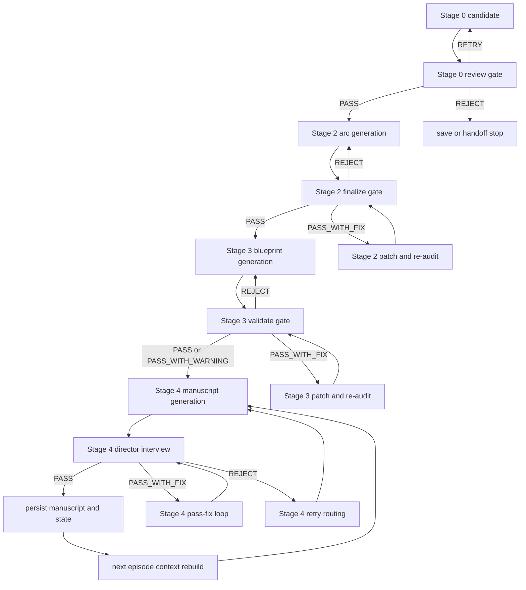
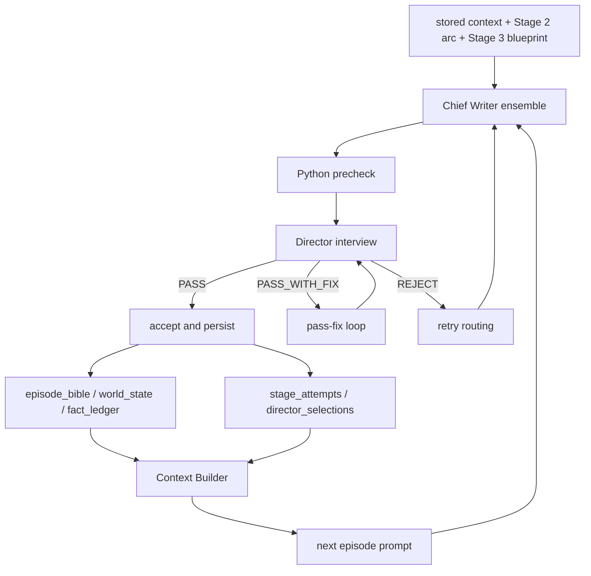
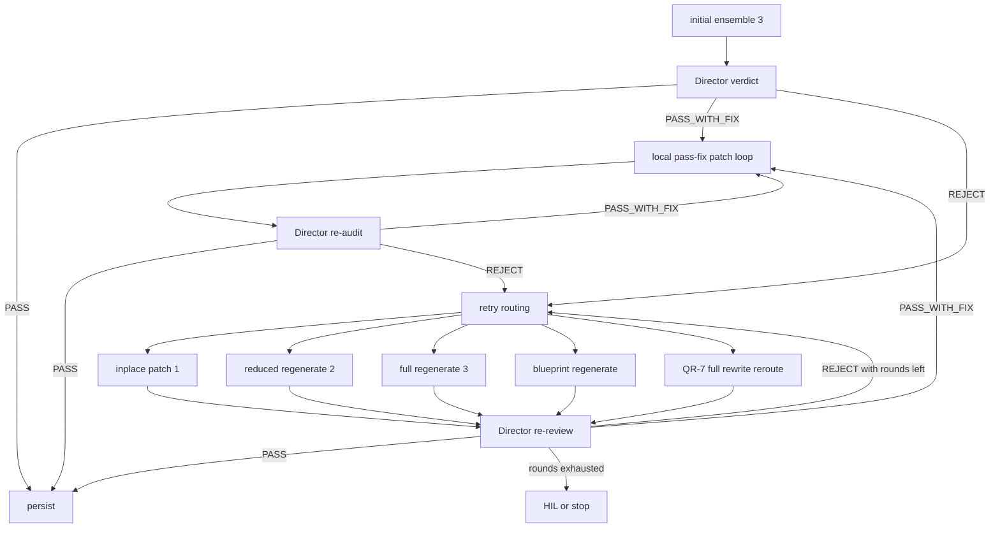
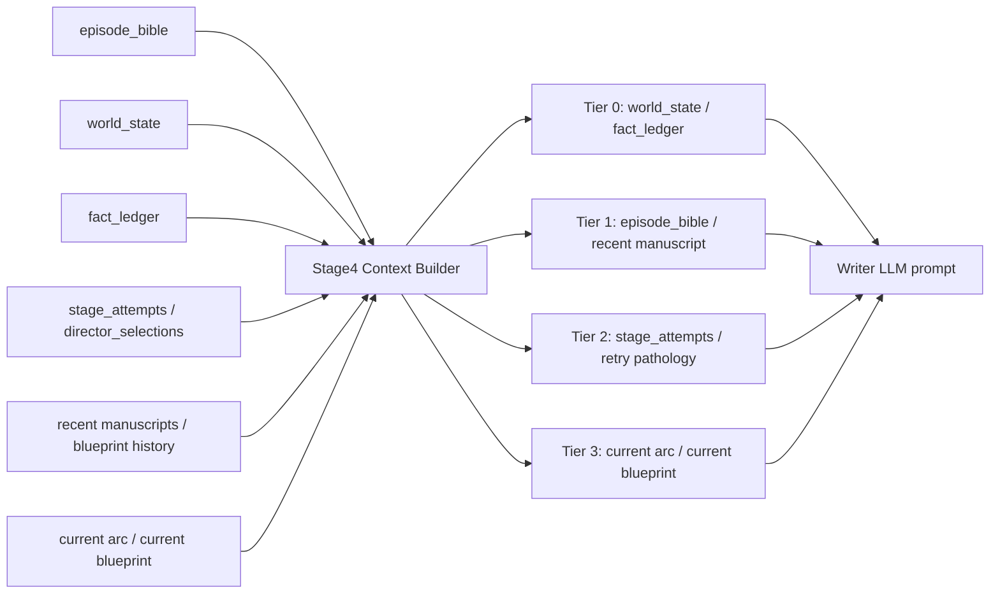

Date: 2026-03-31
Status: final (3-pass audited)
Document Type: human-facing compact briefing
Canonical Path: `docs/2026-03-31/geuldobi-pipeline-compact-human-brief.md`
Temp Mirror Path: none
Audience: short presentation / compact technical explanation
Scope:
- 글도비를 계층형 파이프라인으로 짧게 설명
- Writer LLM / Director LLM 역할 분리
- PASS/REJECT 루프와 수정 경로 요약
- DB 저장 후 컨텍스트 계층화 및 재주입 구조 요약
- 현재 주요 병목 3가지 정리
Excluded Scope:
- Stage 0/1/2/3/4 전체 세부 사양
- API/desktop control plane 상세
- narrative family 라우터 규칙
Evidence Basis:
- `modules/core/stage4_orchestrator.py`
- `modules/core/stage4_outcome_runtime.py`
- `modules/core/stage4_retry_runtime.py`
- `modules/core/stage4_interview_round.py`
- `modules/core/stage4_context_builder.py`
- `modules/core/stage4_post_pass_runtime.py`
- `modules/core/db_manager.py`
- `docs/2026-03-31/geuldobi-system-stage-architecture-report.md`
Additional Input Basis:
- operator-provided bottleneck observations from current reporting context
Side-Effect Coverage:
- file writes: not applicable
- DB writes: covered at summary level
- state mutation: covered at summary level
- rollback/retry: covered at summary level

# 글도비 컴팩트 브리프

## 1. 한 문장 정의

글도비는 Stage 0/2/3/4마다 save-handoff gate를 두는 계층형 파이프라인이고, 특히 Stage 4에서는 "글을 쓰는 LLM"과 "그 글을 심사하는 Director LLM"을 분리해 원고를 판정한다.

## 2. Stage 0-2-3-4 전체샷

이 다이어그램은 글도비의 실제 production topology를 판정 게이트까지 포함해 압축한 것이다. 중요한 점은 모든 스테이지가 단순 직렬 실행이 아니라, 각 단계마다 저장 전 판정 또는 handoff 차단 지점이 있다는 점이다.

- `Stage 0`
  기초 자산 생성 뒤 `review gate`와 `Stage 2 handoff gate`를 지난다. 엄밀히는 Stage 2~4처럼 Director 본심사가 아니라, save/handoff 적합성 review에 가깝다.
- `Stage 2`
  Arc 설계 뒤 finalize gate가 붙고, `PASS / PASS_WITH_FIX / REJECT`가 갈린다. `PASS_WITH_FIX`는 arc patch와 재감리를 탄다.
- `Stage 3`
  Blueprint 생성 뒤 Director-backed validate와 quality gate, 추가 precheck가 붙는다. `PASS_WITH_FIX`는 blueprint patch와 재감리를 탄다.
- `Stage 4`
  Writer 생성 뒤 Director interview가 붙는다. `PASS_WITH_FIX`는 accept branch 내부 patch loop로 흘러가고, `REJECT`는 retry routing으로 흘러간다.

## 3. Stage 4 Writer-Director 샷

핵심은 "생성"과 "판정"을 분리했다는 점이다. Chief Writer는 후보를 만들고, Python은 사전 검증과 라우팅을 맡고, Director는 최종 인터뷰와 선택, 수정 지시를 맡는다. 저장된 결과는 다시 다음 화 prompt의 입력으로 환류된다.

## 4. Stage 4 상세 루프

Stage 4 기준으로는 대체로 다음 순서다.

1. 첫 라운드에서는 Stage 3 Blueprint를 입력으로 Writer LLM이 기본적으로 `ensemble 3개` 후보를 만든다.
2. Python이 사전 검증을 수행하지만, 최종 REJECT 권한은 없다.
3. Director LLM이 `PASS`, `PASS_WITH_FIX`, `REJECT`를 판정한다.
4. `PASS`면 저장 후보가 된다. 다만 사후 검증에서 다시 REJECT로 내려갈 수 있다.
5. `PASS_WITH_FIX`면 accept branch 안에서 local patch와 재감리를 도는 `pass-fix loop`로 들어간다.
6. `REJECT`면 retry lane으로 들어간다.
7. retry lane에서는 `inplace patch(1)`, `reduced regenerate(2)`, `full regenerate(3)` 중 하나를 선택하고, 논리 오류가 누적되면 `단일 에피소드 Blueprint 재생성`으로도 올라간다.
8. 동일 pathology가 반복되면 local retry를 차단하고 `full rewrite reroute`로 올리며, Stage 4 기준 기본 5회 기회 소진 후에는 인간 개입 구간으로 넘긴다.

## 5. 수정 루트

글도비의 수정 루트는 스테이지마다 다르고, 같은 `PASS_WITH_FIX`라도 스테이지별 처리 방식이 다르다.

- `Stage 0`
  `PASS / RETRY / REJECT` 기반의 save-handoff review gate다. 통과하지 못하면 저장이나 다음 단계 handoff를 막는다.
- `Stage 2`
  `PASS / PASS_WITH_FIX / REJECT` 기반의 finalize gate다. `PASS_WITH_FIX`는 arc patch와 Director 재감리를 반복하고, 해결되지 않으면 REJECT로 떨어질 수 있다.
- `Stage 3`
  `PASS / PASS_WITH_FIX / PASS_WITH_WARNING / REJECT` 기반의 validate gate다. `PASS_WITH_FIX`는 blueprint patch와 재감리를 반복한다. quality gate나 dead-NPC precheck는 PASS를 다시 REJECT로 내릴 수 있다.
- `Stage 4`
  `PASS / PASS_WITH_FIX / REJECT` 기반의 manuscript gate다. `PASS_WITH_FIX`는 accept branch 내부 patch loop를 돌고, `REJECT`는 retry routing으로 들어간다.

- `inplace`
  국소 수정이다. 기존 산출물의 큰 틀은 유지하고, 명확한 오류 지점만 patch한다. Stage 2에서는 arc patch, Stage 3에서는 blueprint patch, Stage 4에서는 manuscript patch에 해당한다.
- `partial`
  부분 재작성이다. 단순 patch로 해결되지 않는 경우 일부 장면/전개/논리 블록만 다시 쓴다. Stage 4에서는 `quality_issue` 또는 `constraint_violation` 계열에서 선택 전략 중심의 `reduced regenerate`와 이어진다.
- `full`
  전면 재생성이다. patch 실패, `fix_scope=full`, 또는 반복 pathology 감지 시 `full regenerate` 또는 `full rewrite reroute`로 올라간다. 이 경우 기존 산출물을 보수하는 대신 거의 새로 다시 쓴다.
- `blueprint regenerate`
  원고만 다시 쓰는 것으로 수렴하지 않을 때는 Stage 3 쪽으로 역피드백을 올려 `단일 에피소드 Blueprint` 자체를 다시 만든다. 이후 Writer는 새 Blueprint를 기준으로 다시 생성하고 Director가 재검수한다.

피드백 흐름도 단순 코멘트가 아니다.

- Director 또는 stage review gate는 판정과 함께 다음 시도에 필요한 피드백과 수정 범위를 남긴다.
- runtime은 이 피드백이 local patch 가능한지 검증한다.
- local patch 계약이 성립하면 patch lane으로 간다.
- 제한된 범위에서 고쳐야 하는 경우에는 reduced regenerate나 stage-local patch loop로 간다.
- 계약이 성립하지 않거나 patch가 실패하면 full regenerate 쪽으로 올라간다.
- 논리 오류 누적이나 plateau 반복 시에는 상위 단계 재생성이나 full rewrite reroute로 escalation된다.

## 6. 저장 이후의 컨텍스트 재주입

글도비의 중요한 점은 PASS된 원고를 저장하고 끝내지 않는다는 것이다. 저장된 결과는 다음 화 생성 때 계층형 컨텍스트로 다시 조립된다.

즉 다음 화의 Writer LLM은 빈 상태에서 글을 쓰는 것이 아니라, 저장된 정합성 자산, 실패 이력, 현재 arc와 blueprint까지 함께 주입받는다. 이 구조가 연속성 유지에는 유리하지만, 동시에 컨텍스트 오염이 누적될 경우 상류의 오류가 하류 전 단계로 전염되는 원인이 되기도 한다.

## 7. 현재 주요 병목

- 최적화 문제
  Director-Writer 구조상 Director 기준에 맞는 원고가 바로 나오지 않는 경우가 많다. 현재 운영 관찰상 Writer LLM이 여러 차례 재생성해야 하는 구간이 발생하며, 이때 비용과 시간이 함께 증가한다.
- 안정화 문제
  파이프라인 간 암묵적 계약과 컨텍스트 계층화가 완전히 정규화되지 않아, Stage 간 오염이 발생하고 전파된다. 이 때문에 아직은 HIL이 완전히 빠지기 어렵다.
- 퀄리티 문제
  연속성과 정합성을 맞춘 원고라도 인간 선호 기준에서 재미, 문체, 흡입력이 떨어질 수 있다. 즉 "연속성 해결"과 "사람이 좋아하는 원고"가 자동으로 일치하지 않는다.

## 8. 발표용 결론

글도비는 단순 글쓰기 봇이 아니라, `설계 자산 -> Writer 생성 -> Director 판정 -> 저장 -> 컨텍스트 재주입`으로 이어지는 폐루프형 생산 시스템이다. 강점은 연속성과 추적 가능성이고, 현재의 핵심 과제는 retry 비용 절감, 컨텍스트 오염 제어, 인간 선호 품질의 안정화다.

## 9. Audit Record

- Pass 1 완료: Stage 0/2/3/4를 단순 직렬선으로 그리던 표현을 버리고, 각 스테이지의 gate와 retry 구조가 보이도록 문서 구조를 재정의했다.
- Pass 2 완료: Stage 0 review gate, Stage 2 finalize gate, Stage 3 validate gate, Stage 4 director interview를 코드 기준으로 다시 대조했다. 특히 Stage 4의 `PASS_WITH_FIX`가 reject lane이 아니라 accept branch 내부 patch loop라는 점을 반영했다.
- Pass 3 완료: 전체샷, Stage 4 macro, Stage 4 상세 루프, 컨텍스트 재주입 머메이드를 모두 다시 그렸고, Stage 0은 Director gate가 아니라 review/handoff gate라는 점을 명시해 과장을 제거했다.
- Confidence: 98%
