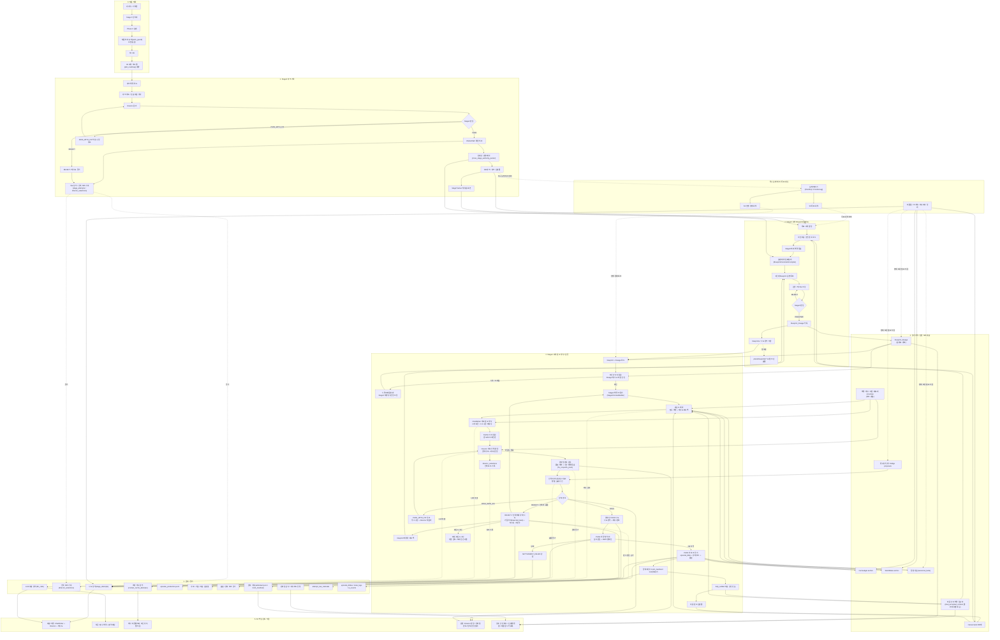

# AX 검토용 시스템 구성도

작성일: 2026-04-30
상태: 3pass 패킷 감리 완료 제출본
연결 이슈: GitHub #145, "AX팀 제공 자료 제작 및 3pass 감리"
근거 문서:
- `docs/2026-04-30/ax-bottleneck-deepdive-survey.md`
- `docs/2026-04-30/ax-long-memory-continuity-standards-survey.md`

## 목적

이 문서는 AX개발팀의 LLM pipeline 검토를 위한 시스템 구성도 요약본입니다.

아래 항목은 의도적으로 제외했습니다.

- 원문 프롬프트
- 원고 전문
- 비밀성 로컬 설정
- 비식별화되지 않은 `llm_io` payload

문서의 초점은 pipeline 구조, 권한 경계, 장기기억/연속성 계층, 비용/응답지연 검토 지점입니다.

## 전체 구성

아래 그림은 세로형으로 읽는 것을 전제로 한 고밀도 구성도입니다. AX팀이 비용/응답지연/토큰 병목을 보기 쉽도록 `LLM 호출이 큰 구간`, `권한이 갈라지는 구간`, `DB/로그/산출물 증거가 남는 구간`을 한 장 안에 같이 배치했습니다.

### 별도 PDF 구성도

| 용도 | 파일 |
| --- | --- |
| 빠른 설명용 생략본 | `docs/2026-04-30/ax-system-architecture-diagram.pdf` |
| 전체 상세 한 장 | `docs/2026-04-30/ax-system-architecture-diagram-full-detail.pdf` |
| S0 재료 정리 확대판 | `docs/2026-04-30/ax-stage0-flow.pdf` |
| S2 아크 기획 확대판 | `docs/2026-04-30/ax-stage2-flow.pdf` |
| S3 회차 설계도 확대판 | `docs/2026-04-30/ax-stage3-flow.pdf` |
| S4 원고 생성/검증 확대판 | `docs/2026-04-30/ax-stage4-flow.pdf` |



### 다이어그램 읽는 법

- 왼쪽 위에서 아래로 내려가는 주 흐름이 `작품 재료 -> Stage2 -> Stage3 -> Stage4 -> 정착 처리`입니다.
- `특수 실행 제어 / 목표 계산`은 핵심 단계축이 아니라 어느 회차까지 Stage3/Stage4를 진행할지 계산하는 보조 실행 기능입니다. 기본 설명은 S0/S2/S3/S4 기준으로 읽으면 됩니다.
- 오른쪽 `장기기억 / 권한 보조 계층`은 최종 진실을 저장하거나 다음 회차 맥락에 주입되는 계층입니다.
- `final_accepted_context`는 물리 테이블이 아니라 `manuscripts`와 `stage_attempts`를 최종 승인/정착 기준으로 읽는 접근자입니다.
- `관측 / 증거`는 판단자가 아니라 사후 검증과 비용/응답지연 분석을 위한 증거 계층입니다.
- 점선 화살표는 보조 증거, 참조 산출물, 또는 현재 보강 필요 지점이 있는 경계입니다.
- `AX 핵심 검토 지점`은 AX팀이 우선 볼 병목 후보입니다. 특히 ChiefWriter/Director LLM 호출, 재시도 루프, 맥락 캐시 최신성, 최종 승인 산출물 연결이 핵심입니다.
- Director 판정은 의미 판단 권한이지만, Stage4의 `PASS/PWF`는 런타임 경로 판정, 선택 후 점검, PWF 재감리, PASS 후 정착 처리를 모두 통과하기 전까지 임시 판정입니다.
- `director_selections`, `llm_calls`, 맥락 캐시 기록은 중요한 관측 증거지만 최종 정본은 아닙니다.

### 다이어그램 근거 앵커

| 영역 | 대표 anchor |
| --- | --- |
| Stage0 / Stage2 진입 / 목표 회차 계산 | `modules/core/stage0_handoff.py`, `modules/core/stage2_orchestrator.py`, `main_a.py` |
| Stage2 확정 처리 / PWF / cross-stage packet | `modules/core/stage2_finalizer.py`, `modules/core/stage2_contracts.py` |
| Stage3 맥락 묶음 / blueprint / lineage | `modules/core/stage3_envelope_builder.py`, `modules/core/stage3_orchestrator.py`, `modules/core/blueprint_lineage.py`, `modules/domain/agents/blueprint_constraint_compiler.py` |
| Stage4 오케스트레이션 / 면담 / 재시도 / 경로 | `modules/core/stage4_orchestrator.py`, `modules/core/stage4_interview_round.py`, `modules/core/stage4_retry_runtime.py`, `modules/core/stage4_runtime_route.py` |
| Stage4 맥락 / 선택 후 점검 / 정착 | `modules/core/stage4_context_builder.py`, `modules/core/stage4_director_runtime.py`, `modules/core/stage4_postselect_runtime.py`, `modules/core/stage4_reject_runtime.py`, `modules/core/stage4_post_processor.py`, `modules/core/stage4_truth_manifest.py`, `modules/core/stage4_outcome_runtime.py` |
| 장기기억 / 권한 보조 계층 | `modules/core/final_accepted_context.py`, `modules/core/fact_ledger.py`, `modules/core/world_state.py`, `modules/core/frontier_staleness.py` |
| DB / 관측 스키마 | `modules/core/db_bootstrap_runtime.py`, `modules/core/db_manager.py`, `modules/core/artifact_logging.py`, `modules/core/session_memory_envelope.py` |
| 되돌림 / 카나리아 정리 | `modules/core/services/project_service.py`, `modules/core/stage4_canary_tools.py` |

## 주요 런타임 블록

| 블록 | 역할 | 현재 권한 수준 |
| --- | --- | --- |
| 작품 재료 입력 | 작품 설정, TR/BI, 프로젝트 설정, 이전 산출물 | 상위 입력 재료. 최종 회차 진실은 아님 |
| Stage2 | 아크 단위 기획과 전술 흐름 | 기획 권한. 시간이 지나면 stale 가능 |
| Stage3 | 회차별 blueprint 생성과 검증 | Stage4 이전의 blueprint 권한 |
| Stage4 ChiefWriter | 회차 원고 후보 생성 | 초안 생산자. 최종 판정자는 아님 |
| Director | 의미 품질과 서사 판단 | 핵심 LLM 판단 권한 |
| 런타임 관문 | 결정론적 경로 정규화와 하드 체크 | Director의 임시 긍정 판정을 하향 조정할 수 있음 |
| 선택 후 점검 | 후보 선택 뒤 연속성/히스토리 충돌 탐지 | 실패 우선 안전 계층 |
| 정착 처리 | 최종 승인 원고와 보조 증거 정착 | 정착 완료 시 해당 회차의 최종 권한 |
| 관측 / 증거 | DB/로그/산출물 증거 | 진단 권한. 서사 판단자는 아님 |

## 권한 모델

글도비는 의미 판단과 런타임 통제를 분리합니다.

```text
Director 의미 판정
  -> 런타임 경로 판정
  -> 선택 후 연속성 판정
  -> 정착/최종 승인 판정
```

이 분리는 방향 자체는 맞습니다. 다만 현재 운영자가 보기에는 혼란이 생길 수 있는 지점이기도 합니다. 예를 들어 Director가 긍정 판정을 냈더라도 런타임/선택 후 관문에서 REJECT로 하향될 수 있습니다.

AX 검토 질문:

- 모든 attempt에 `director_verdict`, `runtime_route_verdict`, `post_select_verdict`, `settled_verdict`를 1급 필드로 분리해 노출하는 것이 맞는가?

## 장기기억 및 연속성 계층

| 계층 | 현재 표면 | 검토 메모 |
| --- | --- | --- |
| 정본 / 불변 사실 | FactLedger, WorldState, `canonical_facts` | 제공사 메모리보다 우선해야 함 |
| 최종 승인 진실 | `final_accepted_context`, manuscripts, `stage_attempts` | 내용 해시 / 산출물 연결 강화 필요 |
| Blueprint 최신성 | `blueprint_lineage`, 진행 경계 최신성 점검 | 현재는 DB 보조 계층이 JSON metadata보다 우선 |
| 연속성 투영 | authoritative continuity projection, continuity packet | 구조화된 보조 계층. 최종 판정은 아님 |
| 재시도/세션 보조 계층 | `session_memory_envelope` | 재현에는 유용하지만 정본은 아님 |
| 맥락 캐시 | `context_cache_attempts`, 캐시 토큰 지표 | 비용/응답지연 보조 계층. 연속성 권한은 아님 |

## 현재 강점

- 장기기억을 단일 제공사 메모리에 맡기지 않고 계층화했습니다.
- `final_accepted_context`가 많은 임시/거절 row 유입을 차단합니다.
- Stage3 blueprint lineage가 DB 보조 계층에 저장됩니다.
- 선택 후 충돌 점검이 임시 PASS/PWF를 하향 조정할 수 있습니다.
- 맥락 캐시와 세션 메모리 관측값이 존재합니다.
- 감독형 실행 기준 15화 draft chain을 생성한 실적이 있습니다.

## 현재 구조 리스크

추가 조사에서 확인한 고가치 보강 항목입니다.

1. 최종 승인 접근자 예외 상황에서 원고 원본 row로 대체 읽기(fallback)할 가능성이 남아 있습니다.
2. final accepted context가 아직 최종 Stage4 attempt의 `content_hash` / `artifact_path`와 원고 내용을 강하게 대조하지 않습니다.
3. 되돌림/초기화가 `blueprint_lineage`, `canonical_facts`, `continuity_bridge_proposals` 같은 권한 보조 계층을 모두 정리/무효화하지 않습니다.
4. 진행 경계 최신성 의미 점검이 현재 관측된 WTI/investment 계열 실패 패턴에 좁게 맞춰져 있습니다.
5. Stage4 권한 우선순위가 타입화된 우선순위 명세가 아니라 프롬프트 삽입/서술문 중심으로 강제됩니다.

## AX 검토 초점

아래 항목에 대한 검토를 요청드립니다.

- 장기 실행 LLM 글쓰기 시스템에서 현재 권한 계층이 타당한지
- 제공사 메모리/캐시를 정본이 아니라 보조 계층으로만 두는 방향이 맞는지
- 현재 캐시/세션 관측값으로 비용과 품질 영향을 증명하기에 충분한지
- 최종 승인 맥락에 더 강한 산출물/해시 연결이 필요한지
- 반복 장기 생산에서 되돌림/최신성 경계가 충분한지

## 패킷 3pass 감리

1차 - 구조:

- AX팀이 요청한 시스템 구성도 범위를 포함합니다.
- 비식별화된 시스템 구성도와 표만 사용합니다.
- 병렬 딥다이브 결과를 반영해 핵심 기준축은 `재료 계약 -> Stage2 -> Stage3 -> Stage4 -> 정착 처리 -> 보조 계층/증거`로 재구성했습니다. OneStop/FrontierLag는 특수 실행 제어로 분리했습니다.
- 원고 전문과 원문 프롬프트는 포함하지 않습니다.

2차 - 근거:

- 두 개의 2026-04-30 AX 원천 조사 문서를 근거로 작성했습니다.
- 포함된 실코드 리스크 항목은 원천 조사 작성 시점에 재확인되었습니다.
- Stage2/Stage3/Stage4 인계, Stage4 권한/재시도/정착 처리, 메모리/캐시/관측 계층을 별도 읽기 전용 조사로 재대조했습니다.
- 장기 실행 문제가 완전히 해결됐다고 주장하지 않습니다.

3차 - 실행 가능성:

- AX 파이프라인/비용/응답지연 검토에 사용할 수 있도록 질문을 구체화했습니다.
- 권한 리스크와 문장 폴리싱 이슈를 분리했습니다.
- Director 의미 판정, 런타임 경로, 선택 후 점검, fully-settled 최종 진실이 한 그림 안에서 구분되도록 수정했습니다.

추정 확신도: 95%
