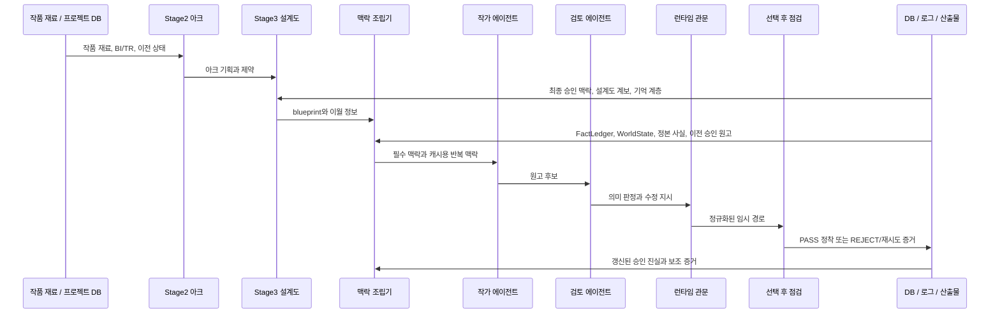

# AX 검토용 주요 데이터 흐름

기준일: 2026-04-30

## 목적

이 문서는 AX개발팀 검토를 위해 글도비의 주요 데이터 흐름을 설명합니다.

핵심 목적은 S4 실제 원고 단계에서 연속성 오류와 선택 후 충돌이 어느 경로에서 생기는지, 그리고 어떤 검증을 더 앞단으로 옮기면 비용과 재시도를 줄일 수 있는지 확인하는 것입니다.

특히 아래 지점에 초점을 둡니다.

- S4 연속성 오류와 선택 후 충돌이 생기는 구간
- 토큰이 많이 쓰이는 구간
- 응답 지연이 누적되는 구간
- 재시도가 늘어나는 구간
- 메모리/캐시가 개입하는 구간
- 최종 권한 검증이 이뤄지는 구간

원문 프롬프트, 원고 전문, 비밀성 로컬 자료는 제외했습니다.

## 기본 데이터 흐름



## Stage4 시도 흐름

1. Stage4가 특정 회차 시도를 시작합니다.
2. 맥락 조립기가 아래 재료를 조립합니다.
   - blueprint
   - 이전 최종 승인 원고 맥락
   - FactLedger / WorldState / 정본 사실(canonical facts)
   - 연속성 투영
   - 작품 정체성과 장르 제약
   - 검색/맥락 패킷
3. 맥락 캐시가 생성, 적중, 건너뜀, 우회 중 하나로 기록됩니다.
4. 작가 에이전트(ChiefWriter)가 하나 이상의 원고 후보를 생성합니다.
5. 검토 에이전트(Director)가 후보를 검토하고 의미 판정/수정 지시를 냅니다.
6. 런타임이 경로를 정규화합니다.
   - 품질 하한
   - PASS_WITH_FIX 계약 유효성
   - 거절 경로
   - 재시도/수정 범위
7. 후보가 임시 선택된 뒤 선택 후 점검이 실행됩니다.
8. 충돌이 발견되면 임시 긍정 결과도 REJECT로 하향될 수 있습니다.
9. PASS/PWF 정착 처리가 최종 증거와 승인 맥락을 기록합니다.
10. 재시도 루프는 이전 시도 증거를 소비해 전체 재작성 또는 부분 수정으로 이어집니다.

## 저장 및 관측 흐름

| 저장소 / 증거 배출구 | 기록 내용 | AX 검토 관련성 |
| --- | --- | --- |
| `stage_attempts` | 시도 판정, 실패 범주, 보조 경고, 모델, 소요 시간, 산출물 경로 | 재시도와 권한의 핵심 장부 |
| `director_selections` | 과거 검토 에이전트 선택 보조 행 | 참고용. 최종 권한은 아님 |
| `manuscripts` | 승인된 회차 본문 행 | 최종 시도 해시/산출물과 일치해야 함 |
| `blueprints` | Stage3 설계도 데이터 | Stage4 이전 기획 권한 |
| `blueprint_lineage` | 이전 승인 원고 해시/출처 정보 | 최신성 권한 |
| `canonical_facts` | 수치/이월 사실 | 정본에 가까운 구조화 사실 |
| `context_cache_attempts` | 캐시 생성/적중/건너뜀/오류 관측값 | 비용/응답지연/캐시 정책 근거 |
| `llm_calls` | 모델 호출 토큰, 캐시 토큰, 소요 시간, 비용 추정 | 토큰/비용/응답지연 근거 |
| `episode_production.jsonl` | 런타임 이벤트와 재시도 병리 | 운영 타임라인 |
| 산출물 트리 | 후보/최종/거절 산출물과 보조 증거 | 심층 포렌식 증거 |

## 현재 핵심 병목 경로

### 1. 선택 후 충돌 경로

현재 Stage4 수렴성에서 가장 큰 신호로 관측된 경로입니다.

```text
작가 에이전트 후보
  -> 검토 에이전트 긍정 또는 수정 가능 판정
  -> 런타임 임시 경로
  -> 선택 후 연속성/히스토리 점검
  -> 충돌 발견
  -> 임시 PASS/PWF 하향
  -> 재시도/전체 재작성 증거 저장
```

AX 검토 질문:

- 전체 원고 생성과 검토 에이전트 평가 비용을 지불하기 전에 일부 선택 후 점검을 더 앞단으로 이동할 수 있는가?

### 2. 최종 승인 맥락 경로

```text
정착 완료된 Stage4 시도
  -> 원고 행
  -> 최종 승인 맥락 접근자
  -> 이후 Stage3/Stage4 맥락
```

현재 우려:

- 접근자가 많은 비최종 행을 차단하지만, 원고 행과 최종 Stage4 시도 사이의 해시/산출물 연결이 더 강해져야 합니다.

### 3. 설계도 계보 경로

```text
이전 승인 원고
  -> Stage3 생성 시 해시 캡처
  -> DB 설계도 계보 보조 계층
  -> Stage4 진행 경계 최신성 점검
```

현재 우려:

- JSON metadata 단독보다 나아졌지만, 되돌림과 보조 계층 무효화 경계는 아직 보강이 필요합니다.

### 4. 캐시 / 세션 보조 계층 경로

```text
안정적이거나 반복되는 맥락
  -> 맥락 캐시 생성/적중/건너뜀/오류
  -> 캐시 토큰 관측값
  -> 세션 메모리 envelope
  -> 재시도/맥락 재현
```

현재 우려:

- 캐시/세션 증거는 사용량과 계산 근거는 보여주지만, 품질 개선이나 오래된 소스 억제의 인과효과를 아직 증명하지는 못합니다.

## AX팀에 우선 공유할 데이터

초기 검토에서는 집계값과 보조 증거 위주 공유를 권장합니다.

- 회차별 시도 수
- 관문별 실패 범주 집계
- agent/model별 LLM 호출 집계
- 캐시 토큰 비중
- 캐시 결과 분포
- 최종 승인 맥락 상태
- 설계도 계보 해시/출처 상태
- 연속성 카나리아 상태
- 필요 시 비식별화된 산출물 진실 샘플

기본 공유에서 제외할 데이터:

- 원문 프롬프트
- 원고 전문
- 비식별화되지 않은 LLM 입출력 원본 로그
- 로컬 인증 정보 또는 비밀 설정
- 원본 로컬 프로젝트 DB

## 검토 질문

1. 어떤 검사를 비싼 작가/검토 에이전트 호출 전에 배치해야 하는가?
2. API 응답지연과 재시도/연속생성/캐시 부하를 분리하려면 어떤 관측값이 더 필요한가?
3. 오래된 소스 억제를 증명하려면 어떤 캐시 계보 필드가 필요한가?
4. 선택 후 충돌은 항상 전체 재작성으로 가야 하는가, 아니면 하위 유형별로 더 싼 경로가 가능한가?
5. 원고 전문 없이 비용/지연 진단을 하려면 AX팀에 필요한 최소 비식별 패킷은 무엇인가?
