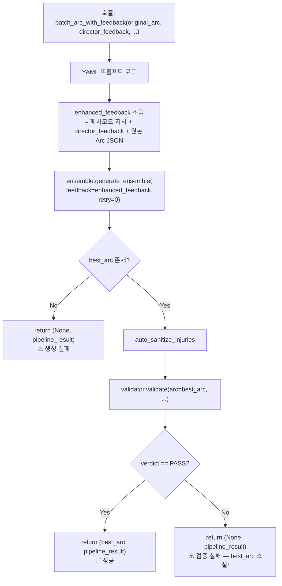
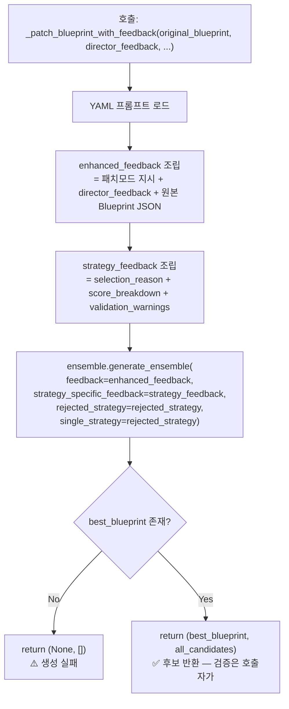
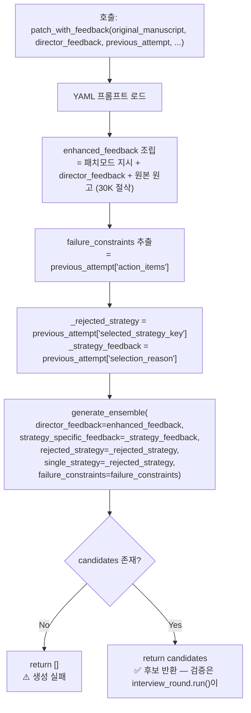

# 패치 모드 추가 재시도 확장 — 상세 구현 계획

> **목적**: 패치 실패 시 즉시 폴백(전면 재생성)하던 것을 **최대 3번 추가 패치**한 뒤 폴백하도록 변경.
> **실행**: 이 문서의 코드를 그대로 적용. 실행은 별도 opus 에이전트에게 위임.

---

## 1. 현재 vs 변경 후 흐름

```
[Before]  패치 1번 → 실패 → 즉시 전면 재생성 폴백

[After]   패치 1번 → 실패 → 패치 2번 → 실패 → 패치 3번 → 실패 → 패치 4번 → 실패 → 전면 재생성 폴백
                    (1 + MAX_PATCH_RETRIES = 총 4번 패치 기회)
```

---

## 2. 피드백 전달 경로 심층 분석

### 2.1 Stage 2 — `patch_arc_with_feedback` 내부 흐름



> [!CAUTION]
> **핵심 문제**: L584-586에서 검증 실패 시 `return None, pipeline_result` — 생성된 Arc를 **버림**.
> 추가 패치를 구현하려면 **검증 실패해도 Arc를 반환**해야 다음 패치의 베이스로 사용 가능.
> `validation_result`에 `feedback` 필드가 있지만 현재 `pipeline_result`에 포함되지 않음.

**피드백 경로 상세:**

| 변수 | 내용 | 소스 |
|------|------|------|
| `director_feedback` (파라미터) | 외부 피드백 (Validator REJECT 사유) | `generate()` L396 `_prev_reject_feedback` |
| `enhanced_feedback` (L504-513) | 패치 지시 + 원본 Arc + director_feedback 합성 | 내부 조립 |
| `feedback` → `generate_ensemble()` | `enhanced_feedback`가 그대로 전달 | L527 |
| `validation_result["feedback"]` | 검증 실패 피드백 | `validator.validate()` 반환 |
| **⚠️ 유실 지점** | 검증 실패 피드백이 호출자에게 전달되지 않음 | L584-586 `return None` |

### 2.2 Stage 3 — `_patch_blueprint_with_feedback` 내부 흐름



> [!NOTE]
> Stage 3 패치는 **내부 검증을 하지 않음**. 패치 후보를 반환하면 호출자(`generate()`)의 Phase 3에서 Director 검증을 수행.
> 따라서 "패치 생성은 성공했지만 검증 실패" 케이스는 **이 메서드 안에서 발생하지 않음**.
> 패치 재시도가 필요한 건 **생성 자체 실패(`None` 반환)** 케이스뿐.

**피드백 경로 상세:**

| 변수 | 내용 | 소스 |
|------|------|------|
| `director_feedback` (파라미터) | Director REJECT 피드백 | `generate()` L383 `_prev_reject_feedback` |
| `rejected_strategy` (파라미터) | 탈락 전략 이름 | `generate()` L384 `_prev_reject_strategy` |
| `selection_reason` (파라미터) | 선택/거절 사유 | `generate()` L390-393 |
| `score_breakdown` (파라미터) | 점수 분해 | `generate()` L385-389 |
| `validation_warnings` (파라미터) | 검증 경고 리스트 | `generate()` L395-404 |
| `enhanced_feedback` (L515-520) | 위 요소들의 합성 | 내부 조립 |
| `strategy_feedback` (L504-513) | selection_reason + score + warnings 합성 | 내부 조립 |
| → **모든 피드백이 generate_ensemble에 전달됨** ✅ | | |

### 2.3 Stage 4 — `chief_writer.patch_with_feedback` 내부 흐름



> [!NOTE]
> Stage 4도 Stage 3처럼 **내부 검증 없음**. 후보를 반환하면 `interview_round.run()`이 Python 검증 + Director 면담을 수행.
> 패치 재시도가 필요한 건 **생성 자체 실패(빈 리스트 반환)** 케이스뿐.

**피드백 경로 상세:**

| 변수 | 내용 | 소스 |
|------|------|------|
| `director_feedback` (파라미터) | Director REJECT 후 누적된 피드백 | `interview_round.py` L744-746 |
| `original_manuscript` (파라미터) | REJECT된 원본 원고 | `previous_attempt["best_manuscript"]` (L801) |
| `previous_attempt` (파라미터) | 이전 라운드 전체 정보 dict | `interview_round.py` L794-808 |
| `previous_attempt["action_items"]` | Director의 구체적 개선 지시 | Director 판정 결과 |
| `previous_attempt["selected_strategy_key"]` | 탈락 전략 키 | Director 선택 결과 |
| `previous_attempt["selection_reason"]` | 선택/거절 사유 | Director 판정 결과 |
| → **`previous_attempt`는 interview round 단위로 갱신** | 패치 재시도 루프 안에서는 동일한 값 사용 | |

> [!IMPORTANT]
> Stage 4 `patch_with_feedback`의 `previous_attempt` 파라미터는 **interview_round.run() 시작 시 이미 확정**된 값.
> 패치를 여러 번 재시도해도 `previous_attempt` 내용은 변하지 않음 — 이것은 **의도된 동작**.
> 패치 재시도에서 바뀌는 건 없고, 단순히 "같은 지시로 다시 생성"하는 것.

---

## 2.5. Stage 2 구조적 문제 — Director 부재

> [!CAUTION]
> **Stage 2의 `generate()` 및 `patch_arc_with_feedback()` 내부에는 Director(LLM)가 없다.**
> Phase 3 검증이 `UnifiedArcValidator` (Python) 단독으로 수행됨.
> Stage 3은 `validator.validate(director=director)` 로 Director가 참여하지만, Stage 2는 그렇지 않음.

### 현재 Stage별 검증 구조 비교

```
Stage 2 generate() Phase 3:
  self.validator.validate(arc=best_arc, prev_arcs=..., constraints=..., state_tracker=...)
  → Python만. Director 없음. ❌

Stage 3 generate() Phase 3:
  self.validator.validate(blueprint=..., director=director, all_candidates=...)
  → Director 비교 선택 + 최종 판정. ✅

Stage 4 interview_round:
  director.select_and_judge_ensemble(candidates=...)
  → Director 직접 면담. ✅
```

### 영향

1. **패치 재시도 피드백 출처**: 현재 플랜의 재시도 피드백은 Python validator에서 옴. Director 피드백이 아님.
2. **non-patch 흐름도 동일**: 패치뿐 아니라 일반 생성도 generate() 내부에서는 Python 검증만 거침.
3. **Director 평가 시점**: Stage 2 오케스트레이터 레벨(`stage2_finalizer.py` L133)에서 `director.audit_strategic_plan()` 호출.

### 해법 — 기존 `audit_strategic_plan()` 재활용

**신규 메서드 불요.** Director에 이미 Arc 품질 평가 메서드가 존재:

```python
# director.py L167 (→ director_auditor.py L681 위임)
director.audit_strategic_plan(
    arc_plan=best_arc,             # Arc dict
    prev_arc_context="...",        # 이전 Arc 요약 텍스트
    curr_block=curr_block,         # 현재 블록
    protagonist_name="주인공",
    entity_registry={...},
    story_context="",              # 생략 가능
)
# 반환: {"decision": "PASS"|"REJECT", "score": int, "reason": str, "re_slice_instruction": str}
```

`patch_arc_with_feedback` 내부에서 필요한 파라미터는 **전부 이미 보유**:
- `prev_arcs` → `self._generate_prev_context(prev_arcs, {})` 호출로 텍스트 변환
- `curr_block`, `protagonist_name`, `entity_registry` → 파라미터로 받음

> [!NOTE]
> `stage2_finalizer.py` L133에서도 `audit_strategic_plan()`을 호출하므로, 내부 패치 루프에서 PASS된 Arc도
> 오케스트레이터 레벨에서 한 번 더 평가받음. **이중 평가는 의도적** — 내부 평가는 재시도 피드백 품질용,
> 외부 평가는 최종 품질 게이트. 비용 대비 피드백 품질 향상이 핵심 가치.

### 구현 — Section 3에 통합

아래 Section 3의 Stage 2 diff에 Director 주입 코드가 **모두 포함**됨:
- 변경 0a: `generate()` 시그니처에 `director=None` 추가
- 변경 0b: `patch_arc_with_feedback()` 시그니처에 `director=None` 추가
- 변경 1: 내부 검증을 Python + Director 이중 구조로 변경
- 변경 2: 재시도 루프에서 `director=director` 전달
- Preflight: 호출자에서 `director=self.ctx.agents.get("director")` 주입

---

## 2.6. Pre-existing Bug — `adversarial_self_play` 파라미터 불일치

> [!CAUTION]
> `stage2_preflight.py` L526에서 `patch_arc_with_feedback(adversarial_self_play=...)` 전달하지만,
> `patch_arc_with_feedback` 시그니처(L428-445)에 해당 파라미터가 **없음**.
> `*` (keyword-only) 강제이므로 **TypeError 크래시** 발생.
> `generate()` L127에는 `adversarial_self_play=None` 존재하지만 `patch_arc_with_feedback`에는 누락.

**원인**: 커밋 `592f27a`에서 `generate()` 호출에 `adversarial_self_play` 추가 시, preflight의
`patch_arc_with_feedback` 호출에도 추가했으나 메서드 시그니처 갱신 누락.

**수정**: 변경 0b에서 `adversarial_self_play=None` 파라미터를 시그니처에 추가.

---

## 2.7. 최악 시나리오 LLM 호출 수 분석

패치 재시도 루프가 기존 재시도 루프 **내부에** 중첩되므로 곱셈 효과 발생.

### Stage별 최악 LLM 호출 수

| Stage | 외부 루프 | 내부 retry | 패치 재시도 | 최악 패치 호출 | Director 포함 |
|-------|----------|-----------|-----------|-------------|-------------|
| **Stage 2** | attempt=5 | retry=3 | patch=4 | 5×3×4=**60** | 60×2=**120** |
| **Stage 3** | — | retry=3 | patch=4 | 3×4=**12** | Director는 외부 Phase 3에서 |
| **Stage 4** | interview=5 | — | patch=4 | 5×4=**20** | Director는 외부 면담에서 |

> [!WARNING]
> **Stage 2의 60회(LLM 120회)는 현재 3회(LLM 3회) 대비 40배.** 실제로는 대부분 1-2회 패치로 성공하거나
> 조기 폴백하므로 최악 시나리오에 도달할 확률은 극히 낮음. 그러나 안전장치가 필요:
>
> - 패치 재시도는 `generate()` 내부 retry 루프의 **첫 번째 retry에서만** 발동 (retry≥1 조건)
> - 실제 최악: attempt(5) × patch(4) = **20회** (retry는 패치 실패 시 전면 재생성으로 전환)
> - `PassRateMonitor`가 `is_patch`, `patch_fallback` 메트릭을 이미 추적 중 — 별도 변경 불요

---

## 3. Stage별 수정 전략

### ⚠️ Stage 2 — Director 주입 + 반환값 변경 + 재시도 루프 (가장 복잡)

4개 변경이 필요. 순서대로 적용:
- 변경 0a: `generate()` 시그니처에 `director=None` 추가
- 변경 0b: `patch_arc_with_feedback()` 시그니처에 `director=None` + `adversarial_self_play=None` 추가
- 변경 1: `patch_arc_with_feedback` 내부 검증을 Python + Director 이중 구조로 변경 + 반환값 변경
- 변경 2: `generate()` 패치 블록을 재시도 루프로 변경 + `director` 전달

#### [MODIFY] [four_phase_arc_generator.py](file:///c:/Users/User/Desktop/글도비/modules/domain/agents/four_phase_arc_generator.py)

**변경 0a: `generate()` 시그니처에 Director 추가 (L121-128)**

```diff
     def generate(
         self,
         arc_no: int,
         ep_start: int,
         vol_strategy: str,
         curr_block: dict,
         prev_arcs: list[dict],
         assets: dict = None,
         max_internal_retries: int = 2,
         protagonist_name: str = "주인공",
         director_feedback: str = "",
         entity_registry: dict = None,
         state_tracker=None,
         vector_context: str = "",
         adversarial_self_play=None,
+        director=None,  # [PatchRetry] Director 참조 — 패치 루프 내 LLM 판정용
     ) -> tuple[dict | None, dict]:
```

**변경 0b: `patch_arc_with_feedback()` 시그니처 변경 (L428-445)**

```diff
     def patch_arc_with_feedback(
         self,
         *,
         original_arc: dict,
         director_feedback: str,
         attempt_number: int,
         arc_no: int,
         ep_start: int,
         vol_strategy: str,
         curr_block: dict,
         prev_arcs: list[dict],
         assets: dict = None,
         protagonist_name: str = "주인공",
         entity_registry: dict = None,
         state_tracker=None,
         vector_context: str = "",
+        adversarial_self_play=None,  # [BugFix] 2.6절 — preflight 호출 시 전달되나 시그니처 누락
+        director=None,  # [PatchRetry] Director 참조 — LLM 판정용
     ) -> tuple[dict | None, dict]:
```

**변경 1: `patch_arc_with_feedback` 내부 검증 변경 (L564-586)**

```diff
-        verdict, validation_result = self.validator.validate(
+        # [PatchRetry] Python 검증 (advisory) — 구조 체크만
+        _py_verdict, _py_result = self.validator.validate(
             arc=best_arc,
             prev_arcs=prev_arcs,
             constraints=full_constraint_block,
             state_tracker=state_tracker,
             pre_collected_items=_pre_items,
             pre_collected_grants=_pre_grants,
         )

         pipeline_result["phases"]["validate"] = {
             "status": "complete",
-            "verdict": verdict,
-            "issues_count": len(validation_result.get("issues", [])),
+            "verdict": _py_verdict,
+            "issues_count": len(_py_result.get("issues", [])),
         }

-        if verdict == "PASS":
-            pipeline_result["final_verdict"] = "PASS"
-            logging.info(f"✅ [Patch Mode] Arc {arc_no} 패치 성공")
-            return best_arc, pipeline_result
-
-        logging.warning(f"⚠️ [Patch Mode] Arc {arc_no} 패치 검증 실패 → 폴백 필요")
-        pipeline_result["final_verdict"] = "FAILED"
-        return None, pipeline_result
+        # [PatchRetry] Director가 최종 판정 (있을 때만 — 없으면 Python 폴백)
+        if director:
+            try:
+                _prev_ctx = self._generate_prev_context(prev_arcs, {})
+                _dir_result = director.audit_strategic_plan(
+                    best_arc, _prev_ctx,
+                    curr_block=curr_block,
+                    protagonist_name=protagonist_name,
+                    entity_registry=entity_registry,
+                )
+                verdict = _dir_result.get("decision", _py_verdict)
+                _dir_feedback = _dir_result.get("reason", "")
+                _dir_instruction = _dir_result.get("re_slice_instruction", "")
+                validation_feedback = f"{_dir_feedback}\n{_dir_instruction}".strip()
+                pipeline_result["director_score"] = _dir_result.get("score", 0)
+            except Exception as _dir_err:
+                logging.warning(f"[PatchRetry] Director 평가 실패 → Python 폴백: {_dir_err!s:.80}")
+                verdict = _py_verdict
+                validation_feedback = _py_result.get("feedback", "검증 실패")
+        else:
+            verdict = _py_verdict
+            validation_feedback = _py_result.get("feedback", "검증 실패")
+
+        if verdict == "PASS":
+            pipeline_result["final_verdict"] = "PASS"
+            logging.info(f"✅ [Patch Mode] Arc {arc_no} 패치 성공")
+            return best_arc, pipeline_result
+
+        # [PatchRetry] 검증 실패해도 Arc 반환 — 호출자가 다음 패치 베이스로 사용
+        logging.warning(f"⚠️ [Patch Mode] Arc {arc_no} 패치 검증 실패 (verdict={verdict})")
+        pipeline_result["final_verdict"] = "FAILED"
+        pipeline_result["validation_feedback"] = validation_feedback
+        return best_arc, pipeline_result
```

**변경 2: `generate()` 패치 블록을 루프로 (L248-286)**

```diff
-            if _prev_rejected_arc and retry >= 1:
-                pipeline_result["patch_used"] = True
-                logging.info(f"[Patch Mode] FourPhase 내부 패치 시도 (retry={retry})")
-                try:
-                    best_arc, _patch_result = self.patch_arc_with_feedback(
-                        original_arc=_prev_rejected_arc,
-                        director_feedback=_prev_reject_feedback,
-                        attempt_number=retry + 1,
-                        arc_no=arc_no, ep_start=ep_start,
-                        vol_strategy=vol_strategy, curr_block=curr_block,
-                        prev_arcs=prev_arcs, assets=assets,
-                        protagonist_name=protagonist_name,
-                        entity_registry=entity_registry,
-                        state_tracker=state_tracker,
-                        vector_context=vector_context,
-                    )
-                    if best_arc and _patch_result.get("final_verdict") == "PASS":
-                        pipeline_result["phases"]["generate"] = {
-                            "status": "patch_pass", "candidates_count": 1,
-                            "selected_strategy": "patch",
-                        }
-                        pipeline_result["final_verdict"] = "PASS"
-                        pipeline_result["retries"] = retry
-                        self.stats["phase3_pass"] += 1
-                        logging.info(f"✅ [Patch Mode] FourPhase 내부 패치 성공 (retry={retry})")
-                        return best_arc, pipeline_result
-                    if not best_arc:
-                        pipeline_result["patch_fallback"] = True
-                        logging.info("[Patch Mode] FourPhase 내부 패치 실패 → 전면 재생성 폴백")
-                except Exception as _patch_err:
-                    logging.warning(f"[Patch Mode] FourPhase 내부 패치 오류: {str(_patch_err)[:80]}")
-                    pipeline_result["patch_fallback"] = True
-                    best_arc = None
+            if _prev_rejected_arc and retry >= 1:
+                from modules.core.constants import PatchModeThresholds
+                pipeline_result["patch_used"] = True
+                _patch_max = 1 + PatchModeThresholds.MAX_PATCH_RETRIES  # 총 4회
+                _patch_base_arc = _prev_rejected_arc
+                _patch_fb = _prev_reject_feedback
+
+                for _patch_try in range(_patch_max):
+                    logging.info(f"[Patch Mode] 패치 시도 {_patch_try + 1}/{_patch_max} (retry={retry})")
+                    try:
+                        best_arc, _patch_result = self.patch_arc_with_feedback(
+                            original_arc=_patch_base_arc,
+                            director_feedback=_patch_fb,
+                            attempt_number=retry + 1,
+                            arc_no=arc_no, ep_start=ep_start,
+                            vol_strategy=vol_strategy, curr_block=curr_block,
+                            prev_arcs=prev_arcs, assets=assets,
+                            protagonist_name=protagonist_name,
+                            entity_registry=entity_registry,
+                            state_tracker=state_tracker,
+                            vector_context=vector_context,
+                            director=director,  # [PatchRetry] Director 전달
+                        )
+                        if best_arc and _patch_result.get("final_verdict") == "PASS":
+                            # 패치 + 검증 성공
+                            pipeline_result["phases"]["generate"] = {
+                                "status": "patch_pass", "candidates_count": 1,
+                                "selected_strategy": "patch",
+                            }
+                            pipeline_result["final_verdict"] = "PASS"
+                            pipeline_result["retries"] = retry
+                            pipeline_result["patch_retries"] = _patch_try + 1
+                            self.stats["phase3_pass"] += 1
+                            logging.info(f"✅ [Patch Mode] 패치 성공 ({_patch_try + 1}/{_patch_max}, retry={retry})")
+                            return best_arc, pipeline_result
+
+                        if best_arc and _patch_result.get("final_verdict") == "FAILED":
+                            # 생성 성공 + 검증 실패 → 다음 패치 베이스 갱신 + 당회 피드백만 전달
+                            # (이전 피드백은 _patch_base_arc에 이미 반영됨 — 누적 불요)
+                            _patch_base_arc = best_arc
+                            _patch_fb = _patch_result.get("validation_feedback", "검증 실패")
+                            logging.info(f"[Patch Mode] 패치 {_patch_try + 1} 검증 실패 → 당회 피드백으로 재시도")
+                            best_arc = None  # 폴백 조건 유지
+                            continue
+
+                        # best_arc is None → 생성 자체 실패
+                        logging.info(f"[Patch Mode] 패치 {_patch_try + 1} 생성 실패 → 폴백")
+                        break
+
+                    except Exception as _patch_err:
+                        logging.warning(f"[Patch Mode] 패치 오류: {str(_patch_err)[:80]}")
+                        best_arc = None
+                        break
+                else:
+                    # for-else: 모든 패치 시도 소진 (마지막도 검증 실패)
+                    logging.info(f"[Patch Mode] {_patch_max}번 패치 모두 검증 실패 → 폴백")
+
+                if not best_arc:
+                    pipeline_result["patch_fallback"] = True
```

---

### Stage 3 — 단순 루프 wrapping

#### [MODIFY] [three_phase_blueprint_generator.py](file:///c:/Users/User/Desktop/글도비/modules/domain/agents/three_phase_blueprint_generator.py)

**L198-217 패치 블록 변경:**

```diff
             if _use_patch:
-                logging.info(f"[Patch Mode] Blueprint 패치 모드 진입 (score={_prev_reject_score}, retry={retry})")
-                best_blueprint, all_candidates = self._patch_blueprint_with_feedback(
-                    original_blueprint=_previous_best,
-                    director_feedback=_prev_reject_feedback,
-                    attempt_number=retry + 1,
-                    ep_num=ep_num, arc_data=arc_data,
-                    constraint_block=constraint_block,
-                    prev_blueprint=prev_blueprint,
-                    protagonist_name=protagonist_name,
-                    protagonist_config=protagonist_config,
-                    state_tracker=state_tracker,
-                    prev_blueprints=prev_blueprints,
-                    prev_manuscripts_text=prev_manuscripts_text,
-                    rejected_strategy=_prev_reject_strategy,
-                    selection_reason=_prev_selection_reason,
-                    score_breakdown=_prev_score_breakdown,
-                    validation_warnings=_prev_validation_warnings,
-                )
-                if not best_blueprint:
-                    logging.info("[Patch Mode] Blueprint 패치 실패 → 전면 재생성 폴백")
-                    best_blueprint, all_candidates = self.ensemble.generate_ensemble(
-                        ... # 기존 폴백 코드 유지
-                    )
+                # PatchModeThresholds는 L196에서 이미 import됨
+                _patch_max = 1 + PatchModeThresholds.MAX_PATCH_RETRIES
+
+                for _patch_try in range(_patch_max):
+                    logging.info(f"[Patch Mode] Blueprint 패치 {_patch_try + 1}/{_patch_max} (score={_prev_reject_score}, retry={retry})")
+                    best_blueprint, all_candidates = self._patch_blueprint_with_feedback(
+                        original_blueprint=_previous_best,
+                        director_feedback=_prev_reject_feedback,
+                        attempt_number=retry + 1,
+                        ep_num=ep_num, arc_data=arc_data,
+                        constraint_block=constraint_block,
+                        prev_blueprint=prev_blueprint,
+                        protagonist_name=protagonist_name,
+                        protagonist_config=protagonist_config,
+                        state_tracker=state_tracker,
+                        prev_blueprints=prev_blueprints,
+                        prev_manuscripts_text=prev_manuscripts_text,
+                        rejected_strategy=_prev_reject_strategy,
+                        selection_reason=_prev_selection_reason,
+                        score_breakdown=_prev_score_breakdown,
+                        validation_warnings=_prev_validation_warnings,
+                    )
+                    if best_blueprint:
+                        logging.info(f"[Patch Mode] Blueprint 패치 성공 ({_patch_try + 1}/{_patch_max})")
+                        break
+                    logging.info(f"[Patch Mode] Blueprint 패치 {_patch_try + 1} 생성 실패")
+
+                if not best_blueprint:
+                    logging.info(f"[Patch Mode] {_patch_max}번 패치 모두 실패 → 전면 재생성 폴백")
+                    best_blueprint, all_candidates = self.ensemble.generate_ensemble(
+                        ep_num=ep_num, arc_data=arc_data,
+                        constraint_block=constraint_block,
+                        prev_blueprint=prev_blueprint,
+                        feedback=_attempt_feedback,
+                        strategy_specific_feedback=_strategy_feedback,
+                        rejected_strategy=_prev_reject_strategy,
+                        protagonist_name=protagonist_name,
+                        protagonist_config=protagonist_config,
+                        state_tracker=state_tracker,
+                        prev_blueprints=prev_blueprints,
+                        prev_manuscripts_text=prev_manuscripts_text,
+                    )
```

> [!NOTE]
> Stage 3의 `_patch_blueprint_with_feedback`는 **검증을 하지 않으므로**, 실패 = 생성 실패(`None` 반환).
> "같은 파라미터로 다시 호출"하면 LLM이 다른 결과를 줄 수 있으므로 단순 재시도에 의미가 있음.

---

### Stage 4 — 단순 루프 wrapping

#### [MODIFY] [stage4_interview_round.py](file:///c:/Users/User/Desktop/글도비/modules/core/stage4_interview_round.py)

**L132-164 패치 블록 변경:**

```diff
+            from modules.core.constants import PatchModeThresholds
+            _MAX_PATCH_EXTRA_RETRIES = PatchModeThresholds.MAX_PATCH_RETRIES

             if _use_patch:
-                logging.info(f"[Phase 3-5B] 패치 모드 진입 (score={_prev_score}, round={round_num})")
-                self.ctx.ui.log(f"   🔧 [Phase 3-5B] 패치 모드: score={_prev_score}, 원본 보존 수정")
-                candidates = chief_writer.patch_with_feedback(
-                    ... # 기존 파라미터
-                )
-                if not candidates:
-                    _is_patch_fallback = True
-                    logging.warning("[Phase 3-5B] 패치 실패, full rewrite 폴백")
-                    self.ctx.ui.log("   ⚠️ [Phase 3-5B] 패치 실패 → 전면 재작성 폴백")
-                    candidates = chief_writer.regenerate_with_feedback(
-                        ... # 기존 폴백 파라미터
-                    )
+                _patch_max = 1 + _MAX_PATCH_EXTRA_RETRIES
+                logging.info(f"[Phase 3-5B] 패치 모드 진입 (score={_prev_score}, round={round_num}, max_tries={_patch_max})")
+                self.ctx.ui.log(f"   🔧 [Phase 3-5B] 패치 모드: score={_prev_score}, 최대 {_patch_max}회 시도")
+
+                for _patch_try in range(_patch_max):
+                    if _patch_try > 0:
+                        self.ctx.ui.log(f"   🔧 [Phase 3-5B] 패치 재시도 {_patch_try + 1}/{_patch_max}")
+                    candidates = chief_writer.patch_with_feedback(
+                        ep_num=next_ep, blueprint=blueprint,
+                        prev_manuscript=prev_text, hud_report=hud_report,
+                        arc_doc=arc_tactical,
+                        master_bible=self.ctx.current_project.master_bible,
+                        style_guide=style_guide,
+                        original_manuscript=_prev_manuscript,
+                        director_feedback=director_feedback,
+                        previous_attempt=previous_attempt,
+                        attempt_number=round_num + 1,
+                        current_inventory=current_inventory,
+                        current_martial_arts=current_martial_arts,
+                        dead_npcs=dead_npcs,
+                        item_acquisition_timeline=item_acquisition_timeline,
+                        reference_anchor_prompt=reference_anchor_prompt,
+                        mandatory_context=mandatory_context,
+                        anti_trope_prompt=_effective_anti_trope,
+                        justification_prompt=justification_prompt,
+                        reflexion_prompt=reflexion_prompt,
+                        genre_name=genre_name,
+                        npc_equipment_summary=npc_equipment_summary,
+                        intro_dna=intro_dna,
+                        purism_prompt=purism_prompt,
+                        state_tracker=self.ctx.state_tracker,
+                        prev_manuscripts_text=_prev_manuscripts_text,
+                        world_state_summary=_world_state_summary,
+                        chain_link_section=_chain_link_section,
+                    )
+                    if candidates:
+                        logging.info(f"[Phase 3-5B] 패치 성공 ({_patch_try + 1}/{_patch_max})")
+                        break
+                    logging.info(f"[Phase 3-5B] 패치 {_patch_try + 1}/{_patch_max} 실패")
+
+                if not candidates:
+                    _is_patch_fallback = True
+                    logging.warning(f"[Phase 3-5B] {_patch_max}번 패치 모두 실패, full rewrite 폴백")
+                    self.ctx.ui.log(f"   ⚠️ [Phase 3-5B] {_patch_max}번 패치 실패 → 전면 재작성 폴백")
+                    candidates = chief_writer.regenerate_with_feedback(
+                        ep_num=next_ep, blueprint=blueprint,
+                        prev_manuscript=prev_text, hud_report=hud_report,
+                        arc_doc=arc_tactical,
+                        master_bible=self.ctx.current_project.master_bible,
+                        style_guide=style_guide,
+                        director_feedback=director_feedback,
+                        previous_attempt=previous_attempt,
+                        attempt_number=round_num + 1,
+                        current_inventory=current_inventory,
+                        current_martial_arts=current_martial_arts,
+                        dead_npcs=dead_npcs,
+                        item_acquisition_timeline=item_acquisition_timeline,
+                        reference_anchor_prompt=reference_anchor_prompt,
+                        mandatory_context=mandatory_context,
+                        anti_trope_prompt=_effective_anti_trope,
+                        justification_prompt=justification_prompt,
+                        reflexion_prompt=reflexion_prompt,
+                        genre_name=genre_name,
+                        npc_equipment_summary=npc_equipment_summary,
+                        intro_dna=intro_dna,
+                        purism_prompt=purism_prompt,
+                        state_tracker=self.ctx.state_tracker,
+                        prev_manuscripts_text=_prev_manuscripts_text,
+                        world_state_summary=_world_state_summary,
+                        chain_link_section=_chain_link_section,
+                    )
```

---

### Stage 2 — 2번째 호출자 (stage2_preflight.py)

> [!CAUTION]
> `patch_arc_with_feedback`는 `generate()` 외에 `stage2_preflight.py:512`에서도 직접 호출됨.
> 변경 1(검증 실패 시 `best_arc` 반환)을 적용하면 이 호출자의 `if not four_phase_arc:` (L528)가
> 검증 실패를 감지하지 못하고 **실패 Arc를 정상 사용** → 조용한 품질 저하.

#### [MODIFY] [stage2_preflight.py](file:///c:/Users/User/Desktop/글도비/modules/core/stage2_preflight.py)

**L512-531 패치 블록을 재시도 루프 + `final_verdict` 체크로 변경:**

```diff
-                        four_phase_arc, pipeline_result = self.ctx.agents["four_phase"].patch_arc_with_feedback(
-                            original_arc=previous_attempt["best_arc"],
-                            director_feedback=_patch_feedback,
-                            attempt_number=attempt + 1,
-                            arc_no=global_arc_no,
-                            ep_start=current_ep_start,
-                            vol_strategy=current_vol_strategy.get("strategy_doc", ""),
-                            curr_block=enriched_block,
-                            prev_arcs=all_refined_arcs,
-                            assets=bible_root.get("AssetLibrary", {}),
-                            protagonist_name=protagonist_name or "주인공",
-                            entity_registry=entity_registry_for_director,
-                            state_tracker=self.ctx.state_tracker,
-                            vector_context=_s2_vector_ctx,
-                            adversarial_self_play=self.ctx.adversarial_self_play,
-                        )
-                        if not four_phase_arc:
-                            _patch_fallback = True
-                            logging.warning("[Patch Mode] Arc 패치 실패 → 전면 재생성 폴백")
-                            self.ctx.ui.log("   ⚠️ [Patch Mode] Arc 패치 실패 → 전면 재생성 폴백")
+                        _patch_max = 1 + PatchModeThresholds.MAX_PATCH_RETRIES
+                        _patch_base = previous_attempt["best_arc"]
+                        _patch_fb_acc = _patch_feedback
+
+                        for _patch_try in range(_patch_max):
+                            logging.info(f"[Patch Mode] Preflight 패치 {_patch_try + 1}/{_patch_max}")
+                            four_phase_arc, pipeline_result = self.ctx.agents["four_phase"].patch_arc_with_feedback(
+                                original_arc=_patch_base,
+                                director_feedback=_patch_fb_acc,
+                                attempt_number=attempt + 1,
+                                arc_no=global_arc_no,
+                                ep_start=current_ep_start,
+                                vol_strategy=current_vol_strategy.get("strategy_doc", ""),
+                                curr_block=enriched_block,
+                                prev_arcs=all_refined_arcs,
+                                assets=bible_root.get("AssetLibrary", {}),
+                                protagonist_name=protagonist_name or "주인공",
+                                entity_registry=entity_registry_for_director,
+                                state_tracker=self.ctx.state_tracker,
+                                vector_context=_s2_vector_ctx,
+                                adversarial_self_play=self.ctx.adversarial_self_play,
+                                director=self.ctx.agents.get("director"),  # [PatchRetry] Director 주입
+                            )
+                            # [PatchRetry] final_verdict 체크 — best_arc가 non-None이어도 검증 실패일 수 있음
+                            if four_phase_arc and pipeline_result.get("final_verdict") == "PASS":
+                                logging.info(f"[Patch Mode] Preflight 패치 성공 ({_patch_try + 1}/{_patch_max})")
+                                break
+                            if four_phase_arc and pipeline_result.get("final_verdict") == "FAILED":
+                                # 이전 피드백 누적 불요 — _patch_base가 이미 수정 반영체
+                                _patch_base = four_phase_arc
+                                _patch_fb_acc = pipeline_result.get("validation_feedback", "검증 실패")
+                                four_phase_arc = None  # 폴백 조건 유지
+                                continue
+                            # 생성 자체 실패
+                            four_phase_arc = None
+                            break
+
+                        if not four_phase_arc:
+                            _patch_fallback = True
+                            logging.warning(f"[Patch Mode] {_patch_max}번 패치 실패 → 전면 재생성 폴백")
+                            self.ctx.ui.log(f"   ⚠️ [Patch Mode] {_patch_max}번 Arc 패치 실패 → 전면 재생성 폴백")
```

---

### Stage 2 — 3번째 호출자 (stage2_preflight.py `generate()` 호출)

> [!NOTE]
> `stage2_preflight.py` L534에서 `generate()` 직접 호출 시에도 `director` 전달 필요.

#### [MODIFY] [stage2_preflight.py](file:///c:/Users/User/Desktop/글도비/modules/core/stage2_preflight.py)

**L534 `generate()` 호출에 `director` 추가:**

```diff
                     four_phase_arc, pipeline_result = self.ctx.agents["four_phase"].generate(
                         arc_no=global_arc_no,
                         ep_start=current_ep_start,
                         vol_strategy=current_vol_strategy.get("strategy_doc", ""),
                         curr_block=enriched_block,
                         prev_arcs=all_refined_arcs,
                         assets=bible_root.get("AssetLibrary", {}),
                         max_internal_retries=4,
                         protagonist_name=protagonist_name or "주인공",
                         director_feedback=director_feedback_for_fourphase,
                         entity_registry=entity_registry_for_director,
                         state_tracker=self.ctx.state_tracker,
                         vector_context=_s2_vector_ctx,
                         adversarial_self_play=self.ctx.adversarial_self_play,
+                        director=self.ctx.agents.get("director"),  # [PatchRetry] Director 주입
                     )
```

---

### 테스트 업데이트

#### [MODIFY] [test_arc_patch_mode.py](file:///c:/Users/User/Desktop/글도비/tests/test_arc_patch_mode.py)

**변경 1의 반환값 계약 변경(`None` → `best_arc`)에 따른 테스트 수정:**

```diff
     def test_patch_validate_reject_returns_none(self, arc_generator, sample_arc):
-        """패치 후 검증 REJECT 시 (None, pipeline_result) 반환."""
+        """패치 후 검증 REJECT 시 (best_arc, pipeline_result) 반환 — final_verdict=FAILED."""
         patched_arc = {**sample_arc, "tactical_doc": "수정된 전술서"}

         arc_generator.ensemble.generate_ensemble.return_value = (patched_arc, [patched_arc])
         ...

-        assert result_arc is None
+        # [PatchRetry] 검증 실패해도 Arc 반환 (호출자가 다음 패치 베이스로 사용)
+        assert result_arc is not None
         assert pipeline["final_verdict"] == "FAILED"
+        assert "validation_feedback" in pipeline
```

> [!NOTE]
> `test_patch_failure_returns_none` (L80) — ensemble이 `None` 반환하는 케이스는 **영향 없음** (변경 1의 변경 지점은 ensemble 성공 후 검증 실패 분기).

---

### 상수 추가

#### [MODIFY] [constants.py](file:///c:/Users/User/Desktop/글도비/modules/core/constants.py)

**L534-538 `PatchModeThresholds`에 상수 추가:**

```diff
 class PatchModeThresholds:
     """[Phase 3-5B] 점수 기반 수정 모드 분기 임계값"""

     REWRITE = _threshold("patch_mode.rewrite_below", 50)
     PATCH = _threshold("patch_mode.patch_below", 80)
+    MAX_PATCH_RETRIES = 3  # 패치 실패 시 추가 재시도 횟수 (총 1+3=4번)
```

---

## 4. Stage별 주의사항 요약

| Stage | 수정 복잡도 | 핵심 주의사항 |
|-------|-----------|-------------|
| **Stage 2** | **높음** | 4개 변경: (0a) `generate()` 시그니처 `director=None`, (0b) `patch_arc_with_feedback` 시그니처 `director=None` + `adversarial_self_play=None` 버그픽스, (1) 내부 검증 Python+Director 이중 구조 + 반환값 `None`→`best_arc`, (2) 재시도 루프 + `director` 전달. **호출자 3곳** 모두에 `director` 주입. |
| **Stage 3** | **낮음** | 단순 for 루프 wrapping. 시그니처 변경 없음. `PatchModeThresholds` 이미 import됨. |
| **Stage 4** | **낮음** | 단순 for 루프 wrapping. 시그니처 변경 없음. import 추가만 필요. |
| **테스트** | **중간** | 기존 `test_patch_validate_reject_returns_none` assertion 변경 + Director mock 필요. |

## 5. 수정 대상 파일 및 라인 정리

| 파일 | 수정 라인 | 변경 유형 |
|------|----------|----------|
| [constants.py](file:///c:/Users/User/Desktop/글도비/modules/core/constants.py) | L538 | 상수 1줄 추가 (`MAX_PATCH_RETRIES=3`) |
| [four_phase_arc_generator.py](file:///c:/Users/User/Desktop/글도비/modules/domain/agents/four_phase_arc_generator.py) | L121-128 | 변경 0a: `generate()` 시그니처 `director=None` 추가 |
| [four_phase_arc_generator.py](file:///c:/Users/User/Desktop/글도비/modules/domain/agents/four_phase_arc_generator.py) | L428-445 | 변경 0b: `patch_arc_with_feedback()` 시그니처 `adversarial_self_play=None` + `director=None` 추가 |
| [four_phase_arc_generator.py](file:///c:/Users/User/Desktop/글도비/modules/domain/agents/four_phase_arc_generator.py) | L564-586 | 변경 1: Python+Director 이중 검증 + 반환값 변경 |
| [four_phase_arc_generator.py](file:///c:/Users/User/Desktop/글도비/modules/domain/agents/four_phase_arc_generator.py) | L248-286 | 변경 2: 패치 블록 → 루프 + `director=director` 전달 |
| [stage2_preflight.py](file:///c:/Users/User/Desktop/글도비/modules/core/stage2_preflight.py) | L512-531 | 패치 블록 → 루프 + `director` 주입 (2번째 호출자) |
| [stage2_preflight.py](file:///c:/Users/User/Desktop/글도비/modules/core/stage2_preflight.py) | L534 | `generate()` 호출에 `director` 주입 (3번째 호출자) |
| [three_phase_blueprint_generator.py](file:///c:/Users/User/Desktop/글도비/modules/domain/agents/three_phase_blueprint_generator.py) | L198-233 | 패치 블록 → 루프 |
| [stage4_interview_round.py](file:///c:/Users/User/Desktop/글도비/modules/core/stage4_interview_round.py) | L128-198 | 패치 블록 → 루프 + import 추가 |
| [test_arc_patch_mode.py](file:///c:/Users/User/Desktop/글도비/tests/test_arc_patch_mode.py) | L103-130 | 반환값 계약 변경 + Director mock |

## 6. 검증 계획

### 6.1 기능 검증
- 각 Stage 로그에서 `[Patch Mode] 패치 시도 N/4` 또는 `패치 N/4` 메시지 확인
- Stage 2 `pipeline_result["patch_retries"]` 필드에 실제 시도 횟수 기록 확인
- Stage 2 `pipeline_result["director_score"]` 필드에 Director 점수 기록 확인
- 패치 모든 실패 시 `patch_fallback: True` 기록 + 전면 재생성 정상 실행 확인

### 6.2 Director 주입 검증
- Stage 2 패치 루프에서 `director.audit_strategic_plan()` 호출 로그 확인
- Director 없이도 Python 폴백 동작 확인 (`director=None` 경로)
- Director 호출 실패 시 Python 폴백 동작 확인 (try-except 경로)

### 6.3 피드백 패턴 검증
- **Stage 2**: 당회 피드백만 전달 (누적 없이 `validation_feedback`만 다음 패치에 전달)
- **Preflight**: `final_verdict` 분기가 검증 실패 Arc를 올바르게 거부하는지 확인

### 6.4 버그 픽스 검증
- `adversarial_self_play` 파라미터가 `patch_arc_with_feedback`에서 TypeError 없이 수용되는지 확인

### 6.5 테스트
- `pytest tests/test_arc_patch_mode.py -v` 전량 통과 확인
- `pytest tests/ -q` 회귀 없음 확인

### 6.6 부하 모니터링
- PassRateMonitor 메트릭에서 `is_patch`, `patch_fallback` 정상 기록 확인
- 실행 시 Stage 2 패치 루프가 과도하게 반복되지 않는지 로그로 확인 (최악 20회/Arc)
