# 글도비 파이프라인 데이터 플로우 (전체 시각화)

> 2026-02-17 기준. Stage 0 → 2 → 3 → 4 전체 데이터 흐름.

---

## 1. 마스터 파이프라인 개요

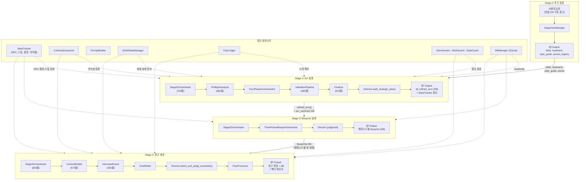

---

## 2. Stage 0: 초기 설정 상세

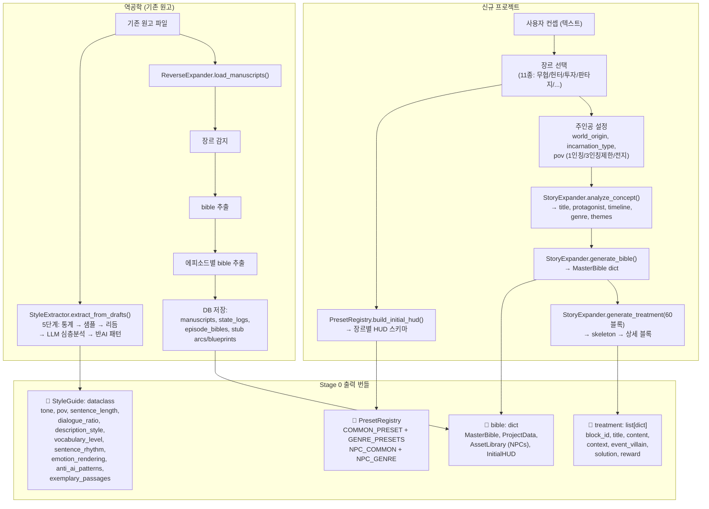

---

## 3. Stage 2: Arc 설계 전체 흐름

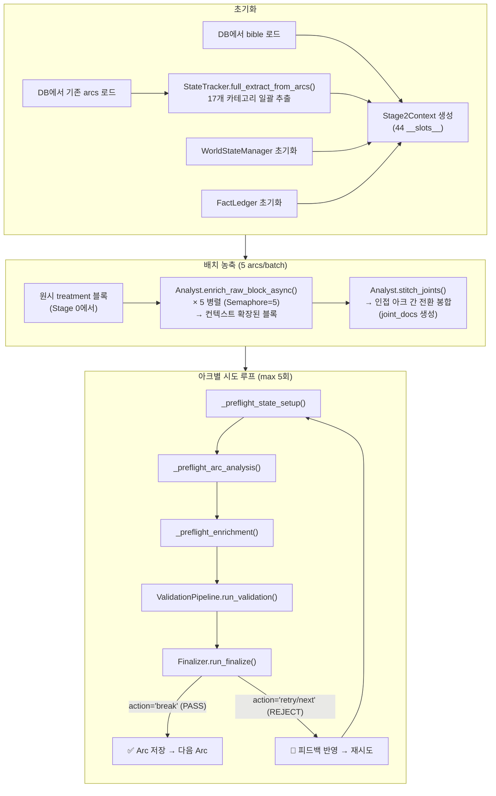

---

## 4. Stage 2: Preflight 3단계 상세

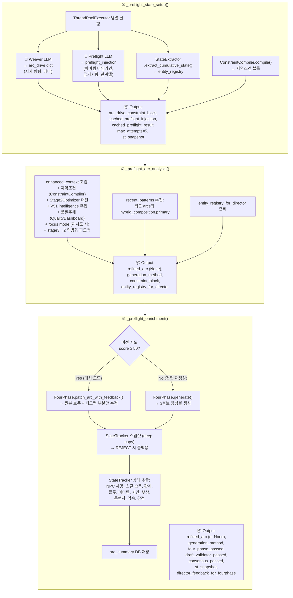

---

## 5. FourPhaseArcGenerator 내부 구조

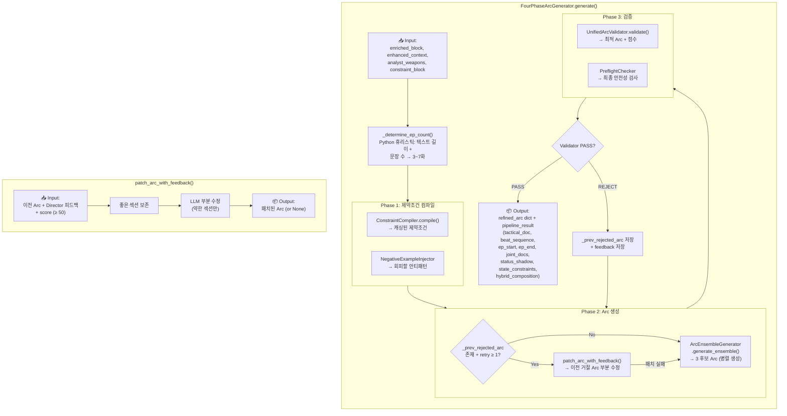

---

## 6. Stage 2: 검증 파이프라인 10단계

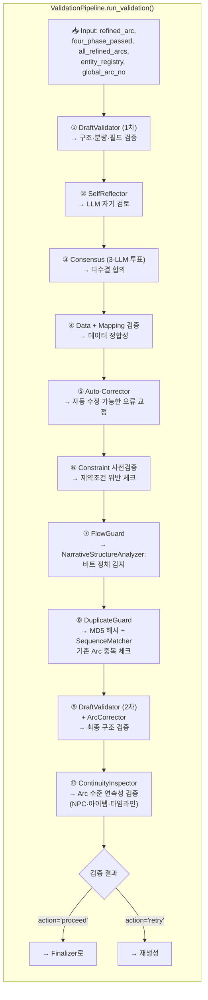

---

## 7. Stage 2: Finalizer + Director 심사

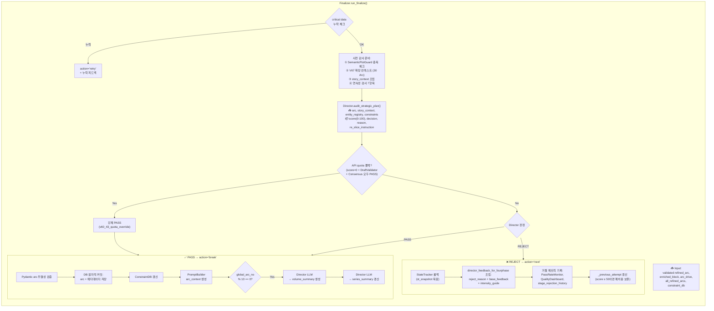

---

## 8. Stage 3: Blueprint 생성

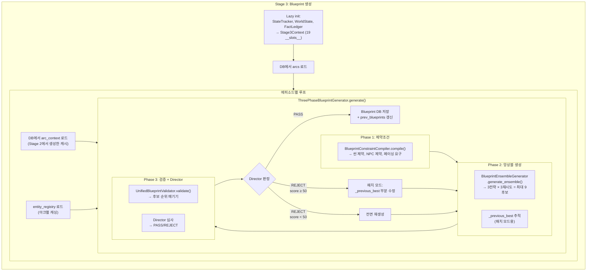

---

## 9. Stage 4: 원고 생성 전체 흐름

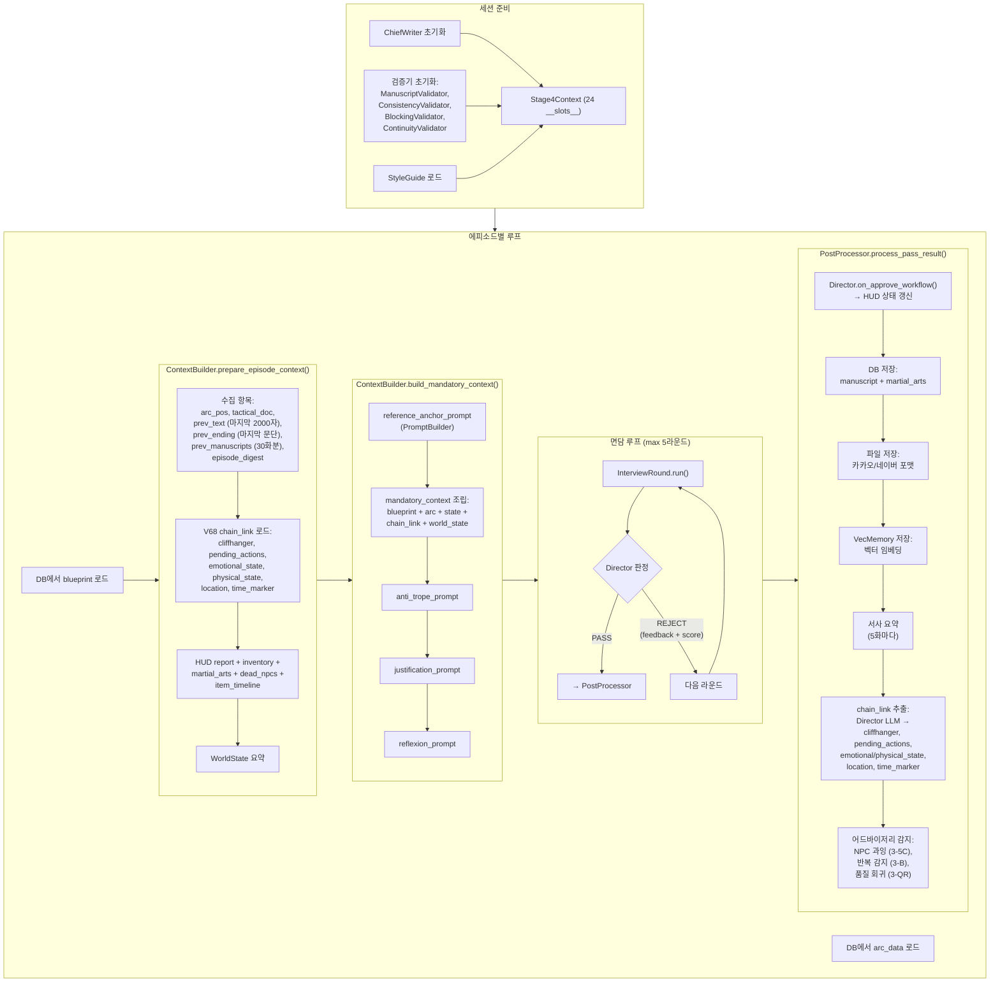

---

## 10. Stage 4: 단일 면담 라운드 상세

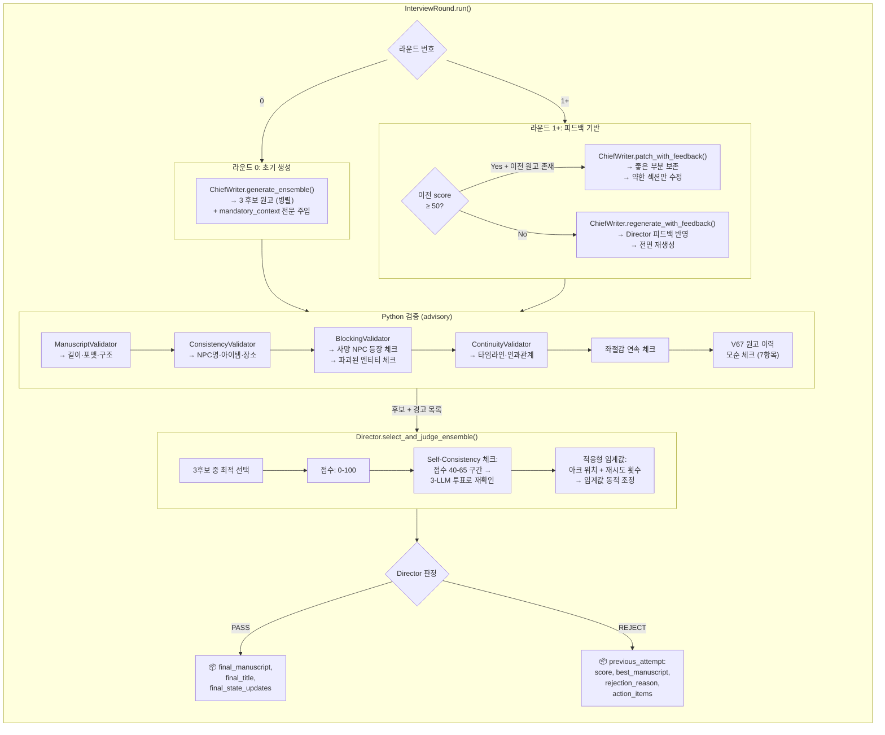

---

## 11. Director 판정 흐름 (전 Stage 통합)

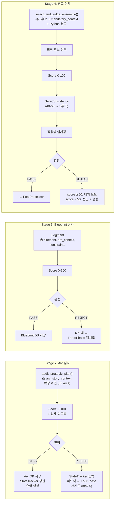

---

## 12. 패치 모드 분기 (전 Stage 통합)

```mermaid
flowchart TB
    subgraph PATCH_ALL["패치 모드 — 전 Stage 통합"]
        direction TB

        REJECT["Director REJECT"]
        ScoreCheck{"score ≥ 50<br/>(PATCH_REWRITE)?"}
        REJECT --> ScoreCheck

        subgraph S2_PATCH["Stage 2: Arc 패치"]
            S2P_In["이전 rejected_arc 보존"]
            S2P_Call["FourPhase.patch_arc_with_feedback()<br/>→ 원본 Arc의 좋은 부분 유지<br/>→ Director 지적사항만 수정"]
            S2P_Fail["패치 실패 → 전면 재생성"]
            S2P_In --> S2P_Call
            S2P_Call -->|"실패"| S2P_Fail
        end

        subgraph S3_PATCH["Stage 3: Blueprint 패치"]
            S3P_In["이전 _previous_best 보존"]
            S3P_Call["ThreePhase 내부 패치<br/>→ 원본 Blueprint 부분 수정"]
            S3P_Fail["패치 실패 → 9후보 재생성"]
            S3P_In --> S3P_Call
            S3P_Call -->|"실패"| S3P_Fail
        end

        subgraph S4_PATCH["Stage 4: 원고 패치"]
            S4P_In["이전 best_manuscript 보존"]
            S4P_Call["ChiefWriter.patch_with_feedback()<br/>→ 원본 원고 좋은 부분 유지<br/>→ 약한 섹션만 수정"]
            S4P_Fail["패치 실패 → 전면 재생성"]
            S4P_In --> S4P_Call
            S4P_Call -->|"실패"| S4P_Fail
        end

        subgraph FP_PATCH["FourPhase 내부 패치"]
            FP_In["이전 _prev_rejected_arc 보존"]
            FP_Call["patch_arc_with_feedback()<br/>→ Validator 거절 Arc 부분 수정"]
            FP_Fail["패치 실패 → 3후보 앙상블"]
            FP_In --> FP_Call
            FP_Call -->|"실패"| FP_Fail
        end

        subgraph BE_PATCH["Block Enricher 패치"]
            BE_In["이전 enrichment 원본 보존<br/>([:20000] 잘라서)"]
            BE_Call["LLM 재시도 프롬프트:<br/>'이전 결과 원본 보존 +<br/>지적사항만 수정'"]
            BE_In --> BE_Call
        end

        ScoreCheck -->|"Yes"| S2_PATCH
        ScoreCheck -->|"Yes"| S3_PATCH
        ScoreCheck -->|"Yes"| S4_PATCH
        ScoreCheck -->|"No"| FullRegen["전면 재생성"]
    end
```

---

## 13. 횡단 컴포넌트 데이터 흐름

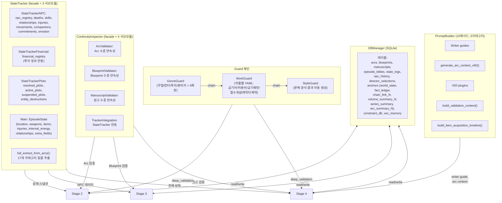

---

## 14. 핵심 데이터 구조 사전

| 데이터 구조 | 생성 | 소비 | 주요 필드 |
|---|---|---|---|
| **bible** (dict) | Stage 0 | Stage 2, 3, 4 | MasterBible, ProjectData, AssetLibrary (NPCs), InitialHUD |
| **treatment** (list[dict]) | Stage 0 | Stage 2 | block_id, title, content, context, event_villain, solution, reward |
| **StyleGuide** (dataclass) | Stage 0 | Stage 4 | tone, pov, sentence_length, dialogue_ratio, anti_ai_patterns, exemplary_passages |
| **refined_arc** (dict) | Stage 2 FourPhase | Stage 2→3→4 | tactical_doc, beat_sequence, ep_start, ep_end, joint_docs, status_shadow, state_constraints, hybrid_composition |
| **blueprint** (dict) | Stage 3 ThreePhase | Stage 4 | scene_list, pacing, npc_assignments, emotional_beats |
| **manuscript** (str) | Stage 4 ChiefWriter | 파일 출력 | 전체 에피소드 텍스트 (4,000~15,000자) |
| **arc_drive** (dict) | Weaver LLM | Stage 2 Preflight | desire_vector, themes, narrative_direction |
| **chain_link** (dict) | Stage 4 Post | 다음 에피소드 Stage 4 | cliffhanger, pending_actions, emotional_state, physical_state, location, time_marker |
| **entity_registry** (dict) | StateExtractor | Stage 2 Director | NPC별 역할·상태·관계 |
| **st_snapshot** (dict) | Stage 2 Preflight | REJECT 시 롤백 | StateTracker 전체 딥카피 |
| **director_feedback** (str) | Director | FourPhase/ChiefWriter | score, 상세 비평, 개선 제안 |
| **previous_attempt** (dict) | REJECT 시 | 다음 시도 패치 모드 | score, best_arc/manuscript, rejection_reason |

---

## 15. 핵심 상수

| 상수 | 값 | 위치 | 용도 |
|---|---|---|---|
| PatchModeThresholds.REWRITE | 50 | constants.py | 50 미만: 전면 재생성 |
| PatchModeThresholds.PATCH | 80 | constants.py | 50-80: 패치, 80+: Director PASS |
| ManuscriptLimits.MIN | 4,000 | constants.py | 최소 원고 길이 |
| ManuscriptLimits.TARGET | 5,000 | constants.py | 목표 원고 길이 |
| ManuscriptLimits.MAX | 15,000 | constants.py | 최대 원고 길이 |
| Self-Consistency 구간 | 40-65 | director_ensemble.py | 3-LLM 투표 트리거 |
| 면담 라운드 | 5 | stage4_orchestrator.py | Stage 4 재시도 한도 |
| Arc 시도 횟수 | 5 | stage2_orchestrator.py | Stage 2 재시도 한도 |
| 배치 크기 | 5 | stage2_orchestrator.py | 배치당 Arc 수 |
| 이전 원고 참조 | 30화 | stage4_context_builder.py | V67 확장 컨텍스트 |
| Volume 요약 주기 | 10 Arc | stage2_finalizer.py | 요약 생성 빈도 |
| 서사 요약 주기 | 5화 | stage4_post_processor.py | 요약 생성 빈도 |
