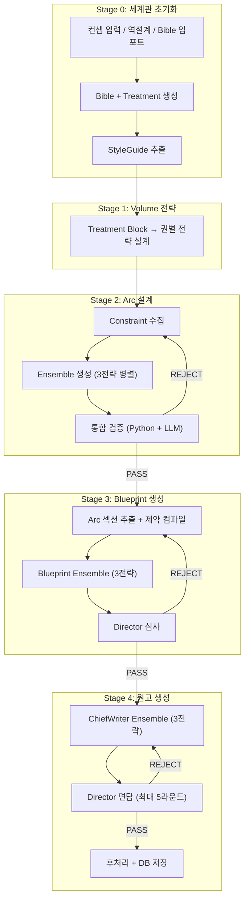
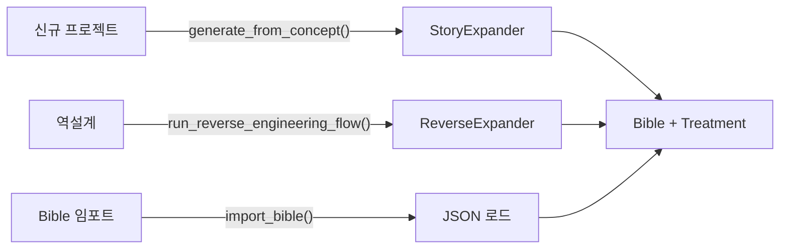
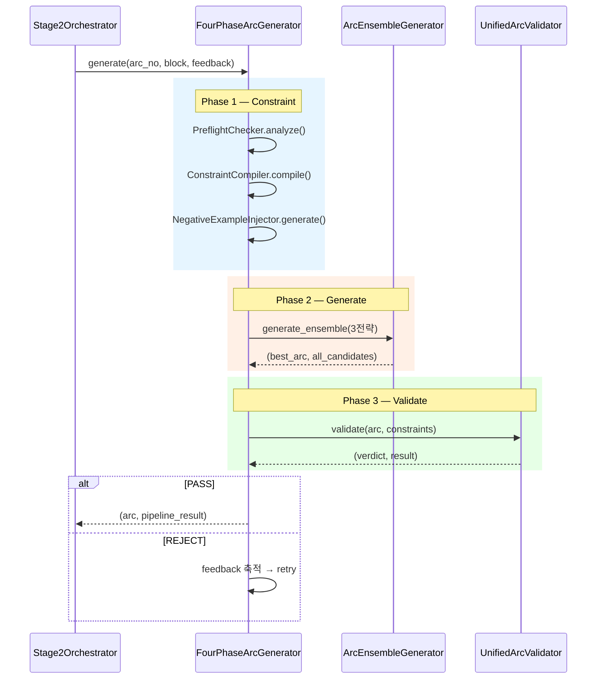
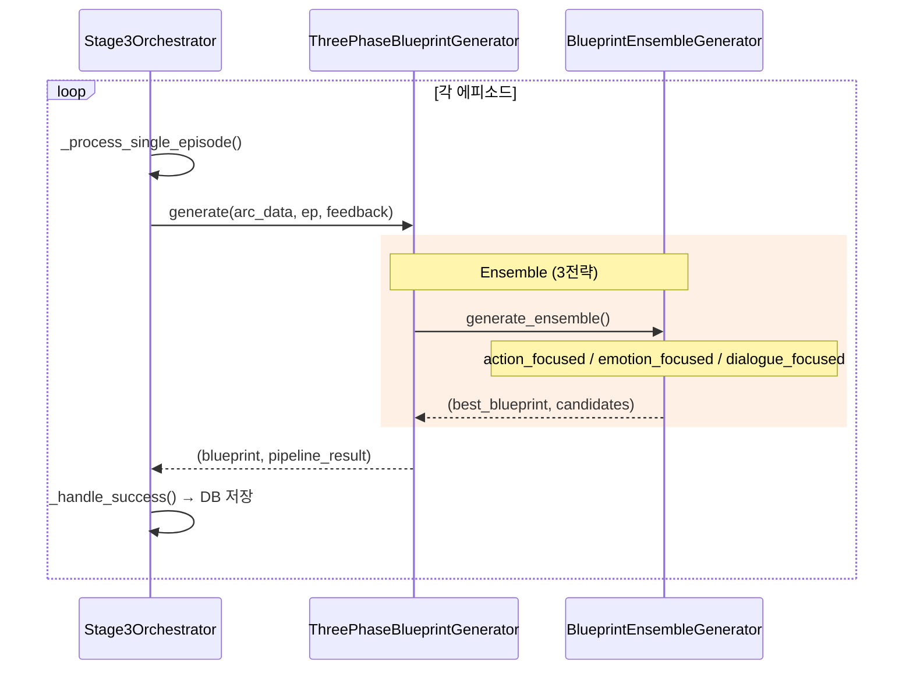
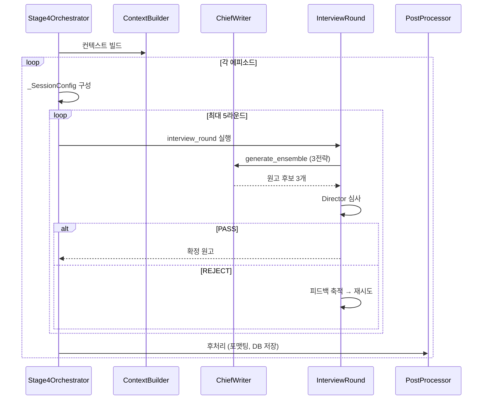

# 글도비 시스템 아키텍처

> **버전**: 2026-02-20 | **대상**: 시스템을 처음 접하는 개발자
>
> 이 문서는 글도비(AI 웹소설 자동 생성 파이프라인)의 Stage 0~4 전체 구조를 설명합니다.

---

## 1. 시스템 개요

### 1.1 전체 파이프라인 흐름도



### 1.2 Stage 요약 표

| Stage | 목적 | 입력 | 출력 | 핵심 에이전트 |
|-------|------|------|------|--------------|
| **0** | 세계관 초기화 | 유저 컨셉 or 기존 원고 | MasterBible, Treatment, StyleGuide | `StoryExpander`, `ReverseExpander`, `StyleExtractor` |
| **1** | 권별 전략 | Treatment blocks | Volume 전략 (per-권) | `Manager` |
| **2** | Arc 설계 | Block DNA + Volume 전략 | Arc별 tactical_doc (3~7화 묶음) | `FourPhaseArcGenerator`, `ArcEnsembleGenerator`, `UnifiedArcValidator` |
| **3** | Blueprint | Arc + 이전 Blueprint | 에피소드별 설계도 (6~8 씬) | `ThreePhaseBlueprintGenerator`, `BlueprintEnsembleGenerator`, `Director` |
| **4** | 원고 집필 | Blueprint + 이전 원고 | 최종 원고 (4,000~7,000자/화) | `ChiefWriter`, `Director`, `ManuscriptValidator` |

### 1.3 핵심 설계 철학

1. **Ensemble + Director 패턴**: 모든 창작 단계(Stage 2/3/4)에서 3개 전략을 병렬 생성 → 최적 선택 → Director 심사
2. **피드백 루프**: REJECT 시 피드백을 축적하여 재시도 (max 2~5회), 실패 시 상위 Stage로 역피드백
3. **상태 연속성**: `StateTracker`가 17+ 필드(내공, 부상, 위치, 소지품, NPC 생사 등)를 Arc 간 추적
4. **DB 앵커 시스템**: `ProjectContext` + `DBManager`가 모든 산출물을 SQLite에 박제

---

## 2. Stage 0 — 세계관 초기화

> **파일**: `modules/core/stage0/__init__.py` (L37 `StageZeroManager`)
>
> **호출 경로**: `main_a.py` L1850 → `_phase_0_recovery()` → `Stage01Helpers.phase_0_recovery()` → `StageZeroManager`

### 2.1 목적과 입출력

| 입력 | 출력 |
|------|------|
| 유저 컨셉 텍스트 | `MasterBible` (JSON, 세계관·캐릭터·아이템·조직) |
| 기존 원고 파일 | `Treatment` (50+ 서사 블록 = "Block DNA") |
| 기존 Bible JSON | `StyleGuide` (문체 DNA) |

### 2.2 3가지 플로우



1. **신규 프로젝트** (`__init__.py` L183 `run_new_project_flow`):
   - 장르 선택 (11종: 무협, 투자물, 헌터물 등)
   - 주인공 설정 (세계관 출신, 환생 유형, 시점)
   - `StoryExpander`가 컨셉 분석 → Bible 생성 → Treatment(60블록) 생성

2. **역설계** (`__init__.py` L248 `run_reverse_engineering_flow`):
   - 기존 원고를 `ReverseExpander`로 분석
   - Bible + EpisodeBible + StyleGuide 역추출

3. **스타일 분석** (`__init__.py` L367 `run_reference_analysis`):
   - `config/style_references/{genre}/` 폴더의 참조 원고 분석
   - `StyleExtractor`가 문체 DNA (모범 문단, AI 금지 패턴) 추출

### 2.3 주요 모듈

| 파일 | 역할 |
|------|------|
| `stage0/preset_registry.py` | 장르별 프리셋 스키마 정의 (Bible 필드 구조) |
| `stage0/story_expander.py` | 컨셉 → Bible + Treatment LLM 생성 |
| `stage0/reverse_expander.py` | 기존 원고 → Bible 역추출 |
| `stage0/style_extractor.py` | 참조 원고 → StyleGuide 추출 |

---

## 3. Stage 1 — Volume 전략 설계

> **파일**: `modules/core/stage01_helpers.py` (L473 `Stage01Helpers.stage_1_volumes`)
>
> **호출 경로**: `main_a.py` L1852 → `_stage_1_volumes()` → `Stage01Helpers.stage_1_volumes()`

### 3.1 목적과 입출력

| 입력 | 출력 |
|------|------|
| Treatment blocks (50+ 서사 블록) | 권(Volume)별 전략 — 주제, 톤, 클라이맥스 배치 |

### 3.2 내부 구조

- Treatment를 권(Volume) 단위로 슬라이스
- 각 권에 대해 `Manager` 에이전트가 전략 설계
- `_vol_attempt_func()` (L550) → LLM 호출로 전략 초안 생성
- `_vol_on_success()` (L567) → DB 앵커(`volumes`)에 저장
- **선택적 Stage**: 스킵 가능 (`main_a.py` L1855-1860)

### 3.3 장르별 전략 시스템

| 파일 | 장르 |
|------|------|
| `domain/strategies/base_strategy.py` | 기반 클래스 (L1, 500B) |
| `domain/strategies/wuxia_strategy.py` | 무협 전략 |
| `domain/strategies/investment_strategy.py` | 투자물 전략 |
| `domain/strategies/hunter_strategy.py` | 헌터물 전략 |
| `domain/strategies/cooking_strategy.py` | 요리물 전략 |
| `domain/strategies/medical_strategy.py` | 의학물 전략 |
| `domain/strategies/sports_strategy.py` | 스포츠물 전략 |
| `domain/strategies/composer_strategy.py` | 작곡가물 전략 |

---

## 4. Stage 2 — Arc 설계

> **파일**: `modules/core/stage2_orchestrator.py` (L1 `Stage2Orchestrator`)
>
> **호출 경로**: `main_a.py` L1861 → `_stage_2_arcs()` → `Stage2Orchestrator.stage_2_arcs_async_logic()`

### 4.1 목적과 입출력

| 입력 | 출력 |
|------|------|
| Block DNA + Volume 전략 + 이전 Arc들 | `ArcData` (3~7화 묶음 전술서) |

- 각 Arc는 `tactical_doc` (서사 흐름), `episode_designs` (화별 요약), `state_constraints` (연속성 데이터)를 포함
- Arc 데이터 모델: `modules/models/arc.py` (Pydantic)

### 4.2 3단계 파이프라인



**핵심 코드**: `four_phase_arc_generator.py` L202-416 (retry 루프)

### 4.3 앙상블 시스템

`arc_ensemble.py` L58 `ArcEnsembleGenerator` — 3개 전략을 `ThreadPoolExecutor`로 병렬 생성:

| 전략 | 특성 | Temperature |
|------|------|-------------|
| **conservative** | 안전한 서사, 기존 패턴 준수 | 낮음 |
| **balanced** | 균형잡힌 전개 | 중간 |
| **creative** | 창의적·파격적 전개 | 높음 |

→ 3개 후보 중 **JSON 파싱 성공 + 구조 완성도** 기반으로 최적 선택

- `strategy_specific_feedback` + `rejected_strategy` 지원 — REJECT 시 **당선됐다 탈락한 전략에만 전용 피드백**을 주입 (`arc_ensemble.py` L86-87, `[EnsembleFB]` 태그). Stage 3/4와 동일한 패턴.

### 4.4 피드백 / 재시도 루프

- `max_internal_retries` = 2 (기본)
- REJECT 시 `feedback` 문자열에 검증 피드백 누적 (`four_phase_arc_generator.py` L382-386)
- **Patch Mode** (L247-285): retry ≥ 1에서 기존 Arc의 지적사항만 수정 시도
- Director 피드백은 `_base_director_feedback`으로 보존 (모든 retry에 주입)

### 4.5 검증 파이프라인

| 검증기 | 역할 |
|--------|------|
| `UnifiedArcValidator` | Python 규칙 + LLM 검증 통합 (`validate()` → 이슈 리스트 + PASS/REJECT) |
| `ConstraintCompiler` | 이전 Arc에서 하드 제약 추출 (아이템, NPC, 위치) |
| `PreflightChecker` | 생성 전 세계 상태·관계 분석 |
| `NegativeExampleInjector` | 과거 REJECT 사례 주입 (학습) |

### 4.6 보조 오케스트레이터 파일

| 파일 | 역할 |
|------|------|
| `stage2_context.py` | Stage 2 DI 컨텍스트 객체 |
| `stage2_preflight.py` | 프리플라이트 + 피드백 루프 관리 |
| `stage2_validation_pipeline.py` | 합의 검증, 연속성 체크 |
| `stage2_finalizer.py` | Arc 확정 + DB 저장 |
| `stage2_optimizer.py` | 최적화 (중복 제거, 흐름 보정) |

---

## 5. Stage 3 — Blueprint 생성

> **파일**: `modules/core/stage3_orchestrator.py` (L21 `Stage3Orchestrator`)
>
> **호출 경로**: `main_a.py` L1864 → `_stage_3_batch_blueprinting()` → `Stage3Orchestrator.stage_3_batch_blueprinting()`

### 5.1 목적과 입출력

| 입력 | 출력 |
|------|------|
| Arc (tactical_doc) + 이전 Blueprint | 에피소드 설계도 (6~8 씬, 화별) |

- Blueprint 데이터 모델: `modules/models/blueprint.py` (Pydantic)

### 5.2 내부 구조



### 5.3 3전략 앙상블

`blueprint_ensemble.py` L111 `generate_ensemble()`:

| 전략 | 특성 |
|------|------|
| **action_focused** | 액션·전투 장면 강조 |
| **emotion_focused** | 감정·심리 묘사 강조 |
| **dialogue_focused** | 대화·관계 전개 강조 |

**공통 패턴**: Stage 2/3/4 모두 `strategy_specific_feedback` + `rejected_strategy` 파라미터를 지원 — REJECT된 전략에만 전용 피드백을 주입하는 `[EnsembleFB]` 패턴이 전 Stage에 통일되어 있음

### 5.4 Director 심사 체계

| 파일 | 역할 |
|------|------|
| `director.py` | Director 메인 에이전트 (PASS/REJECT 판정) |
| `director_ensemble.py` | 앙상블 후보 비교 + 최적 선택 |
| `director_auditor.py` | 품질 감사 (점수화) |
| `director_grading.py` | 채점 기준 (설정 일관성, 장면 구성, 서사 흐름 등) |
| `director_prompts.py` | Director 전용 프롬프트 |
| `director_caching.py` | Director 판정 캐싱 |

---

## 6. Stage 4 — 원고 생성

> **파일**: `modules/core/stage4_orchestrator.py` (L214 `Stage4Orchestrator`)
>
> **호출 경로**: `main_a.py` L1867 → `_stage_4_v2_chief_writer()` → `Stage4Orchestrator.stage_4_v2_chief_writer()`

### 6.1 목적과 입출력

| 입력 | 출력 |
|------|------|
| Blueprint + 이전 원고 + 상태 데이터 | 최종 원고 (`ManuscriptCandidate`) — 4,000~7,000자/화 |

- Manuscript 모델: `modules/models/manuscript.py` (Pydantic)

### 6.2 내부 구조



### 6.3 ChiefWriter 앙상블

`chief_writer.py` — 3전략 병렬 원고 생성:

| 전략 | 특성 |
|------|------|
| **immersive** | 몰입감 높은 묘사 중심 |
| **dynamic** | 빠른 전개, 액션 강조 |
| **literary** | 문학적 문체, 비유/상징 |

- `strategy_specific_feedback` + `rejected_strategy` 지원 (Stage 3과 동일 패턴)

### 6.4 인터뷰 라운드 시스템

- `stage4_interview_round.py` — Director ↔ Writer 반복 대화
- 최대 5라운드, 각 라운드에서:
  1. ChiefWriter가 원고 생성
  2. Validator 체크 (ManuscriptValidator, ConsistencyValidator, BlockingValidator)
  3. Director 심사 (PASS/REJECT/CONDITIONAL_PASS)
  4. REJECT 시 사유를 피드백으로 축적
- **Patch Mode**: retry 후반부에서 원본 보존 + 지적사항만 수정

### 6.5 후처리 파이프라인

`stage4_post_processor.py`:
- 원고 포맷팅 (제목, 씬 구분)
- DB 저장 (`commit_full_episode_data`)
- State 갱신 (무공, 아이템, NPC 상태 등)
- Chain Link 추출 (다음 화 연결고리)

### 6.6 컨텍스트 빌더

`stage4_context_builder.py`:
- 이전 원고, Blueprint, 상태, StyleGuide를 통합하여 Writer 프롬프트 구성
- 벡터 메모리 검색 결과 주입 (과거 유사 맥락)

---

## 7. 횡단 시스템 (Cross-cutting)

### 7.1 BaseAgent 구조

`domain/agents/base_agent.py` — 모든 에이전트의 기반 클래스:
- `ask(prompt, temperature, thinking_level)` — LLM 호출
- `_extract_json_robust(text)` — JSON 추출 (마크다운 코드블록 제거, 복구 시도)
- `_escape_braces(text)` — `.format()` 안전화
- **Thinking Level**: `high`/`medium`/`low`로 Gemini thinking 토큰 사용량 조절
- **모델 계층**: `gemini-2.5-pro` (주요 생성), `gemini-2.5-flash` (검증), `gemini-3-flash-preview` (분석)

### 7.2 상태 관리 — StateTracker

`domain/agents/state_tracker.py` (67KB) — 17+ 상태 필드 추적:

| 필드 군 | 추적 대상 | 관련 모듈 |
|---------|----------|----------|
| 전투/무공 | 습득 무공, 내공, 전투 기록 | `state_tracker.py` |
| NPC | NPC 생사, 등장 이력, 관계 | `state_tracker_npc.py` (96KB) |
| 경제 | 재화, 보상, 거래 | `state_tracker_financial.py` |
| 서사 | 복선, 활성 플롯, 해결된 갈등 | `state_tracker_plots.py` |
| 물리 | 위치, 소지품, 부상 상태 | `state_extractor.py` |

- Arc 설계 시 `load_arc_design()` → Blueprint/원고 생성 시 `validate_timeline()` → 에피소드 확정 시 `extract_all_state_changes()`

### 7.3 연속성 검증 체계

3종 Continuity 에이전트:

| 에이전트 | Stage | 검증 대상 |
|---------|-------|----------|
| `continuity_arc.py` (50KB) | Stage 2 | Arc 간 상태 연속성 |
| `continuity_blueprint.py` (22KB) | Stage 3 | Blueprint ↔ Arc 정합성 |
| `continuity_manuscript.py` (56KB) | Stage 4 | 원고 ↔ Blueprint/Arc 정합성 |

### 7.4 DB 구조

`db_manager.py` (82KB) — SQLite 기반:

| 테이블/앵커 | 용도 |
|-------------|------|
| `anchors` | `bible`, `volumes`, `arcs`, `style_guide` 등 JSON 앵커 |
| `episode_blueprints` | 화별 설계도 |
| `manuscripts` | 화별 원고 |
| `episode_bibles` | 화별 상태 스냅샷 |
| `sentence_fingerprints` | 문장 해시 (크로스 에피소드 반복 감지) |
| `lore_entries` | NPC/아이템 설정 DB |
| `martial_stats` | 무공/전투 통계 |

### 7.5 벡터 메모리

`vec_memory.py` (24KB) — `sqlite-vec` 기반:
- 에피소드별 서사 임베딩 저장
- `memorize_v20_episode()` → 원고 확정 시 벡터화
- `search_similar()` → Arc/Blueprint 생성 시 과거 유사 맥락 검색
- 컨텍스트 주입: `[과거 유사 맥락 (벡터 검색)]` 섹션으로 프롬프트에 삽입

### 7.6 Pydantic 모델

| 모델 | 파일 | 핵심 필드 |
|------|------|----------|
| `ArcData` | `models/arc.py` | `arc_no`, `ep_start`, `ep_end`, `tactical_doc`, `episode_designs`, `state_constraints` |
| `Blueprint` | `models/blueprint.py` | `ep_num`, `scenes` (6~8개), `arc_context`, `character_arcs` |
| `ManuscriptCandidate` | `models/manuscript.py` | `text`, `title`, `state_updates`, `word_count` |
| `NPC` | `models/npc.py` | `name`, `status`, `faction`, `relationship` |

### 7.7 프롬프트 관리

- `prompt_loader.py` — YAML 기반 프롬프트 파일 로드 (`config/prompts/{agent_name}.yaml`)
- `prompt_builder.py` (46KB) — 컨텍스트 조립 (Arc 위치 가이드, Writer 가이드, 아이템 타임라인 등)
- `feedback_system.py` (40KB) — REJECT 피드백 정량화, 역피드백 (Stage4→3, Stage3→2, Stage4→2)

### 7.8 검증 모듈

`modules/validation/` — Stage 4 원고 전용 검증:

| 파일 | 역할 |
|------|------|
| `validation_orchestrator.py` (67KB) | 전체 검증 오케스트레이션 |
| `scoring_validator.py` (46KB) | 점수 기반 품질 평가 |
| `continuity_validator.py` (46KB) | 연속성 검증 |
| `consistency_validator.py` (30KB) | 일관성 검증 |
| `blocking_validator.py` (9KB) | 장면 구성 검증 |
| `pre_llm_validator.py` (19KB) | LLM 호출 전 Python 사전 검증 |

### 7.9 8대 Protocol 타입

`modules/protocols/agents.py` — 구조적 서브타이핑:

| Protocol | 적합 에이전트 | 메서드 |
|----------|-------------|--------|
| `PipelineGenerator` | FourPhaseArcGenerator, ThreePhaseBlueprintGenerator | `generate()` |
| `EnsembleGenerator` | ArcEnsembleGenerator, BlueprintEnsembleGenerator | `generate_ensemble()` |
| `ArtifactValidator` | UnifiedArcValidator | `validate()` |
| `ArtifactCritic` | ArcCritic | `critique()` |
| `Corrector` | ArcCorrector | `can_correct()`, `correct()` |
| `DraftValidator` | ArcDraftValidator, ManuscriptValidator | `validate()` |
| `ConstraintCompilerProtocol` | ConstraintCompiler, BlueprintConstraintCompiler | `compile()` |
| `StateAggregator` | StateTracker | `load_arc_design()`, `validate_timeline()`, ... |

---

## 8. 데이터 흐름 종합

### 8.1 Stage 간 데이터 전달

```
Stage 0                        Stage 1              Stage 2                Stage 3                Stage 4
──────────                     ──────              ──────                 ──────                 ──────
MasterBible ─────────────────────────────────────────────────────────────────────────────────→ (전 Stage 참조)
Treatment ────→ Volume Strategy  
                   │
                   └──────────→ Block DNA ─→ Arc ─────────→ Arc Section ─→ Blueprint ─────→ 원고
                                                              │                                │
                                                              └─────── StateTracker ───────────┘
                                                                        (상태 연속성)
                                StyleGuide ──────────────────────────────────────────────────→ (Stage 4)
```

### 8.2 에이전트 호출 관계

```
SovereignApp
 ├─ Stage01Helpers
 │   ├─ StageZeroManager
 │   │   ├─ StoryExpander
 │   │   ├─ ReverseExpander
 │   │   └─ StyleExtractor
 │   └─ Manager (Volume 설계)
 │
 ├─ Stage2Orchestrator
 │   └─ FourPhaseArcGenerator
 │       ├─ PreflightChecker
 │       ├─ ConstraintCompiler
 │       ├─ NegativeExampleInjector
 │       ├─ ArcEnsembleGenerator
 │       │   └─ (3x) _generate_single ──→ Analyst
 │       └─ UnifiedArcValidator
 │
 ├─ Stage3Orchestrator
 │   └─ ThreePhaseBlueprintGenerator
 │       ├─ BlueprintConstraintCompiler
 │       ├─ BlueprintEnsembleGenerator
 │       │   └─ (3x) _generate_single
 │       ├─ UnifiedBlueprintValidator
 │       └─ Director (심사)
 │           ├─ DirectorEnsembleSelector
 │           ├─ DirectorAuditor
 │           └─ DirectorGrading
 │
 └─ Stage4Orchestrator
     ├─ ContextBuilder
     ├─ InterviewRound
     │   ├─ ChiefWriter (3전략 앙상블)
     │   ├─ ManuscriptValidator
     │   ├─ ConsistencyValidator
     │   ├─ BlockingValidator
     │   └─ Director (면담)
     └─ PostProcessor (후처리 + DB 저장)
```

### 8.3 피드백/재시도 경로 종합

| 경로 | 발동 조건 | 효과 |
|------|----------|------|
| Stage 2 내부 retry | Validator REJECT | 동일 Arc 재생성 (Patch Mode 우선) |
| Stage 3 내부 retry | Director REJECT | 동일 Blueprint 재생성 |
| Stage 4 면담 loop | Director REJECT | 동일 원고 재작성 (최대 5라운드) |
| Stage 4 → Stage 3 역피드백 | Writer 반복 실패 | Blueprint 재설계 요청 |
| Stage 3 → Stage 2 역피드백 | Architect 반복 실패 | Arc 재설계 요청 |
| Stage 4 → Stage 2 역피드백 | Arc 난이도 문제 | Arc 난이도 조정 요청 |

<!-- Phase 8 complete -->
