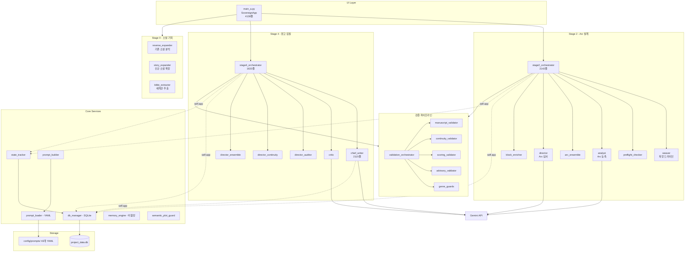
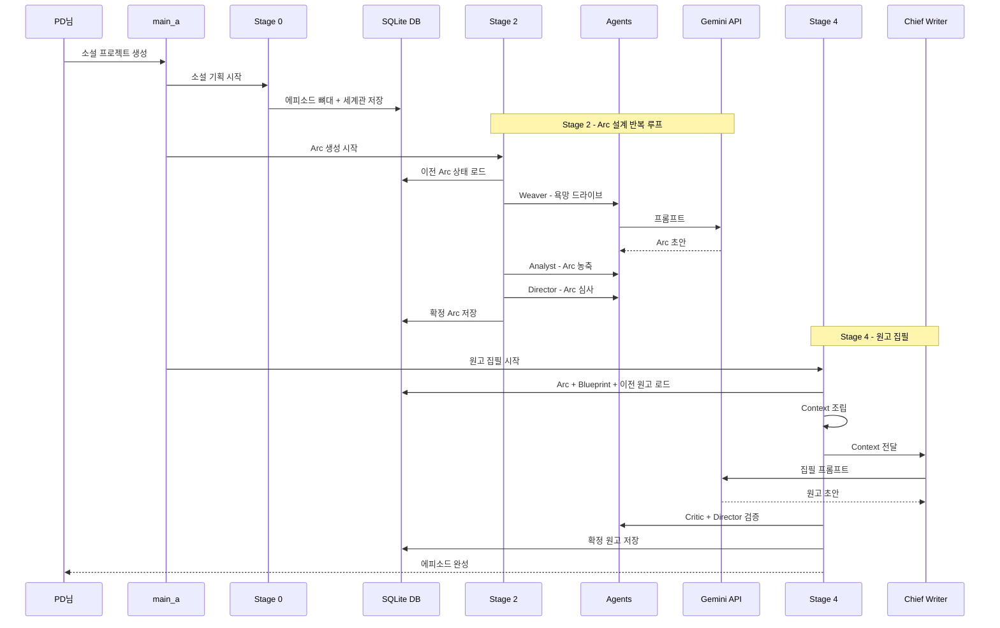
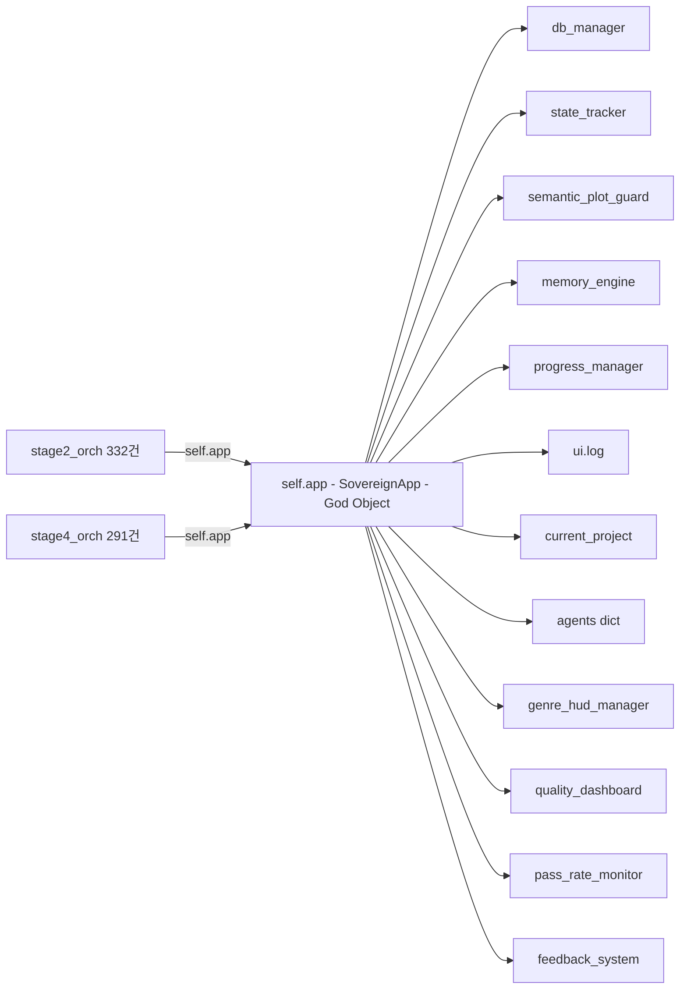
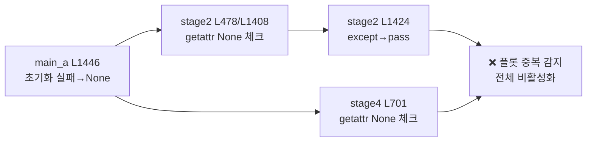
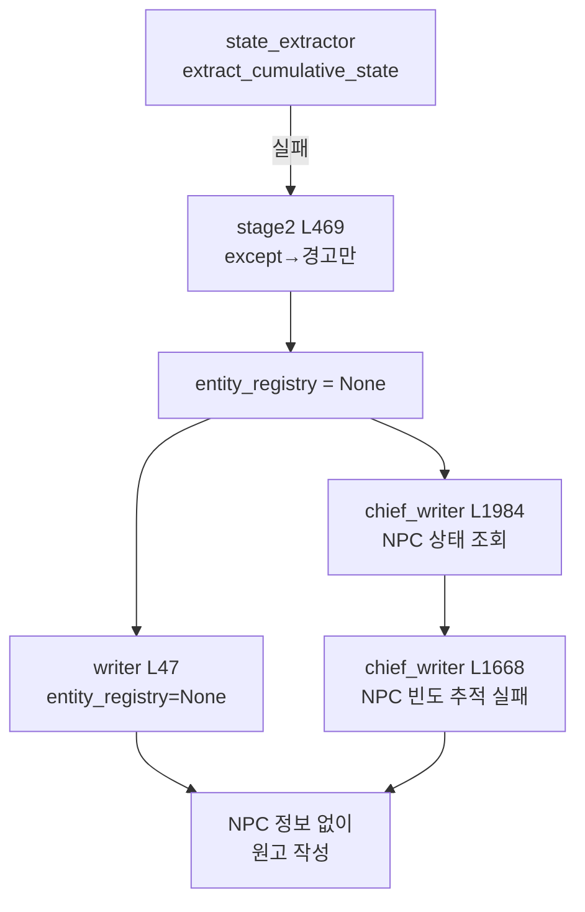

# 🔍 글도비 프로젝트 참고자료

> 조사 목적: `except Exception` 밀집 파일 중심으로 잠재적 버그 패턴 식별
> 조사 기준: V65+ 코드 (2026-02 기준)
> ⚠️ 이 문서는 **조사 결과만** 기록하며, 코드 수정은 포함하지 않음

---

## 🏗️ 시스템 아키텍처 (전체 구조도)

### 전체 파이프라인



### 에피소드 생성 시퀀스 (시간순)



### God Object (`self.app`) 의존성 맵



> 🟡 Phase 4에서 `self.app` → 의존성 주입(DI)으로 전환 예정

---

## 📊 except Exception 분포 (전체 46개 파일 중 상위)

| 파일 | 건수 | 위험도 | Tier | 비고 |
|------|------|--------|------|------|
| `stage2_orchestrator.py` | 66 | 🔴 HIGH | T1 | silent pass 20+건 |
| `stage4_orchestrator.py` | 58 | 🔴 HIGH | T2 | stage2와 동일 패턴 |
| `memory_engine.py` | 11 | 🟡 MED | T2 | API 재시도 양호 |
| `prompt_builder.py` | 10 | 🟡 MED | T2 | 5연속 silent pass |
| `project_manager.py` | 10 | 🟢 LOW | T1 | 대부분 적절한 처리 |
| `genre_hud_manager.py` | 9 | 🟡 MED | T2 | 9건 전부 동일 코드 중복 |
| `db_manager.py` | 7 | 🟢 LOW | T1 | 구체적 예외, 모범 사례 |
| `adaptive_retry.py` | 5 | 🟢 LOW | T2 | FailureLearner 연동 무시 |
| `blueprint_memory.py` | 5 | 🟢 LOW | T2 | 양호 |
| `world_state.py` | 5 | 🟢 LOW | T2 | 양호 |
| `pre_director_checklist.py` | 0 | ✅ CLEAN | T1 | 완전 정리됨 |
| 기타 36개 파일 | 1~3 | — | T3 | 미조사 |

---

## 🔴 [1] stage2_orchestrator.py (2134줄, 66건)

### 패턴 A: StateTracker 추출 메서드 2중 반복

**동일한 try/except 블록이 초기화(130~188줄)와 업데이트(740~824줄)에서 중복됨.**

```python
# 패턴 — 아래가 12+종류 각각 반복됨
try:
    self.app.state_tracker.extract_time_markers_from_arc(prev_arc)
except Exception as e:
    print(f"  [V66.1] 시간선 추출 실패 (무시): {e}")
```

**관찰된 추출 메서드 목록** (각각 개별 try/except):
- `extract_time_markers_from_arc` (L133, L785)
- `extract_permanent_injuries_from_arc` (L138, L791)
- `update_companions_from_arc` (L143, L797)
- `extract_commitments_from_arc` (L148, L803)
- `extract_protagonist_emotion_from_arc` (L153, L809)
- `extract_relationship_changes_from_arc` (L158, L815)
- `update_npc_registry_from_arc` (L163, L821)
- `update_world_events_from_arc` (L168)
- `update_protagonist_growth` (L173)
- `update_timeline` (L178)
- `extract_npc_dialogue_styles_from_arc` (L183, L773)
- `cleanup_npc_registry_with_llm` (L842)

> [!WARNING]
> **위험**: 특정 추출이 지속적으로 실패해도 프로그램은 정상처럼 동작. StateTracker 데이터가 점진적으로 불완전해지면서 나중 Arc에서 NPC 누락이나 세계관 불일치 발생 가능.
> **증상 예측**: "갑자기 NPC가 사라졌다" / "시간대가 맞지 않는다" 류의 서사 버그.

---

### 패턴 B: Silent Pass (except Exception: pass)

해당 라인 목록:

| 줄 | 용도 | 위험 |
|-----|------|------|
| L704 | `perf_timer.stop()` | ✅ 무해 |
| L773 | `extract_npc_dialogue_styles` | 🟡 데이터 유실 |
| L1404 | `example_manager.add_successful_arc` | ✅ 무해 |
| L1424 | `semantic_plot_guard.check_new_arc` | 🔴 **중복 플롯 미감지** |
| L1430 | `perf_timer.start()` | ✅ 무해 |
| L1478 | `_story_context` 조립 실패 | 🟡 Director에 빈 컨텍스트 전달 |
| L1492 | `perf_timer.stop()` | ✅ 무해 |
| L1647 | `pass_rate_monitor.record_attempt` | ✅ 무해 |
| L1662 | `quality_dashboard.record_validation` | ✅ 무해 |
| L1669 | `failure_memory.clear_arc_failures` | 🟡 실패 메모리 잔존 |
| L1676 | `perf_timer.log_summary()` | ✅ 무해 |

> [!CAUTION]
> **L1424가 가장 위험**: `SemanticPlotGuard.check_new_arc`이 조용히 실패하면 동일한 플롯이 반복 생성되는 서사 품질 저하 직결.

---

### 패턴 C: 핵심 실패의 "약화" 처리

```python
# L468 — extract_cumulative_state 실패
except Exception as e:  # CRITICAL: state extraction failure → NPC validation disabled
    self.app.ui.log(f"⚠️ [V64.P4] extract_cumulative_state 실패 (NPC 검증 약화)")
    self.app._audit_event("critical_state_extraction_failed", ...)
    # → NPC 검증이 비활성화된 채로 Arc 생성 계속 진행
```

> [!IMPORTANT]
> `extract_cumulative_state` 실패 시 NPC 검증 없이 Arc가 통과될 수 있음. 이 경우 사망한 NPC 재등장, 미등장 NPC 대화 등의 심각한 서사 결함 발생 가능.

---

### 패턴 D: 200K자 하드코딩

```python
# L1453 — Director 컨텍스트 200K자 절삭
if len(_full_arc_history) > 200000:
    _full_arc_history = _full_arc_history[:200000] + "\n... (200K자 절삭)"
```

- 매직 넘버 하드코딩 (모델 변경 시 조정 필요)
- 200K자 경계에서 Arc가 잘리면 중요 서사 컨텍스트 손실 가능

---

## 🟢 [2] project_manager.py (839줄, 10건)

**전체적으로 양호.** V44 리팩토링에서 타입 검증 및 안전한 패턴이 적용됨.

### 주요 except Exception 용도

| 줄 | 용도 | 평가 |
|-----|------|------|
| L125 | DB 앵커 로드 실패 → 빈 상태 초기화 | ✅ 적절 (fallback) |
| L145 | karma 로드 실패 → 빈 dict | ✅ 적절 |
| L332 | Arc txt 저장 실패 → 경고 | ✅ (부가 기능) |
| L392 | Blueprint txt 저장 실패 → 경고 | ✅ (부가 기능) |
| L513 | Bible 저장 실패 → **raise로 에스컬레이트** | ✅ 모범 패턴 |
| L542 | Vector 동기화 실패 → 부분 성공(sync=2) | 🟡 아래 참고 |
| L553 | 전체 커밋 실패 → sync=0, return False | ✅ 적절 |
| L600 | 파일 ep번호 탐색 실패 → DB값 사용 | ✅ 적절 |
| L721 | force_sync_v25_dna 전체 실패 | ✅ 적절 |
| L819 | auto_backtrack 실패 → return None | 🟡 아래 참고 |

### 🟡 관찰 사항

**L542 (Vector 동기화 부분 실패)**:
```python
except Exception as sub_e:
    print(f"🚨 [Partial Failure] 벡터 동기화 중 오류: {sub_e}")
    try:
        self.db.update_sync_status(ep_num, 2)  # partial sync
    except Exception:
        pass  # ← sync_status 업데이트마저 실패하면 완전 무시
    return True  # DB 성공이므로 진행
```

- `sync_status=2`(부분 성공)를 나중에 재동기화하는 로직이 없으면 벡터 DB와 SQLite 사이 영구 불일치 가능

**L819 (auto_backtrack 실패)**:
- `return None` 후 호출부에서 None 체크를 하지 않으면 후속 로직에서 `TypeError` 발생 가능

---

## 🟢 [3] db_manager.py (1127줄, 7건)

**가장 깔끔한 파일.** 구체적 예외(`sqlite3.OperationalError`, `JSONDecodeError` 등)를 적절히 사용.

- 스키마 마이그레이션 시 `ALTER TABLE` 실패를 `OperationalError`로 정확히 잡음
- JSON 파싱 시 `json.loads` + `JSONDecodeError` 처리 적절
- `except Exception`은 최상위 fallback용으로만 사용 → **모범 사례**

---

## ✅ [4] pre_director_checklist.py

- `except Exception` 0건
- V65+ 리팩토링으로 완전 정리됨

---

## 🔴 [5] stage4_orchestrator.py (1632줄, 58건)

**stage2와 동일한 구조 — 대량 "비차단" 패턴 반복.** Stage 4는 실제 원고 생성 단계.

### 패턴 A: 컨텍스트 조립 실패 무시 (20+건)

L430~L730 구간에서 원고 생성 전 컨텍스트를 조립하는데, 각 소스(world_state, vector_memory, foreshadow, pacing, narrative_summary 등)가 개별 try/except로 실패 무시:

```python
# 반복 패턴 (L430, L680, L688, L697, L711 등)
try:
    _world_state_summary = self.app.world_state.get_summary(max_chars=5000)
except Exception:
    pass  # 세계 상태 정보 없이 원고 생성됨
```

> [!WARNING]
> 컨텍스트 소스 여러 개가 동시에 실패하면 Writer가 **거의 빈 컨텍스트**로 원고를 쓰게 됨. 표면적으론 정상 작동하지만 품질 저하.

### 패턴 B: Silent Pass 후 즉시 Save (위험)

```python
# L1358-L1364 — voice analysis 실패해도 바로 save 호출
try:
    self.app.character_voice.analyze_manuscript(next_ep, final_manuscript)
except Exception:  # OPTIONAL: voice analysis
    pass
self.app.character_voice.save_to_json(...)  # ← 분석 실패 상태 그대로 저장!
```

동일 패턴이 `foreshadow_tracker`(L1366)에도 존재:
```python
try:
    self.app.foreshadow_tracker.auto_detect_from_manuscript(next_ep, final_manuscript)
except Exception:  # OPTIONAL: foreshadow auto-detect
    pass
self.app.foreshadow_tracker.save_to_json(...)  # ← 감지 실패 상태 그대로 저장!
```

> [!CAUTION]
> analyze/detect 실패 → 이전 상태 그대로 저장 → 데이터 정합성 저하. 최소한 실패 시 save를 스킵하거나 dirty flag 체크 필요.

### 패턴 C: DB 저장 실패 시 continue

```python
# L1284 — DB 저장 실패 시 에피소드 유실
except Exception as db_err:
    self.app.ui.log(f"🚨 DB 저장 실패: {db_err}")
    continue  # ← 에피소드 데이터 버려짐, 복구 로직 없음
```

### 패턴 D: Validator 실패 시 검증 스킵

`ConsistencyValidator`(L984), `BlockingValidator`(L1003), `ContinuityValidator`(L1028) — 3종 Validator 모두 실패 시 로그만 남기고 검증 없이 통과.

---

## 🟡 [6] memory_engine.py (441줄, 11건)

**전체적으로 양호.** API 429/503 재시도 로직 포함.

| 줄 | 용도 | 평가 |
|-----|------|------|
| L60 | ChromaDB API 실패 → 지수 백오프 재시도 | ✅ 양호 |
| L101 | SQLite 초기화 실패 | ✅ 연결 정리 포함 |
| L107 | conn.close() 실패 | ✅ 무해 |
| L184 | DB 저장 실패 → return False | ✅ 적절 |
| L198 | DB 로드 실패 → return None | ✅ 적절 |
| L249 | 검색 실패 → 빈 값 반환 | ✅ 시스템 보호 |
| L289 | MultiQuery 실패 → continue | ✅ 다음 쿼리 계속 |
| L345 | 에피소드 주입 실패 → return False | ✅ 적절 |
| L392 | sync 개별 실패 → 다음 에피소드 계속 | ✅ 적절 |
| L414/L429 | 상태 조회/종료 실패 | ✅ 무해 |

---

## 🟡 [7] prompt_builder.py (934줄, 10건)

### 핵심 발견: 5연속 Silent Pass (L695~L733)

```python
# L695~L733 — 5개 보조 프롬프트가 연속으로 silent pass
try: prompts.append(pacing_analyzer.generate_pacing_prompt())  # L695
except Exception: pass

try: prompts.append(character_voice.get_writer_injection())     # L705
except Exception: pass

try: prompts.append(foreshadow_tracker.generate_writer_prompt()) # L715
except Exception: pass

try: prompts.append(expert_mixture.generate_writer_injection())  # L725
except Exception: pass

try: prompts.append(self.generate_self_diagnosis_checklist())    # L733
except Exception: pass
```

> [!WARNING]
> 5개 모두 실패해도 Writer 프롬프트가 "정상" 생성됨. 호흡 분석, 캐릭터 보이스, 복선 가이드 등이 전부 빠진 프롬프트로 원고 생성 가능.

### 기타

| 줄 | 용도 | 평가 |
|-----|------|------|
| L541 | StateExtractor 실패 → audit + fallback | ✅ 양호 |
| L825 | 아이템 타임라인 실패 | ✅ 빈 문자열 반환 |
| L883~L893 | Validation context 구성 실패 | 🟡 중첩 try/except |

---

## 🟡 [8] genre_hud_manager.py (1279줄, 9건)

**9건 전부 동일 패턴** — 코드 중복이 핵심 문제.

```python
# L88, L206, L328, L452, L576, L697, L820, L945, L1067
# 9개 장르별 HUD 생성 함수에서 주인공 이름 추출이 동일하게 반복
try:
    protagonist_name = (
        bible.get('protagonist_config', {}).get('name')
        or bible.get('InitialHUD', {}).get('name')
        or '주인공'
    )
except Exception:
    pass
```

> [!NOTE]
> 버그 위험보다 **코드 중복이 문제**. 9개 장르 함수(`generate_XXX_hud`)가 거의 동일한 구조를 반복. 이름 추출 로직 변경 시 9곳을 전부 수정해야 함. 공통 함수로 추출 권장.

---

## 🟢 [9] adaptive_retry.py (854줄, 5건)

| 줄 | 용도 | 평가 |
|-----|------|------|
| L558 | FailureLearner 기록 실패 | 🟡 학습 데이터 유실 |
| L718 | FailureLearner 프롬프트 생성 실패 | 🟡 학습 피드백 누락 |
| L824 | 로거 실패 | ✅ 무해 |
| L830 | 재시도 대상 함수 실행 실패 | ✅ 핵심 예외 처리 |
| L849 | on_failure 콜백 실패 → 빈 피드백 | ✅ 적절 |

---

## 🟢 [10] blueprint_memory.py (886줄, 5건), world_state.py (393줄, 5건)

**양호.** 모든 except Exception이 로그 + 안전한 기본값 반환 패턴.

- `blueprint_memory`: 초기화/인덱싱/검색 각각 실패 시 빈 리스트 반환
- `world_state`: DB 로드/저장/업데이트/요약 실패 시 logger.error + 빈 값

---

## 📋 [11] Tier 3 — 나머지 36개 파일 (각 1~3건)

**대부분 양호.** 카테고리별 분류:

### A. LLM 호출 래퍼 (5개 파일, 동일 패턴)

```python
# adversarial_self_play, chain_of_verification, cross_agent_verifier,
# multi_agent_deliberation, self_reflection, tree_of_thoughts
# — 전부 동일한 패턴:
except Exception as e:
    print(f"[모듈명] LLM 호출 실패: {e}")
    return ""
```

✅ **양호** — LLM API 실패 시 빈 문자열 반환. 단, 6개 파일이 동일 패턴이므로 공통 래퍼 함수로 통합 가능.

### B. 영속성 (DB 로드/저장, 12개 파일)

| 파일 | 건수 | 패턴 | 평가 |
|------|------|------|------|
| `fact_ledger.py` | 2 | 로드 실패→초기화, 저장 실패→경고 | ✅ |
| `character_voice_profiler.py` | 2 | 로드/저장 실패→경고 | ✅ |
| `pass_rate_monitor.py` | 2 | 로드→빈 배열, 저장→경고 | ✅ |
| `pattern_tracker.py` | 2 | 로드/저장→return False | ✅ |
| `quality_dashboard.py` | 2 | 메트릭 로드/저장→경고 | ✅ |
| `seed_tracker.py` | 2 | 로드/저장→경고 | ✅ |
| `character_voice.py` | 1 | 로드→경고 (FileNotFoundError 별도) | ✅ |
| `failure_learning.py` | 1 | 로드→경고 | ✅ |
| `foreshadow_tracker.py` | 1 | 로드→경고 | ✅ |
| `constraint_db.py` | 1 | DB 로드 실패→경고 | ✅ |
| `reflexion_manager.py` | 1 | 메모리 로드→빈 상태 | ✅ |
| `primitive_guard.py` | 2 | JSON 로드→기본값, 검증→continue | ✅ |

### C. 검증/분석 (5개 파일)

| 파일 | 건수 | 패턴 | 평가 |
|------|------|------|------|
| `diversity_sampler.py` | 3 | 샘플 생성 실패→continue, 난이도 판단→"MEDIUM" | ✅ |
| `tree_of_thoughts.py` | 3 | LLM+분기 실패→continue, 파싱→None | ✅ |
| `narrative_structure_analyzer.py` | 1 | 추출 실패→None (PASS 처리) | ✅ |
| `graceful_degradation.py` | 2 | 재시도 에러 분류+LLM 수정 실패→None | ✅ |
| `ab_testing.py` | 2 | A/B 후보 실패→error dict | ✅ |

### D. 상태/데이터 추적 (6개 파일)

| 파일 | 건수 | 패턴 | 평가 |
|------|------|------|------|
| `hud_utils.py` | 3 | 상태 로드 오류→메시지, **NPC 로드→pass** | 🟡 |
| `information_diffusion.py` | 2 | 사건 로드→경고, 팩션→빈값 | ✅ |
| `martial_manager.py` | 2 | 내공 형식화→기본값, 이력 파싱→continue | ✅ |
| `narrative_diversity.py` | 1 | 에피소드 로드→경고 | ✅ |
| `relationship_tracker.py` | 1 | **NPC 상태 추적→pass** | 🟡 |
| `lore_manager.py` | 1 | 쿼리 실패→키워드 폴백 | ✅ |

### E. 기타 (4개 파일)

| 파일 | 건수 | 패턴 | 평가 |
|------|------|------|------|
| `semantic_plot_guard.py` | 2 | 클라이언트 초기화→None, 임베딩→None | 🟡 |
| `constants.py` | 1 | 주인공 이름 추출→pass | ✅ |
| `arc_summary_utils.py` | 1 | 에너지 파싱→기본값 | ✅ |
| `reference_anchor.py` | 1 | 앵커 추출→빈 리스트 | ✅ |
| `slack_bot.py` | 1 | 전송 실패→경고 | ✅ |
| `system.py` | 1 | DB 상태 확인→False | ✅ |
| `finetuning_automation.py` | 1 | 파일 처리→continue | ✅ |
| `material_db.py` | 1 | laws 로드→경고 | ✅ |

### 🟡 Tier 3 주의 사항 3건

1. **`relationship_tracker.py` L364**: NPC 상태 업데이트 중 `except Exception: pass` — NPC 관계 데이터 조용히 유실 가능
2. **`hud_utils.py` L77**: NPC 레지스트리 로드 실패 시 silent pass — Writer/Director에게 NPC 정보 누락된 채 전달
3. **`semantic_plot_guard.py` L64**: genai.Client 초기화 실패 시 `_client = None` — 이후 모든 임베딩 호출이 실패하여 플롯 중복 감지 전체 비활성화

---

## 🔵 [12] Tier 4 — 인프라/에이전트/도구 (modules/core 외 108개 파일)

> modules/core 바깥 프로덕션 코드. 108개 .py 파일, 65개에서 except Exception 발견.

### A. main_a.py (4138줄, 65건) — 앱 진입점

**대부분 양호** — DB 커밋/롤백, 캐시 생성, 모듈 초기화 등 적절한 fallback.

🟡 **주의 사항**:

| 줄 | 용도 | 위험 |
|-----|------|------|
| L1446 | `SemanticPlotGuard` 초기화 → silent `None` | 🔴 stage2 L1424와 연결 — 플롯 중복 감지 원천 비활성화 |
| L3384 | `protagonist_config` 조회 → pass | 🟡 캐릭터 설정 누락 가능 |
| L4068 | 상위 볼륨 요약 로드 → pass | 🟡 장편 서사 컨텍스트 손실 |
| L1802 | 종료 시 `_shutdown_app` → pass | ✅ 의도적 (종료 중 예외 무시) |

### B. agents — 에이전트 모듈 (49개 파일)

> import 체인 분석으로 현역/레거시 분류 완료

**직접 import (main_a/stage2/stage4에서):**

| 에이전트 | import 위치 | 역할 |
|----------|-------------|------|
| `analyst` | main_a, stage2 | Arc 분석 |
| `chief_writer` | main_a, stage4 | 원고 앙상블 총괄 |
| `writer` | main_a, stage4 | 원고 작성 (**최후 폴백**, chief_writer가 주력 — 곧 정리 예정) |
| `critic` | main_a, stage2, stage4 | 품질 비평 |
| `director` | main_a, stage2, stage4 | 연출/감수 |
| `state_tracker` | main_a, stage2, stage4 | 상태 추적 |
| `manager` | main_a, stage2, stage4, proj_mgr | 프로젝트 관리 |
| `weaver` | main_a, stage2 | 직조 |
| `arc_ensemble` | main_a | Arc 앙상블 |
| `block_enricher` | main_a | Treatment 농축 |
| `consensus_validator` | main_a | 합의 검증 |

**간접 import (다른 에이전트에서 참조):**

- `director_auditor/caching/continuity/ensemble/grading/prompts` ← `director`에서 import
- `continuity_arc/blueprint/manuscript/tracker` ← `continuity_inspector`에서 import
- `state_tracker_npc/financial/plots` ← `state_tracker`에서 import
- `editor` ← `writer`에서 import
- `blueprint_ensemble/constraint_compiler` ← `three_phase_blueprint_generator`에서 import
- `analyst_prompts/chief_writer_prompts/ensemble_prompts` ← 각 에이전트에서 import

**🪦 DEAD CODE (3개) — 어디서도 import 안 됨:**

| 파일 | 줄수 | 비고 |
|------|------|------|
| `bible_extractor.py` | 598L | 레거시 — 현재 미사용 |
| `cleaner.py` | ?L | 레거시 — 현재 미사용 |
| `evaluator.py` | 67L | 레거시 — 현재 미사용 |

**except Exception 분석 대상 (현역만):**

#### B-1. base_agent.py (1112줄, 13건) — 모든 에이전트의 부모

- 메트릭 수집 6건: `[V64.P4] OPTIONAL` 표시, 의도적 pass → ✅
- LLM API 호출 실패: `_classify_error()` → 에러 타입 분류 + 백업 모델 전환 → ✅ **모범 패턴**
- JSON 파싱 실패: fallback dict 반환 → ✅

#### B-2. writer.py (500줄, 12건) — 원고 작성 에이전트 ⚠️ 곧 정리 예정 (chief_writer가 주력)

🟡 **12건 중 6건이 silent pass** — NPC/HUD 관련 (곧 정리 예정이므로 우선순위 낮음):

```python
# L110: reference_anchor → pass
# L254: finance_rules → pass  
# L327: justification_guide → pass
# L407: relationship_changes → pass
# L429: npc_states → pass
# L478: npc_frequency → pass (외부 except까지 2중)
```

> [!WARNING]
> Writer가 NPC 관계 변화, 등장 빈도, 참조 앵커 등의 정보 없이 원고를 작성할 수 있음. stage2의 StateTracker 문제와 결합하면 NPC 서사 일관성 저하 가중.

#### B-3. chief_writer.py (2115줄, 8건)

| 줄 | 핵심 | 평가 |
|-----|------|------|
| L230 | 컨텍스트 캐싱 실패 → pass | ✅ OPTIONAL |
| L1657 | **원고 캐시 구축 실패** | 🔴 연속성 체크 무력화 |
| L1872 | 이상치 탐지 실패 → 빈 결과 | 🟡 |

#### B-4. 앙상블 에이전트 (arc/blueprint/consensus — 3개 파일, 13건)

**3개 파일이 동일한 ThreadPoolExecutor 패턴 반복:**
```python
# arc_ensemble, blueprint_ensemble, consensus_validator 동일:
try:
    with ThreadPoolExecutor(max_workers=N) as executor:
        ...
        except FutureTimeoutError: ...
        except Exception as e: ...  # 개별 전략 실패
    except FutureTimeoutError: ...  # 전체 타임아웃
except Exception as e: ...  # Executor 전체 실패 방어
```
✅ 적절 — 다만 3파일 코드 중복, 공통 함수로 추출 가능.

#### B-5. 기타 에이전트 (14개 파일)

- `analyst.py`(10건): 대부분 양호, LLM 캐시 실패 시 Full-Text 폴백 → ✅
- `block_enricher.py`(6건): 검증 실패 시 `PASS` 처리 (보수적) → ✅
- `director_continuity.py`(5건): 검증 실패 시 `PASS` + error 포함 → ✅
- `director_auditor.py`(6건): L77 `actual_truth` → pass 🟡, L582 원고 조회 → pass 🟡
- `continuity_manuscript.py`(3건): L191 `incarnation_type` → pass, 기타 적절 → ✅
- 나머지 8개: 1~2건씩, 모두 적절한 fallback → ✅

### C. validation — 검증 모듈 (6개 파일, 19건)

| 파일 | 건수 | 핵심 | 평가 |
|------|------|------|------|
| `retrospective_validator.py` | 7 | 각 체크 실패→경고, 이력 로드→pass | ✅ |
| `validation_orchestrator.py` | 4 | 병렬 실패→순차 폴백 | ✅ **모범** |
| `batch_validator.py` | 3 | async 실패→sync 폴백 | ✅ |
| `blocking_validator.py` | 2 | 적절 | ✅ |
| `continuity_validator.py` | 2 | 적절 | ✅ |
| `scoring_validator.py` | 2 | 적절 | ✅ |

### D. tools/tools2 — 도구류 (15개 파일, 25건)

대부분 독립 실행 스크립트. 프로덕션 파이프라인에 직접 영향 없음.

- `genre_library_builder.py`(7건): JSON 파싱 다단계 폴백 → ✅
- `db_porter.py`(4건): 내보내기/가져오기 로깅 → ✅
- `studio_dashboard.py`(5건): Streamlit UI 에러 표시 → ✅
- `test_*` 파일들: 테스트 스크립트, 프로덕션 무관 → ✅

### E. RESET.py (156줄, 2건)

✅ 양호 — 벡터DB 소거 실패→경고, 전체 리셋 실패→에러.

### 🔴 Tier 4 핵심 발견 3건

1. **`writer.py` 6건 silent pass**: NPC 관계/빈도/참조 데이터 없이 원고 작성 → stage2 StateTracker 문제와 합산 시 NPC 서사 품질 심각 저하
2. **`main_a.py` L1446**: `SemanticPlotGuard` 초기화 silent fail → stage2 L1424와 연결되어 플롯 중복 감지 **완전** 비활성화 경로 확인
3. **`chief_writer.py` L1657**: 원고 캐시 구축 실패 → 연속성 체크 전체 무력화

---

## 🔗 [13] Tier 5 — 시스템 단위 버그 체인 분석

> Tier 1~4는 **파일 단위** 조사. Tier 5는 **파일 간 에러 전파 경로** 추적.

### Chain 1: 🔴 SemanticPlotGuard 완전 비활성화 경로



**실패 시나리오**: `GOOGLE_API_KEY` 미설정 또는 genai 라이브러리 오류
→ `main_a L1446`에서 `self.semantic_plot_guard = None`
→ stage2/4의 모든 `getattr(self.app, 'semantic_plot_guard', None)` 체크가 **False**
→ 플롯 중복 검사 **0회 실행** (50화 동안 한 번도 안 돌 수 있음)
→ **동일 플롯 반복 위험 무방비**

**영향 범위**: stage2 L478, L766, L1408, L1592 / stage4 L701 — **5곳** 전부 비활성화

### Chain 2: 🔴 NPC 정보 유실 체인



**실패 시나리오**: LLM API 오류 또는 아크 데이터 파싱 실패
→ `extract_cumulative_state` 예외 → `entity_registry = None`
→ writer/chief_writer가 **NPC 관계·등장 빈도·상태 정보 없이** 원고 작성
→ NPC가 갑자기 죽었다 살아나거나, 이미 떠난 NPC가 등장하는 등 **서사 일관성 붕괴**

**추가 위험**: main_a L3336/3340에서도 entity_registry 추출 실패 시 `None` 설정 → stage3 블루프린트에도 NPC 정보 미전달

### Chain 3: 🟡 Validator 전체 우회 체인

```
director_continuity.py:
  L130 → except → return {"decision": "PASS"}  # Entity 일관성 검증
  L656 → except → return {"decision": "PASS"}  # Blueprint 연속성 검증  
  L741 → except → return {"decision": "PASS"}  # Manuscript 연속성 검증
```

**3종 연속성 검증이 동시 실패 시**: Entity·Blueprint·Manuscript 검증이 모두 "PASS"로 무조건 통과
→ LLM API 장애 시 **검증 없는 원고가 최종 출력**될 수 있음

> [!CAUTION]
> Chain 1 + Chain 2 + Chain 3가 **동시에 발동**하면:
> - 플롯 중복 감지 0% + NPC 정보 0% + 검증 0% = **품질 보호 장치 완전 제거** 상태에서 원고 생산
> - API 장애 시 이 3개가 동시에 발동할 확률이 높음 (모두 LLM 호출 의존)

---

## 🔬 [14] Tier 6 — main_a.py 시스템 심층 검사

> `except Exception` 외 **6가지 추가 버그 패턴**을 핵심 11개 파일에서 스캔.

### 심층 스캔 결과 요약

| 파일 | 줄수 | except | state→None | 대형try | 중첩3+ |
|------|------|--------|-----------|---------|--------|
| **main_a.py** | 4138 | 65 | 26 | 5 | 4 |
| **stage2_orchestrator.py** | 2133 | 66 | **33** | 3 | 0 |
| **stage4_orchestrator.py** | 1632 | 58 | 27 | 4 | **9** |
| chief_writer.py | 2115 | 8 | 1 | 3 | 1 |
| base_agent.py | 1112 | 13 | 1 | 2 | 0 |
| validation_orchestrator.py | 1426 | 4 | 1 | 0 | 1 |
| project_manager.py | 839 | 10 | 5 | 4 | 0 |
| prompt_builder.py | 934 | 10 | 0 | 1 | 0 |
| db_manager.py | 1127 | 7 | 0 | 1 | 0 |
| analyst.py | 1400 | 10 | 6 | 0 | 0 |
| director.py | 261 | 0 | 0 | 0 | 0 |

> bare except 0건(전파일), TODO 2건(main_a만), open w/o with 1건(crash_dump.log L7, 의도적)

### 🔴 발견 1: 초대형 try 블록

| 파일 | 범위 | 줄수 | 위험 |
|------|------|------|------|
| **stage4** | L269→L1623 | **1354줄** | 🔴 함수 전체가 하나의 try |
| main_a | L1264→L1620 | 356줄 | 🔴 에이전트 초기화 전체 |
| base_agent | L245→L463 | 218줄 | 🟡 LLM 호출 전체 |
| stage2 | L670→L872 | 202줄 | 🟡 검증 파이프라인 |

> [!WARNING]
> `stage4_orchestrator.py` L269→L1623: **1354줄이 하나의 try** 안에 있음. 어디서 예외가 발생하든 같은 except에 도달 → 에러 위치 특정 불가.

### 🟡 발견 2: 에러 시 상태 초기화 (state→None)

- **stage2: 33건(최다)** — entity_registry, cached data 등이 None/{}으로 리셋
- stage4: 27건 — 동일 패턴
- main_a: 26건 — 모듈 초기화 실패 시 None 설정

후속 로직이 None 체크 없이 접근하면 **2차 에러 → 다시 except → 연쇄 장애** 가능.

### 🟡 발견 3: stage4 중첩 try depth 3+ (9곳)

stage4는 try 안의 try 안의 try를 9곳에서 사용. 에러 핸들링 흐름이 매우 복잡하여 **특정 에러가 어떤 except에 잡히는지 예측 어려움**.

---

## 🌐 [15] Tier 7 — 전방위 심층 패턴 분석

> `except Exception` 외 **7가지 추가 버그 패턴** 전체 코드베이스 스캔.

### Pattern A: ThreadPoolExecutor 동시성 (12개 파일)

| 파일 | workers | 용도 |
|------|---------|------|
| stage2 | 2 | arc_drive + preflight 병렬 |
| chief_writer | 3 | 원고 앙상블 후보 |
| arc_ensemble | N | Arc 전략 병렬 |
| block_enricher | batch | Treatment 농축 |
| validation_orchestrator | N | 검증 병렬 |

✅ 대부분 `with` 문으로 안전 사용. self. 공유 상태 직접 쓰기 미확인 — **양호**.

### Pattern B: 클래스 레벨 mutable state

대부분 **상수 dict/list** → ✅ 양호

🟡 `base_agent.py` 주의:
- `_quota_exhausted_models = {}` (L57) — 클래스 레벨, 인스턴스 간 공유
- `_api_keys = []` (L64) — 클래스 레벨
- `_context_caches = {}` (L881) — 캐시 무한 성장 가능

### Pattern C: 반환값 불일치 (12개 함수)

| 파일 | 함수 | 불일치 |
|------|------|--------|
| main_a | `_validate_arc_data_fields()` | None / value |
| main_a | `_extract_block_index()` | None×3 / value |
| stage2 | `_compute_preflight()` | value / None×2 |
| chief_writer | `_generate_single_candidate()` | None×2 / value |
| chief_writer | `_get_npc_frequency()` | empty×3 / value |

호출측 **None 체크 누락 시 AttributeError** 가능.

### 🔴 Pattern D: 완전 무음 except — **78건**

> print/log/raise 없이 순수 `pass`만

| 파일 | 건수 | 비고 |
|------|------|------|
| **stage2_orchestrator** | **18** | 8건 OPTIONAL, 10건 비표시 |
| **stage4_orchestrator** | **15** | 대부분 비표시 |
| genre_hud_manager | 9 | 9개 장르 함수 전부 |
| prompt_builder | 7 | 보조 프롬프트 5건 |
| base_agent | 5 | OPTIONAL 표시 ✅ |
| writer | 5 | 곧 정리 예정 |
| main_a | 4 | 1건 의도적(종료) |
| db_manager | 4 | DB 스키마 마이그레이션 |
| 기타 19개 파일 | 각 1~3건 | |

> [!CAUTION]
> 78건 중 ~50건이 OPTIONAL 표시 없이 무음 — 의도인지 실수인지 구분 불가.

### 🔴 Pattern E: rollback 없는 DB commit — **12개 파일**

| 파일 | commit | rollback | 위험 |
|------|--------|----------|------|
| db_manager | 24 | 12 | ✅ |
| **memory_engine** | **2** | **0** | 🔴 |
| **project_manager** | **2** | **0** | 🔴 |
| **stage4_orchestrator** | **1** | **0** | 🔴 |
| **reflexion_manager** | **2** | **0** | 🔴 |
| tools 7개 파일 | 1~6 | 0 | 🟡 |

> commit 실패 시 rollback 없으면 **DB 연결 잠김 또는 부분 데이터** 발생 가능.

### Pattern F: getattr None 전파 (23건)

- `stage2`: 8건 — semantic_plot_guard, state_tracker
- `stage4`: 6건 — guard, pacing_analyzer
- `prompt_builder`: 6건 — pacing_analyzer, character_voice

None이면 해당 기능 전체 스킵 — Chain 1 전파 메커니즘과 동일.

### 🟡 Pattern G: dict 키 유사 쌍 — **오타 후보 15건**

| 키 1 | 빈도 | 키 2 | 빈도 | 유사도 |
|------|------|------|------|--------|
| `_actual_ep_count` | 4x | `actual_ep_count` | 2x | 97% |
| `fix_instruction` | 2x | `fix_instructions` | 7x | 97% |
| `_scene_count` | 2x | `scene_count` | 9x | 96% |
| `issue_count` | 1x | `issues_count` | 1x | 96% |
| `scene_type` | 11x | `scene_types` | 5x | 95% |

> 문자열 키 기반이라 오타가 **런타임에 감지 불가** → `dict.get()`이 조용히 `None` 반환.

---

## 🎯 핵심 결론 (전체 154개 파일 조사 완료: core 46 + 인프라 108)

### 🔴 즉시 주의가 필요한 9가지

| # | 파일 | 위치 | 위험 |
|---|------|------|------|
| 1 | `stage2_orchestrator.py` | L1424 | SemanticPlotGuard silent pass → 플롯 중복 미감지 |
| 2 | `stage2_orchestrator.py` | L468 | extract_cumulative_state 실패 → NPC 검증 무력화 |
| 3 | `stage2_orchestrator.py` | 130~824 | StateTracker 12+개 메서드 개별 silent fail |
| 4 | `stage4_orchestrator.py` | L1358/L1366 | 분석 실패 후 이전 상태 그대로 save |
| 5 | `prompt_builder.py` | L695~L733 | 5개 보조 프롬프트 전부 silent fail 가능 |
| 6 | `semantic_plot_guard.py` | L64 | genai.Client 초기화 실패 → 플롯 중복 감지 전체 비활성화 |
| 7 | `writer.py` | 6곳 | NPC silent pass (곧 정리 예정 — chief_writer가 주력) |
| 8 | `main_a.py` | L1446 | SemanticPlotGuard 초기화 silent None → #6과 연결 |
| 9 | `chief_writer.py` | L1657 | 원고 캐시 구축 실패 → 연속성 체크 무력화 |

### 🟡 구조적 문제 6가지

1. **`genre_hud_manager.py`**: 9개 장르 함수가 동일 코드 중복
2. **stage2 + stage4 비차단 패턴**: 컨텍스트 조립 실패 누적 시 품질 저하 감지 불가
3. **`project_manager.py` sync_status=2**: 부분 실패 복구 메커니즘 부재
4. **LLM 래퍼 6개 파일**: 동일 패턴 중복 → 공통 함수 추출 권장
5. **앙상블 에이전트 3개 파일**: ThreadPoolExecutor 패턴 중복
6. **writer.py + stage2 StateTracker**: NPC 정보 유실 경로가 2중으로 존재

### 구조적 개선 제안 (참고용)

- StateTracker 추출 메서드 → `safe_extract_all()` 통합 + 실패 카운트 추적
- 비차단 except 중 서사 품질 영향 → 최소한 경고 로그 + 실패 카운터
- `genre_hud_manager.py` → 공통 HUD 생성 함수 추출 (9→1)
- stage4 분석/감지 실패 시 → save 스킵 또는 dirty flag
- `sync_status=2` 재동기화 메커니즘
- LLM 호출 래퍼 → `_safe_llm_call()` 공통 함수
- `semantic_plot_guard.py` → 초기화 실패 경고 + 런타임 체크
- writer.py NPC silent pass → 최소 경고 로그 추가
- chief_writer.py 원고 캐시 실패 → 연속성 체크 비활성화 경고
- 앙상블 패턴 → 공통 `run_ensemble()` 함수 추출

---

## 📐 리팩토링 로드맵

### 전체 순서

```
Phase 1:   에러 핸들링 정비  ← ✅ 1-A, 1-B 완료 (2026-02-12)
           ├─ except Exception 디버깅 (silent pass 18건 완료) ✅
           ├─ print() → logging 전환 (973/994건 완료) ✅
           └─ DB rollback 추가 ← 불필요 판정 (db_manager 경유) ❌
  ↓
Phase 1.5: 레거시 정리  ← 부분 완료
           ├─ writer.py → Phase 2 연기 (유틸리티 의존성)
           ├─ editor.py 삭제 ✅
           ├─ cleaner.py 삭제 ✅
           ├─ evaluator.py 삭제 ✅
           └─ bible_extractor.py 보존 (tools2 사용)
  ↓
Phase 2:   타입 시스템 도입  ← 2-B 완료 (2026-02-12)
           ├─ Pydantic 도입 (dict → 모델 전환)
           ├─ Type Hints 보강 (78% → 95.5%) ✅
           └─ ABC/Protocol 에이전트 인터페이스 정의
  ↓
Phase 2.5: DB 통합 (SSOT)
           ├─ sqlite-vec 도입 (ChromaDB 제거)
           ├─ JSON-in-SQLite → 구조화 칼럼 전환
           └─ project_data.db 하나로 통합
  ↓
Phase 3:   검증 & 안정화
            ├─ Pydantic ValidationError가 드러내는 추가 버그 수정
            └─ Silent pass 59건 정리 (B등급 보류분)
   ↓
Phase 4:   구조 개선
            ├─ God Object 분해 (self.app → 의존성 주입)
            ├─ 대형 파일 분할 (main_a 4138줄, stage2 2133줄 등)
            └─ async/sync 패턴 통일
   ↓
Phase 5:   프롬프트 외부화 & 설정 관리
            ├─ 하드코딩 프롬프트 → YAML/JSON 분리
            ├─ 환경별 설정 체계 (.env → config 계층화)
            └─ 모델명/API키 중앙 관리
   ↓
Phase 6:   테스트 & CI
            ├─ 단위 테스트 (pytest, 핵심 모듈 커버리지 80%+)
            ├─ 통합 테스트 (에피소드 파이프라인 E2E)
            ├─ requirements.txt 버전 핀닝
            └─ pre-commit / linter 자동화
```

> [!IMPORTANT]
> **미래 에이전트 참조용 (AGENT CONTEXT)**
>
> 위 로드맵의 각 Phase에는 안전 레벨이 있음:
> - `[SAFE]` = 런타임 동작 변경 없음. 자유롭게 진행.
> - `[RISKY]` = 런타임 영향. 충분한 토큰 예산 확보 후 진행.
>
> | Phase | 안전 레벨 | 선행 조건 | 상태 | 핵심 파일 |
> |-------|----------|----------|------|----------|
> | 1, 1.5 | `SAFE` | 없음 | ✅ 완료 | `base_agent.py`, `chief_writer.py`, `stage2_orchestrator.py`, `db_manager.py` |
> | 2-B (Type Hints) | `SAFE` | 없음 | ✅ 완료 | `modules/` 전체 |
> | 2-A (Pydantic) | `RISKY` | Phase 1 완료 ✅ | 미착수 | `domain/models.py`, 에이전트 전체 |
> | 2-C (ABC/Protocol) | `RISKY` | Phase 2-A | 미착수 | `base_agent.py`, 에이전트 전체 |
> | 2.5 (DB 통합) | `RISKY` | Phase 2 | 미착수 | `memory_engine.py`, `db_manager.py`, `blueprint_memory.py` |
> | 3 (검증) | `RISKY` | Phase 2 | 미착수 | StateTracker, Director 등 핵심 에이전트 |
> | 4 (구조 개선) | `RISKY` | Phase 3 | 미착수 | `main_a.py`(4138줄), `stage2`(2133줄), `stage4`(1632줄) |
> | 5-A (프롬프트 외부화) | `SAFE` | 없음 | ✅ 완료 | `config/prompts/*.yaml` (43개), `prompt_loader.py` |
> | 5-B (설정 관리) | `SAFE` | 없음 | 미착수 | `config_manager.py`, `.env` |
> | 5-C (의존성 정리) | `SAFE` | 없음 | ✅ 완료 | `requirements.txt`, `.gitignore`, `pyproject.toml` |
> | 6-A (단위 테스트) | `SAFE` | 없음 | 미착수 | 새 파일 생성 (`tests/`) |
> | 6-B (E2E 테스트) | `RISKY` | Phase 2-A | 미착수 | 파이프라인 전체 |
> | 6-C (코드 품질) | `SAFE` | 없음 | 부분완료 | `pyproject.toml` (ruff ✅), `pre-commit` 미설정 |
>
> **안전 작업 우선 순서** (Phase 번호와 무관하게 절약 가능):
> ~~`5-A`~~ → `5-B (설정 관리)` → ~~`5-C`~~ → `6-A (단위테스트)` → `6-C (pre-commit 설정)`

---

### Phase 1: 에러 핸들링 정비 ✅ 완료

**1-A. except Exception 디버깅 — ✅ 완료 (2026-02-12)**

실행 결과: **OPTIONAL 태그 silent pass 18건**에 `logging.debug` 추가 완료.

| 파일 | 건수 | 대상 |
|------|------|------|
| `base_agent.py` | 5 | metrics startup/end (primary + backup) |
| `chief_writer.py` | 1 | context caching |
| `stage2_orchestrator.py` | 8 | metrics/dashboard/optimizer |
| `db_manager.py` | 4 | schema migration rollback |

> [!NOTE]
> **변경 패턴**: `except Exception:` → `except Exception as e:` + `logging.debug(f"[SILENT] ...: {e}")` + `pass` 유지.
> 동작 변경 0. 로그 파일에서만 이슈 추적 가능해짐.

**스킵 항목:**
- `character_voice.py`: 이미 `ValueError`(구체적 예외) 사용
- `constants.py`, `stage2_optimizer.py`, `system.py`: `except Exception` 패턴 없음 (초기 스캔 오탐)

**1-A 잔여 (B등급, 미착수):**
- 핵심 로직 silent pass (SemanticPlotGuard, StateTracker 등) → 동작 변경 위험으로 보류

**1-B. print() → logging 전환 — ✅ 완료 (2026-02-12)**

실행 결과: **994건 print 중 973건** `logging.info/warning`으로 자동 변환.

| 레벨 | 건수 | 기준 |
|------|------|------|
| `logging.warning` | ~82 | WARNING/ERROR/실패/🚨/❌ 키워드 |
| `logging.info` | ~891 | 나머지 상태 메시지 |

> [!NOTE]
> 잔존 21건은 **의도적 유지**: `file=sys.stderr` 7건, 빈 `print()` 8건, `end="\r"` 1건, `input()` 인접 4건, 멀티라인 1건.
> 변환 시 f-string 내 선행 공백(`"      ✅ ..."`) 자동 제거됨.

**1-C. DB rollback 추가 — ❌ 불필요 판정**

- `memory_engine.py`, `project_manager.py`, `stage4_orchestrator.py`, `reflexion_manager.py`
  → 자체 `commit()` 없음. 모든 DB 작업은 `db_manager.py` 경유이며, `db_manager`에 이미 rollback 존재.

> [!IMPORTANT]
> Phase 1 완료 기준: `except Exception: pass` → 구체적 예외 처리로 전환 완료. Phase 2에서 Pydantic `ValidationError`가 제대로 표면으로 올라오는 상태.

---

### Phase 1.5: 레거시 정리 ✅ 부분 완료 (editor/cleaner/evaluator 삭제, writer 보류)

**제거 대상:**

| 파일 | 상태 | 비고 |
|------|------|------|
| `writer.py` (500줄) | 🟡 **Phase 2 연기** | 유틸리티 3개가 stage4에서 직접 호출 (아래 참조) |
| `editor.py` | ✅ **삭제 완료** (2026-02-12) | writer.py도 미참조 확인 |
| `bible_extractor.py` (598줄) | 🟡 **보존** | `tools2/reverse_bible.py`에서 사용 |
| `cleaner.py` | ✅ **삭제 완료** (2026-02-12) | 어디서도 미참조 확인 |
| `evaluator.py` (67줄) | ✅ **삭제 완료** (2026-02-12) | 어디서도 미참조 확인 |

**writer.py 재확인 결과 (2026-02-12):**

`write_v20_manuscript()` (원고 생성 본체)은 stage4에서 **호출되지 않음** — 냉동인간 폴백은 **주석으로만 존재**.
하지만 `stage4_orchestrator.py`에서 Writer의 유틸리티 메서드 3개를 **직접 호출**:

| 메서드 | stage4 호출 위치 | 역할 |
|--------|-----------------|------|
| `_build_mandatory_context()` | L473 | 강제 맥락 조립 (NPC/HUD/이벤트) |
| `_build_anti_trope_instructions()` | L737 | 반클리셰 명령 |
| `_build_justification_guidance()` | L742 | 정당화 패턴 안내 |

또한 `main_a.py` L1277에서 `Writer()` 인스턴스를 `self.app.agents['writer']`에 등록.

> [!IMPORTANT]
> **삭제하려면**: 위 3개 메서드를 ChiefWriter 또는 별도 모듈로 이전 + stage4/main_a 참조 수정 필요.
> Phase 2(타입 시스템) 때 함께 처리하는 것이 효율적.

---

### Phase 2: 타입 시스템 도입 (2-B ✅ 완료 / 2-A, 2-C 미착수)

**2-A. Pydantic 도입 (dict → 모델 전환)**

- silent pass 정리 완료 후 → `ValidationError`가 표면으로 올라옴
- 레거시 코드 제거 후 → 적용 대상이 줄어듦

**2-B. Type Hints 보강 — ✅ 완료 (2026-02-12)**

실행 결과: **2340개 함수 중 2234개(95.5%)** 에 type hints 적용 완료.

| 단계 | 방법 | 적용 수 |
|------|------|--------|
| Tier 1 (0% 파일 20개) | 수동 적용 | ~93개 함수 |
| `genre_hud_manager.py` | AST 스크립트 | 61개 함수 |
| 나머지 전체 (106개 파일) | AST 자동화 | 355개 함수 |
| 잘못된 추론 수정 | AST 검증 | 89개 `-> None` 제거 |

> [!NOTE]
> 런타임 동작 변경 0. 남은 미적용 ~106개 함수는 복합 반환 타입(Optional 등)으로 수동 판단 필요.
> `memory_engine.py` import 에러는 `chromadb` 패키지 의존성 문제이며 type hints와 무관.

**2-C. ABC/Protocol 에이전트 인터페이스 정의**

- 현재: 20+ 에이전트가 각자 다른 메서드명
- 목표: `AgentProtocol`로 공통 인터페이스 정의 → 교체/테스트 용이

---

### Phase 2.5: sqlite-vec 도입 (ChromaDB → SQLite 통합) — 미착수

**목표**: `project_data.db` 하나로 구조화 데이터 + 벡터 검색 통합 = **SSOT**

**변경 대상:**

| 파일 | 변경 | 비고 |
|------|------|------|
| `memory_engine.py` | ChromaDB → sqlite-vec 전환 | `import chromadb` 제거, `sqlite-vec` 로드 |
| `blueprint_memory.py` | ChromaDB → sqlite-vec 전환 | 블루프린트 시맨틱 검색 복구 |
| `semantic_plot_guard.py` | 자체 cosine → sqlite-vec KNN 전환 | 성능 개선 + 코드 단순화 |
| `db_manager.py` | 벡터 테이블 스키마 추가 | `vec_embeddings` 테이블 |
| `RESET.py` | chroma_db 참조 제거 | sqlite-vec는 project_data.db에 포함 |
| `error_helper.py` | MEMORY_CHROMADB 에러 코드 정리 | 불필요한 에러 타입 제거 |
| `config_manager.py` | `memory: chroma_db` 경로 제거 | 별도 경로 불필요 |
| `constants.py` | `CHROMA_DB` 상수 제거 | |

**Phase 2(Pydantic) 이후 이유:**

- Pydantic 모델로 데이터 구조 정리 후 벡터 칼럼 추가가 더 안전
- embedding 결과의 타입도 Pydantic 모델로 관리 가능

**도입 체크리스트:**

- [ ] `pip install sqlite-vec` Windows 호환 확인
- [ ] `db_manager.py`에 `vec_embeddings` 테이블 생성 쿼리 추가
- [ ] `memory_engine.py`에서 ChromaDB import/초기화 제거 → sqlite-vec 전환
- [ ] `blueprint_memory.py` 시맨틱 검색 복구 테스트
- [ ] `semantic_plot_guard.py` 플롯 유사도 검색 정상 동작 확인
- [ ] 기존 `chroma_db/` 디렉토리 참조 전부 제거

---

### Phase 3: 검증 & 안정화 — 미착수

**3-A. Pydantic ValidationError가 드러내는 추가 버그 수정**

- Phase 2에서 도입한 Pydantic 모델이 기존 데이터 흐름의 타입 불일치를 감지
- 반환값 불일치 12개 함수(Pattern C) 등이 자연스럽게 노출

**3-B. Silent pass 잔여 정리**

- ~~Phase 1에서 B등급으로 보류했던 핵심 로직 silent pass~~ → ✅ Phase 1에서 18건 `logging.debug` 전환 완료
- Pydantic 모델 도입 후 나머지를 안전하게 `ValidationError`로 전환 가능
- 대상: StateTracker, SemanticPlotGuard, Director 등 핵심 에이전트

---

**3-C. NPC/세계관 연속성 실패 시나리오 총정리**

> 발생할 수 있는 모든 시나리오를 정리. `continuity_inspector` + `state_tracker_npc` 개선 시 참조.

**① 고정 속성 변조 (가장 빈번)**

| # | 시나리오 | 예시 | 현재 탐지 |
|---|---------|------|----------|
| 1 | NPC 직업 변조 | 수학자 → 물리학자 | ❌ 놓침 |
| 2 | NPC 성별 변조 | 남 → 여 | ❌ 놓침 |
| 3 | NPC 나이 불일치 | 32세(3화) → 28세(15화) | ❌ 놓침 |
| 4 | NPC 외모 변조 | 흑발(2화) → 금발(10화) | ❌ 놓침 |
| 5 | 혈연 관계 변조 | 형제 → 사촌 | ❌ 놓침 |
| 6 | 출신지/소속 변조 | 화산파 → 무당파 | ⚠️ 장르 가드가 잡을 수도 |

> **원인**: `state_tracker_npc`가 최신 값으로 **덮어쓰기**. 이력(history) 없어서 비교 불가.

**② 생사/존재 관련 (현재 부분 대응)**

| # | 시나리오 | 예시 | 현재 탐지 |
|---|---------|------|----------|
| 7 | 죽은 NPC 재등장 | 5화에서 사망 → 20화에 대화 | ✅ `continuity_inspector` |
| 8 | 아직 등장 안 한 NPC 언급 | 30화에 첫 등장인데 15화에 대화 | ❌ 놓침 |
| 9 | 퇴장한 NPC 재등장 | 고향 떠남 → 다음 화 갑자기 옆에 | ⚠️ 위치 추적 약함 |

**③ 상태 변화 누락**

| # | 시나리오 | 예시 | 현재 탐지 |
|---|---------|------|----------|
| 10 | 부상 무시 | 팔 부러짐(10화) → 11화에 칼 휘두름 | ⚠️ `state_tracker` 부상 필드 있지만 추출 의존 |
| 11 | 승진/강등 무시 | 대리(5화) → 10화에 여전히 대리 (진작 과장) | ❌ "변해야 하는데 안 변함"은 탐지 불가 |
| 12 | 감정 급변 | 원수(10화) → 11화에 갑자기 친구 | ⚠️ `emotion_tracker` 있지만 약함 |
| 13 | 능력 급변 | 입문자(5화) → 6화에 화경 | ✅ 장르 가드 경지 체크 |

**④ 세계관/시공간 오류**

| # | 시나리오 | 예시 | 현재 탐지 |
|---|---------|------|----------|
| 14 | 시간 역행 | "3일 뒤" 반복해서 날짜가 안 맞음 | ⚠️ `state_tracker` 타임라인 있지만 약함 |
| 15 | 지리 불일치 | A도시에서 B도시 "걸어서 1시간" → 나중에 "비행 2시간" | ❌ 지리 DB 없음 |
| 16 | 계절 불일치 | 봄(3화) → 5화 뒤에 여전히 봄 (시간 흘렀는데) | ❌ |
| 17 | 화폐/경제 불일치 | 빈곤 → 갑자기 부자 (수입원 묘사 없음) | ⚠️ 요리 가드에만 자금 체크 |

**⑤ 서사 논리 오류**

| # | 시나리오 | 예시 | 현재 탐지 |
|---|---------|------|----------|
| 18 | 복선 미회수 | "반드시 돌아오겠다" → 100화 지나도 안 옴 | ⚠️ `foreshadow_tracker` 있지만 적극적 알림 없음 |
| 19 | 비밀 정보 누출 | A만 아는 비밀을 B가 갑자기 앎 | ❌ 정보 소유권 추적 없음 |

**개선 방향 (Phase 2-A + 3 통합):**

```
1. state_tracker_npc DB 스키마 개선:
   - NPC 속성 이력 테이블: (npc_id, field, value, episode, timestamp)
   - "수학자"(ep3) → "물리학자"(ep15) 변경 시 diff 자동 감지

2. continuity_inspector 강화:
   - 매화 집필 후 "고정 속성 변경 감지" 체크 추가
   - 변경 감지 시 → "스토리상 전직/변신 장면이 있는가?" LLM 확인
   - 없으면 → REJECT + "ep3에서 수학자였는데 물리학자로 바뀜" 피드백

3. 정보 소유권 추적 (신규):
   - "누가 뭘 알고 있나" DB화
   - A만 아는 비밀 → B가 언급하면 플래그
```

> [!IMPORTANT]
> 이 시나리오들은 Phase 2-A(Pydantic) + Phase 3(검증 강화)에서 순차 대응.
> 가장 시급한 것: **① 고정 속성 변조** — NPC 이력 테이블만 추가해도 1~6번 전부 커버.

**3-D. 수정 모드 (Revision Mode) — 전체 재작성 → 부분 수정 전환**

현재 시스템은 심사 불합격 시 **전 스테이지에서 통째로 다시 만듦**:

```
[Stage 2] Analyst가 Arc 작성 → Director 심사 → 불합격 → 통째로 다시 (최대 N회)
[Stage 2] Blueprint 생성 → 검증 → 불합격 → 통째로 다시
[Stage 4] Chief Writer 원고 작성 → Director 면담 → 불합격 → 통째로 다시 (최대 3회)
```

**문제**: 80점짜리 결과물도 통째로 버림 → 다시 만든 게 60점일 수도 있고, 토큰도 낭비.

**개선안: 점수 기반 분기 (전 스테이지 공통)**

```
심사 결과:
  < 50점: 전체 재작성 (구조적으로 망한 경우)
  50~80점: "수정 모드" — 기존 결과물 + 수정 지시만 전달, 부분 수정
  > 80점: 통과
```

**스테이지별 적용:**

| 스테이지 | 대상 | 수정 모드 예시 |
|---------|------|--------------|
| Stage 2 - Arc | Arc 구조 | "갈등 구조는 좋은데 3막 클라이맥스가 약함 → 3막만 보강" |
| Stage 2 - Blueprint | 블루프린트 | "전체 흐름 OK인데 2번 블록 분량 배분 수정" |
| Stage 4 - 원고 | 원고 | "문체·서사 OK인데 3번 문단 연속성 오류 수정" |

| | 전체 재작성 | 수정 모드 |
|--|-----------|----------|
| 토큰 비용 | 전체 분량 | 수정 지시 + 대상 부분만 |
| 좋은 부분 보존 | ❌ 날아감 | ✅ 유지 |
| 연속성 위험 | 🔴 새로 만들면서 앞뒤 틀릴 수 있음 | 🟢 기존 맥락 유지 |
| 품질 안정성 | 🎲 운빨 | ✅ 점진적 개선 |

**수정 모드 프롬프트 구조 (Stage 4 원고 예시):**

```
[기존 원고]
(전문)

[Director 수정 지시]
1. 3번째 문단: "서영락 물리학자" → 기존 설정대로 "수학자"로 수정
2. 7번째 문단: 감정 전환이 너무 급격함 → 중간 단계 추가
3. 마지막 문단: 복선 회수가 안 됨 → "그가 남긴 편지" 언급 추가

위 지시에 따라 수정하되, 지시받지 않은 부분은 절대 변경하지 마라.
```

> [!TIP]
> 구현 지점: `stage2_orchestrator.py` (Arc/Blueprint 루프) + `stage4_orchestrator.py` (Director 면담 루프). Phase 3(검증 강화) 때 함께 진행.

---

### Phase 4: 구조 개선 (장기) — 미착수

**4-A. God Object 분해 (self.app → 의존성 주입)**

- stage2: self.app 332건, stage4: 291건 → DI 패턴 전환
- 테스트 시 mock 주입 가능

**4-B. 대형 파일 분할**

- main_a.py (4138줄) → UI/로직/초기화/저장 분리
- stage2 (2133줄), stage4 (1632줄) → 기능별 모듈화

**4-C. async/sync 패턴 통일**

- async def + ThreadPoolExecutor 혼용 → `asyncio.to_thread()` 통일

---

### Phase 5: 프롬프트 외부화 & 설정 관리 `[SAFE]` (5-A ✅, 5-C ✅ / 5-B 미착수)

**5-A. 프롬프트 외부화 ✅ 완료**

- ~~에이전트 파일들에 수백 줄짜리 프롬프트가 Python 문자열로 하드코딩~~ → YAML 분리 완료
- `config/prompts/` 디렉토리에 **43개 YAML 파일, 87개 프롬프트 키** 외부화
- `modules/core/prompt_loader.py` — 싱글톤 로더 (PyYAML 의존성 없이 자체 파서)
- 사용법: `PromptLoader().load("director", "AUDIT_PROMPT", var1="값")`

> [!NOTE]
> 아직 사용처의 import는 전환 안 됨 (Phase 5-A'). YAML 파일 생성 + 로더만 완료 상태.

**5-B. 설정 관리 + 장르/작품 가드 외부화 `[SAFE]` — 미완료**

| 현재 | 목표 |
|------|------|
| `.env` + 하드코딩 혼재 | `config/` 디렉토리 계층화 |
| 모델명 파일마다 산재 | `config/models.yaml` 중앙 관리 |
| API 키만 `.env` | `.env` (시크릿) + `config/` (설정) 분리 |
| 장르 가드 Python 하드코딩 | `config/guards/` YAML 외부화 |

- `config/models.yaml`: 모델 티어별 매핑 (tier1 → gemini-2.5-pro, tier2 → gemini-2.5-flash 등)
- `config/system.yaml`: 토큰 한도, 재시도 횟수, 청크 크기 등 시스템 파라미터

**5-B'. 장르 가드 / 작품 가드 외부화 `[SAFE]`**

현재 장르 가드는 Python 클래스에 금기어·등급 체계·행동 제한이 전부 하드코딩:

| 가드 | 줄 수 | 실제 역할 |
|------|-------|----------|
| `wuxia_guard.py` | 558줄 | **진짜 가드** — 현대어 한 글자도 잡음 |
| `cooking_guard.py` | 385줄 | 개연성 **가이드** — 셰프 등급 체계 |
| `fantasy_guard.py` | 248줄 | 사실상 "무협 용어 쓰지 마" 수준 |

**목표 구조:**

```
config/guards/
├── genres/                         ← 장르 가드 (장르 공통 룰)
│   ├── wuxia.yaml                  ← 금기어, 경지 위계, 현대어 패턴
│   ├── fantasy.yaml                ← 마법 티어, 금기어
│   └── cooking.yaml                ← 셰프 등급, 식당 등급
└── works/                          ← 작품 가드 (이 작품만의 룰)
    └── 천마회귀.yaml               ← 회귀자 설정, 커스텀 금기어, 세계관 고유 룰
```

**Stage 0 흐름 (기획 단계에서 선택):**

```
Stage 0: 소설 프로젝트 생성
  ├── "장르 가드를 사용하시겠습니까?" → [무협 / 판타지 / 요리 / 없음]
  ├── "작품 가드를 사용하시겠습니까?" → [YAML 경로 지정 / 새로 만들기 / 없음]
  └── 세계관 질문 (이미 Stage 0에서 물어보는 항목 — 외부화 대상):
      ├── "주인공은 현대인입니까?" → [현대인 / 원시인 / 해당 세계 원주민]
      ├── "회귀자입니까?" → [회귀 / 빙의 / 전생 / 해당없음]
      └── 응답 → 작품 가드 YAML에 자동 기록
```

**작품 가드 YAML 예시:**

```yaml
# config/guards/works/천마회귀.yaml
작품명: 천마회귀
기반장르: wuxia                     # genres/wuxia.yaml 상속
주인공설정:
  회귀자: true
  회귀시점: 천마신군 사망 직전
  현대인: false                     # 원래 무림인 → 현대 지식 표현 금지
  초기경지: 입문
추가금기어:
  - "전생에서 배운 과학"             # 이 작품에선 현대인 아니니까
  - "시스템 메시지"
추가허용어:
  - "천마공"                        # 이 작품 고유 무공
  - "혈마기"
커스텀룰:
  - "회귀 전 기억은 3화마다 점진적으로 회복"
  - "천마교 내부 위계: 교주 > 호법 > 장로 > 전도사"
```

> [!TIP]
> 장르 가드 = **장르 공통 문법** (무협이면 현대어 금지 등)
> 작품 가드 = **이 소설만의 룰** (회귀자인가, 빙의인가, 고유 설정)
> 둘 다 YAML → 코드 수정 없이 새 작품/장르 추가 가능

**5-C. 의존성 정리 ✅ 완료**

- ~~`requirements.txt` 없음~~ → ✅ `requirements.txt` 생성 (Core 3 + Data 3 + Optional 주석, chromadb 비활성화)
- ✅ `.gitignore` 생성 (Python 표준 + 프로젝트 맞춤)
- ✅ `pyproject.toml` 생성 (ruff 린터 + pytest 설정)

---

### Phase 6: 테스트 & CI (6-C 부분완료 / 6-A, 6-B 미착수)

**현재 문제:**

- 테스트 코드 **0줄** — 다른 개발자가 가장 먼저 지적할 항목
- 리팩토링 시 회귀 버그 감지 불가
- 코드 스타일 일관성 미보장

**6-A. 단위 테스트 (pytest) `[SAFE]` — 새 파일 생성만 함, 기존 코드 미수정**

- 핵심 모듈부터 시작:
  - `genre_guard.py`: 금기어 탐지, 숫자 변환 (순수 로직, mock 불필요)
  - `repetition_guard.py`: n-gram 분석 (입출력 명확)
  - `emotion_tracker.py`: 감정 단조 판정 (수치 기반)
  - `reference_anchor.py`: 앵커 추출/필터링
  - `db_manager.py`: CRUD 정상 동작 (SQLite in-memory)
- 목표: 핵심 비즈니스 로직 **커버리지 80%+**

**6-B. 통합 테스트 (E2E) `[RISKY]` — Pydantic 모델 완료 후 진행**

- 에피소드 1~3 자동 생성 → 출력 검증 스크립트
- dict 키 유사 쌍(Pattern G) 오타 탐지 자동화
- Pydantic 모델 기반 응답 스키마 검증

**6-C. 코드 품질 자동화 `[SAFE]` — 부분 완료**

- ✅ `pyproject.toml`에 ruff 설정 완료 (F/E/W/I/UP, __init__.py F401 무시)
- [ ] `pre-commit` 훅 설정 (ruff + formatter)
- [ ] CI 파이프라인 (GitHub Actions 등): push 시 자동 테스트 + lint

---

## 🗄️ 벡터 DB 교체 전략 (ChromaDB → ?)

### 현재 상태

| 구성 | 상태 | 역할 |
|------|------|------|
| **SQLite** (`project_data.db`) | ✅ 현역 | arcs, blueprints, manuscripts, HUD 등 구조화 데이터 |
| **ChromaDB** | ❌ **비활성화** | `memory_engine.py` L112: Windows Rust segfault → 강제 비활성화 |
| **genai 직접 호출** | ✅ 현역 | `SemanticPlotGuard`에서 gemini-embedding-001 → 자체 cosine_similarity |
| **blueprint_memory.py** | ❌ ChromaDB 의존 | 블루프린트 시맨틱 검색 (현재 미작동) |

> ChromaDB 비활성화로 **벡터 검색 전체 미작동** 상태. SemanticPlotGuard만 자체 cosine으로 독립 동작.

### SSOT 단일 DB 후보 비교

| 항목 | **LanceDB** | **SQLite-vec** | **Qdrant** | **PostgreSQL + pgvector** |
|------|------------|----------------|------------|--------------------------|
| **설치** | `pip install lancedb` | `pip install sqlite-vec` | Docker/pip | PostgreSQL 설치 필요 |
| **서버** | ❌ 임베디드 (프로세스 내) | ❌ 임베디드 (SQLite 확장) | ✅ 별도 서버 | ✅ 별도 서버 |
| **Windows** | ✅ 네이티브 | ✅ 네이티브 | ✅ Docker | 🟡 설치 복잡 |
| **SSOT** | 🟡 별도 파일 | ✅ **기존 SQLite와 통합 가능** | ❌ 별도 저장소 | 🟡 SQLite→PG 마이그레이션 필요 |
| **Python 친화** | ✅ Pandas/Arrow | ✅ sqlite3 그대로 | ✅ REST/gRPC | ✅ psycopg2 |
| **벡터 검색** | ✅ ANN (IVF_PQ) | ✅ KNN (정확) | ✅ HNSW | ✅ HNSW |
| **스케일** | 수백만 | 수만~수십만 | 수억 | 수억 |
| **메타데이터** | ✅ 칼럼 + 필터 | ✅ SQL JOIN | ✅ 페이로드 | ✅ SQL |
| **운영 부담** | 없음 | 없음 | Docker 관리 | DB 관리 |

### 🏆 추천: 용도별 분기

#### 옵션 A: **sqlite-vec** (SSOT 최우선)

```
현재: SQLite(구조화) + ChromaDB(벡터) = 2개 DB
목표: SQLite(구조화 + 벡터) = 1개 DB ← SSOT!
```

- **장점**: 기존 `db_manager.py` + `project_data.db`에 벡터 칼럼만 추가. DB가 **1개로 통합**
- **장점**: `pip install sqlite-vec` 한 줄. Windows 네이티브
- **장점**: SQL JOIN으로 `SELECT * FROM arcs WHERE vec_distance(embedding, ?) < 0.3` 가능
- **단점**: 데이터 수만 건 이하에서 적합 (현재 규모에 충분)
- **변경 범위**: `memory_engine.py`, `blueprint_memory.py`, `semantic_plot_guard.py` — 3파일

#### 옵션 B: **LanceDB** (성능 우선)

- **장점**: 임베디드(서버 없음), Arrow 기반 고속, 수백만 스케일
- **단점**: 별도 파일 → SSOT 약간 위배 (SQLite + LanceDB = 2개)
- **변경 범위**: ChromaDB → LanceDB 교체, API가 비슷하여 마이그레이션 용이

#### 옵션 C: **Qdrant** (미래 확장 우선)

- **장점**: 프로덕션급, 풍부한 필터링, 스냅샷/복제
- **단점**: Docker 필수, 별도 서버 = SSOT 위배, 운영 부담
- **적합**: 멀티유저, 대규모 서비스화 단계에서

### 결론

> [!TIP]
> 현재 규모(프로젝트당 수백~수천 에피소드)와 SSOT 원칙을 고려하면 **sqlite-vec**가 최적.
> - 기존 `project_data.db` 하나에 벡터 칼럼 추가 = **진정한 SSOT**
> - `db_manager.py`의 기존 커넥션 재사용
> - ChromaDB의 Rust 바인딩 문제 원천 해결 (순수 C 확장)
> - 향후 규모 확대 시 LanceDB or Qdrant로 마이그레이션 가능

### 도입 시점 (리팩토링 로드맵 기준)

```
Phase 1:   except Exception 디버깅            ✅ 완료
Phase 1.5: 레거시 제거 (writer, DEAD CODE)     ✅ 완료
Phase 2-B: Type Hints 보강 (95.5%)             ✅ 완료
Phase 5-A: 프롬프트 YAML 외부화                ✅ 완료
Phase 5-C: 의존성/인프라 정비                   ✅ 완료
Phase 2-A: Pydantic 도입                        ← 다음
Phase 2.5: sqlite-vec 도입 (ChromaDB 교체)
Phase 3:   ValidationError 추가 수정
```

Phase 2-A(Pydantic) 이후가 적절 — Pydantic 모델로 데이터 구조가 정리된 상태에서 벡터 칼럼 추가가 더 안전.

---

## 🏗️ [16] Tier 8 — 아키텍처 개선 기회 분석

> "더 높은 지식이 있었다면 수정할 만한 것" — 시스템 전반 구조적 리뷰.

### ~~🔴~~ ✅ 1. print() → logging 전환 완료 (Phase 1)

~~print() 2289건 vs logging 76건~~ → **Phase 1에서 973/994건 logging 전환 완료**

- 나머지 21건: UI 출력 전용 `print`(사용자에게 보여야 하는 것)로 의도적 유지
- `except Exception: pass` → `logging.debug` 전환 18건 완료

### ~~🟡~~ ✅ 2. Type Hints 95.5% 달성 (Phase 2-B)

- ~~반환 타입 힌트 있음: 52%~~ → **95.5% (2234/2340)**
- 수동 적용 ~93개 함수 (20개 파일) + AST 자동화 355개 함수 (106개 파일)
- 잘못된 `-> None` 추론 89개 수정 완료

### 🔴 3. God Object (`self.app` 623건)

| 파일 | self.app 사용 |
|------|--------------|
| **stage2_orchestrator.py** | **332건** |
| **stage4_orchestrator.py** | **291건** |

`self.app`은 사실상 **전역 변수** — 모든 것에 접근 가능한 God Object.

```python
# 현재 (God Object)
self.app.state_tracker.resolved_plots
self.app.semantic_plot_guard
self.app.current_project.db
self.app.ui.log(...)

# 개선 (의존성 주입)
class Stage2Orchestrator:
    def __init__(self, state_tracker, plot_guard, db, logger):
        self.state_tracker = state_tracker
        ...
```

**장점**: 테스트 용이, 의존성 명확, 순환 참조 방지. **시기**: Phase 3 이후 장기 과제.

### 🟡 4. JSON-in-SQLite 패턴 (12건)

`db_manager.py`에서 `json.dumps()`로 SQLite TEXT 칼럼에 JSON 저장:

- 장점: 스키마 유연
- 단점: SQL 쿼리로 JSON 내부 필드 검색 불가, 타입 안전성 0

Pydantic 도입 시 구조화된 칼럼으로 전환하면 해결. 급하지 않음.

### 🔴 5. ABC/Protocol 미사용 (4+2개 파일만)

에이전트가 20+개 있지만 **공통 인터페이스 미정의**:

```python
# 현재: 각 에이전트가 자체 인터페이스
class Writer: def generate(self, ...)
class ChiefWriter: def write_episode(self, ...)
class Analyst: def analyze(self, ...)

# 개선: Protocol 또는 ABC로 공통 인터페이스
class AgentProtocol(Protocol):
    def execute(self, context: Context) -> Result: ...
```

**장점**: 에이전트 교체/테스트 용이, 타입 체커 활용 가능.

### 🟡 6. 파일 크기 — 1000줄+ 파일 15개

| 파일 | 줄수 |
|------|------|
| main_a.py | 4138 |
| stage2_orchestrator.py | 2133 |
| chief_writer.py | 2115 |
| state_tracker_npc.py | 1922 |
| stage4_orchestrator.py | 1632 |
| pre_director_checklist.py | 1452 |

> 일반적으로 500줄 이상은 분할 검토 대상. **main_a.py 4138줄**은 특히 위험 — UI/로직/초기화/저장이 하나의 클래스에.

### 🟡 7. async + ThreadPoolExecutor 혼용

| 파일 | 상태 |
|------|------|
| main_a.py | async def + ThreadPoolExecutor |
| stage2_orchestrator.py | async def + ThreadPoolExecutor |
| batch_validator.py | async def + ThreadPoolExecutor |

> Python에서 async def 안에서 ThreadPoolExecutor를 쓰는 것은 권장 패턴이 아님.
> `asyncio.to_thread()` 또는 일관된 async 패턴으로 통일 권장.

### 리팩토링 우선순위

| 순위 | 항목 | Phase | 상태 |
|------|------|-------|------|
| ~~1~~ | ~~print → logging~~ | ~~Phase 1~~ | ✅ **완료** (973/994건) |
| ~~2~~ | ~~Type Hints~~ | ~~Phase 2-B~~ | ✅ **완료** (95.5%) |
| 3 | ABC/Protocol | Phase 2-C | 미완료 (Pydantic 이후) |
| 4 | JSON-in-SQLite | Phase 2.5 | 미완료 (DB 통합 시) |
| 5 | God Object 분해 | Phase 4 | 미완료 (장기) |
| 6 | 파일 분할 | Phase 4 | 미완료 (장기) |
| 7 | async 통일 | Phase 4 | 미완료 (후순위) |

---

## 🗺️ Phase 로드맵 및 완료 현황

### 완료된 Phase

| Phase | 내용 | 안전 등급 | 상태 |
|-------|------|-----------|------|
| **1** | print→logging 전환 (973/994건), except 개선 (18건) | `[SAFE]` | ✅ 완료 |
| **1.5** | 레거시 파일 삭제 (editor.py, cleaner.py, evaluator.py) | `[SAFE]` | ✅ 완료 |
| **2-B** | Type Hints 보강 (78%→95.5%, 2234/2340) | `[SAFE]` | ✅ 완료 |
| **5-A** | 프롬프트 외부화 (43개 YAML, 87개 키) | `[SAFE]` | ✅ 완료 |

### 미완료 Phase (우선순위순)

| Phase | 내용 | 안전 등급 | 전제 조건 |
|-------|------|-----------|-----------|
| **5-A'** | 사용처 import → `PromptLoader.load()` 전환 | `[SAFE]` | 5-A 완료 ✅ |
| **5-B** | Settings 관리 통합 (`config/settings.yaml`) | `[SAFE]` | 없음 |
| **5-C** | 의존성 정리 (`requirements.txt` 갱신) | `[SAFE]` | 없음 |
| **6-A** | Unit Test 도입 (pytest) | `[SAFE]` | 없음 |
| **6-C** | 코드 품질 자동화 (pre-commit, ruff) | `[SAFE]` | 없음 |
| **2.5** | 벡터 DB 교체 (ChromaDB→sqlite-vec) | `[RISKY]` | 없음 |
| **2-A** | Pydantic 모델 도입 | `[RISKY]` | 2-B 완료 ✅ |
| **2-C** | ABC/Protocol 인터페이스 | `[RISKY]` | 2-A |
| **3** | 검증 및 버그 픽스 | `[RISKY]` | 2 전체 |
| **4** | 코드 리팩토링 (God Object 분해 등) | `[RISKY]` | 3 |
| **6-B** | E2E 테스트 | `[RISKY]` | 6-A |

---

## 📦 Phase 5-A: 프롬프트 외부화 현황

### 구조

```
config/prompts/
├── analyst.yaml          (5 keys)   ← analyst_prompts.py
├── director.yaml         (4 keys)   ← director_prompts.py
├── ensemble.yaml         (2 keys)   ← ensemble_prompts.py
├── block_enricher.yaml   (5 keys)   ← block_enricher.py
├── bible_extractor.yaml  (6 keys)   ← bible_extractor.py (인라인)
├── chief_writer.yaml     (5 keys)   ← chief_writer_prompts.py
├── tree_of_thoughts.yaml (4 keys)   ← tree_of_thoughts.py (인라인)
├── story_expander.yaml   (5 keys)   ← story_expander.py (인라인)
├── reverse_expander.yaml (4 keys)   ← reverse_expander.py (인라인)
├── state_locked_arc_generator.yaml (4 keys)
├── quality_constitution.yaml       (4 keys)
└── ... (총 43개 YAML, 87개 프롬프트 키)
```

### PromptLoader 사용법

```python
from modules.core.prompt_loader import PromptLoader

loader = PromptLoader()

# 프롬프트 로드 + 변수 치환
prompt = loader.load("analyst", "ENRICH_BLOCK_PROMPT_V30",
                     prev_context="이전 내용",
                     curr_block="현재 블록")

# 원본 템플릿 (치환 없이)
raw = loader.get_raw("analyst", "POST_STITCH_REPAIR_PROMPT")

# 키 목록
keys = loader.list_keys("analyst")
```

### 남은 작업 (Phase 5-A')
- 사용처에서 `from .analyst_prompts import X` → `PromptLoader.load("analyst", "X")` 전환
- f-string → `.format_map()` 호출 방식 변경
- 기존 `*_prompts.py` → fallback 기간 후 삭제

---

## 🤖 Agent Context (미래 에이전트용 메타 정보)

### 즉시 실행 가능한 SAFE 작업

| 순서 | Phase | 작업 | 예상 규모 |
|------|-------|------|-----------|
| 1 | 5-A' | PromptLoader import 전환 | 중 (40+파일 import 변경) |
| 2 | 5-B | Settings YAML 통합 | 소 (config_manager 수정) |
| 3 | 5-C | requirements.txt 정리 | 소 |
| 4 | 6-A | pytest 테스트 도입 | 중 |
| 5 | 6-C | pre-commit + ruff 설정 | 소 |

### 핵심 파일 맵

| 파일 | 역할 |
|------|------|
| `modules/core/prompt_loader.py` | YAML 프롬프트 로더 (싱글톤) |
| `config/prompts/*.yaml` | 외부화된 프롬프트 (43개) |
| `modules/core/db_manager.py` | SQLite DB 매니저 |
| `modules/core/stage2_orchestrator.py` | 핵심 오케스트레이터 (2134줄, God Object) |
| `modules/domain/agents/*.py` | AI 에이전트 20+개 |
| `참고자료.md` (이 문서) | 전체 컨텍스트 참고자료 |
